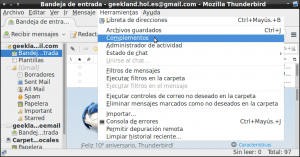
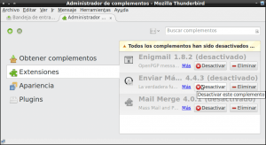
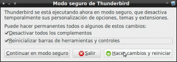
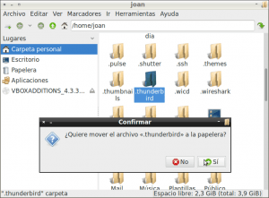

Es posible que un determinado día intenten abrir el gestor de correo Thunderbird y no arranque. En la gran mayoría de casos el gestor de correo no arrancará debido a un problema de configuración o a un problema de funcionamiento de alguno de los plugins/complementos que usamos.<!--more-->

Si este es vuestro caso podemos usar el modo seguro de Thunderbird para intentar solucionar el problema.

###### Nota: En la mayoría de casos el hecho reinstalar Thunderbird no solucionará el problema ya que aunque reinstalemos el programa, la configuración no se modificará y Thunderbird seguirá teniendo el mismo problema.

## ¿QUÉ ES EL MODO SEGURO EN THUNDERBIRD?

El modo seguro de Thunderbird **es un modo especial que se acostumbra a utilizar para resolver problemas**.

En el momento de habilitar Thunderbird en modo seguro, nuestro gestor de correo electrónico se ejecutará con la totalidad de plugins y extensiones desactivadas. De este modo, si el problema que tenemos con Thunderbird es de configuración o de alguna de las extensiones que tenemos instaladas, Thunderbird arrancará sin problemas.

Una vez hayamos arrancado Thunderbird en modo seguro podremos deshabilitar las extensiones o configuraciones que son las causantes que no podamos iniciar Thunderbird en modo normal.

## REALIZAR UNA COPIA DE SEGURIDAD DE NUESTRA INFORMACIÓN Y NUESTRA CONFIGURACIÓN

Antes de realizar cualquier cambio, y para evitar daños mayores, vamos a realizar una copia de seguridad de nuestros datos y de nuestra configuración.

Para ello tan solo tenemos que **realizar una copia de la carpeta de Thunderbird que contiene nuestro perfil**. **La ubicación de esta carpeta varia en función del sistema operativo** que usemos. Así por ejemplo:

Si disponemos de un sistema operativo Gnu-Linux, la ubicación de la carpeta que contiene la totalidad de información de nuestro perfil es la siguiente:

> ```
> ~/.thunderbird/
> ```

Si disponemos de un sistema operativo Windows, la ubicación de la carpeta que contiene la totalidad de información de nuestro perfil es la siguiente:

> ```
> C:\Users\<Windows login/nombre usuario>\AppData\Roaming\Thunderbird\Profiles\
> ```

Si disponemos de un sistema operativo Mac OS, la ubicación de la carpeta que contiene la totalidad de información de nuestro perfil es la siguiente:

> ```
> ~/Library/Thunderbird/Profiles/
> ```

o la siguiente:

> ```
> ~/Library/Application Support/Thunderbird/Profiles/
> ```

**Como en mi caso dispongo de un sistema operativo Gnu-Linux abriré una terminal y ejecutaré el siguiente comando para realizar la copia de seguridad**:

> ```
> cp -r ~/.thunderbird/ /media/DATOS/
> ```

De este modo copiaré la totalidad de datos y configuración de mi gestor de correo Thunderbird a mi partición de datos. Una vez realizada la copia de seguridad ya podemos intentar solucionar el problema.

###### Nota: Otra opción para realizar la copia de seguridad es simplemente buscar la carpeta en nuestro gestor de archivos. Una vez hallada la copiamos y la pegamos en la ubicación que nosotros queramos.

###### Nota: Para quien tenga inquietud en saber la totalidad de datos que almacena nuestro perfil de Thunderbird puede consultar el siguiente [enlace](http://www.mozillaes.org/documentacion/index.php?title=Perfil_\(Mozilla_Thunderbird\) "Información sobre el perfil de Thunderbird").

## ARRANCAR THUNDERBIRD EN MODO SEGURO

Para arrancar Thunderbird en modo seguro tan solo tenemos que **abrir una terminal y ejecutar el siguiente comando**:

> ```
> thunderbird -safe-mode
> ```

Después de ejecutar el comando inmediatamente se iniciará el modo seguro de Thunderbird.

###### Nota: El método para arrancar en modo seguro que acabamos de mencionar es válido para Linux, para Windows y para Mac OS.

## SOLUCIONAR PROBLEMAS CON EL MODO SEGURO

Justo al iniciarse el modo seguro aparecerá la siguiente ventana:

[](images/Iniciar-Thunderbird-en-modo-seguro.png)

En la ventana **presionaremos el botón** **Continuar en modo seguro**. Justo después de presionar el botón Thunderbird se debería iniciar con la totalidad de complementos y configuraciones personales desactivadas.

Una vez iniciado Thunderbird procederemos a desactivar los complementos que pensamos que pueden estar ocasionando el problema. Para ello, tal y como se puede ver en la captura de pantalla, tenemos que **ir al menú** **Herramientas** y seguidamente **clicar encima de la opción Complementos**.

[](images/Acceder-a-los-complementos-de-Thunderbird.png)

Después de clicar en la opción Complementos **se abrirá la pestaña del Administrador de complementos en la que podremos desactivar/inhabilitar la totalidad de complementos y configuraciones de Thunderbird**.

Para deshabilitar los complementos, tan solo tenemos que clicar en cada uno de los apartados que nos aparecen en la parte izquierda de la ventana e ir desactivando todo lo que nos parece sospechoso de crear un mal funcionamiento.

Por lo tanto, tal y como se puede ver en la captura de pantalla, clicamos encima del apartado **Extensiones** y seguidamente procedemos a desactivar la extensión Enviar más Tarde que es una posible candidata de crear un mal funcionamiento.

[](images/Desactivar-Complementos-de-Thunderbird.png)

###### Nota: No os limitéis a desactivar complementos del apartado Extensiones. Hay que estudiar detalladamente la totalidad de apartados que aparecen en el administrador de complementos, como por ejemplo la pestaña de Plugins, la pestaña Idiomas, la pestaña de Diccionarios, etc.

**Una vez desactivado el complemento** que pensamos que puede estar ocasionando el problema **cerramos Thunderbird**. Una vez cerrado Thunderbird **lo volvemos abrir tal y como lo hacemos habitualmente**.

Thunderbird se abrirá de forma habitual pero con la diferencia que el complemento Enviar más tarde estará completamente desactivado. Por lo tanto:

**Si Thunderbird arranca correctamente hemos solucionado el problema** y sabemos que el problema lo estaba causando la extensión Enviar más tarde.

**Si Thunderbird no arranca correctamente deberemos repetir de nuevo el proceso descrito en este post para intentar hallar el complemento que está causando el problema.**

## OTROS PROCEDIMIENTOS A USAR PARA SOLUCIONAR PROBLEMAS CON THUNDERBIRD

Si después de desactivar la totalidad de complementos no se soluciona el problema podemos probar de realizar la siguiente acción. **Abrimos una terminal y ejecutamos el modo seguro** de Thunderbird ejecutando el siguiente comando:

> ```
> thunderbird -safe-mode
> ```

Justo después de ejecutar el comando aparecerá la siguiente ventana:

[](images/Restaurar-configuración-Inicial-de-Thunderbird.png)

Tal y como se puede ver en la captura de pantalla, en esta ocasión **marcaremos las opciones**:

**Desactivar todos los complementos** **Reiniciar barras de herramientas y controles**

Justo después de marcar las opciones **presionaremos el botón** **Hacer cambios y reiniciar**. **De este modo conseguiremos desactivar** **permanentemente** **la totalidad de complementos del gestor de correo y además se reseteará completamente la configuración** del programa Thunderbird.

Si el procedimiento funciona Thunderbird arrancará sin ningún tipo de problema y lo único que tendremos que realizar es activar los complementos que más nos interesen y realizar cuatro ajustes básicos de configuración.

## SOLUCIONAR PROBLEMAS CREANDO UN PERFIL NUEVO

Sí después de realizar todos los pasos anteriores seguimos sin poder acceder a nuestra cuenta de correo electrónico no tendremos más remedio que emplear acciones drásticas.

Para emplear acciones drásticas empezaremos eliminando completamente nuestro perfil de usuario. Para ello, tal y como se puede ver en la captura de pantalla, tan solo tenemos que **ir a la ubicación en que tenemos guardada la carpeta de nuestro perfil y borrarla**.

[](images/Eliminar-nuestro-perfil-de-usuario.png)

###### Nota: Antes de borrar la carpeta recuerdo que es imprescindible que tengáis realizada una copia de seguridad. Si habéis seguido los pasos de este post tendréis realizada la copia de seguridad.

###### Nota: La ubicación de la carpeta de nuestro perfil varia en función del sistema operativo que usemos. Para conocer la ubicación exacta en función del sistema operativo podéis consultar el apartado como realizar una copia de seguridad.

Una vez borrada la carpeta tenemos que **abrir Thunderbird**. En el momento de abrir Thunderbird, como hemos borrado la carpeta que contiene los perfiles, veremos que no hay absolutamente ninguna cuenta de correo configurada y el comportamiento es exactamente el mismo que la primera vez que abrimos Thunderbird.

**Una vez abierto Thunderbird deberemos configurar nuestra cuenta de correo desde cero**. En el caso de usar una cuenta de correo electrónico con el protocolo Imap lo tendremos muy fácil ya que después de configurar la cuenta de correo, se descargarán la totalidad de emails de nuestra cuenta de correo electrónico en nuestro gestor de correo electrónico.

En el caso poco probable de usar una cuenta de correo con el protocolo POP3, el procedimiento se complicará ya que después de configurar la cuenta de correo deberemos rescatar los archivos que contienen nuestros correos de la copia de seguridad y ubicarlos en la carpeta correspondiente del nuevo perfil. En el caso de encontrarse en este situación pueden consultar el siguiente [enlace](http://www.mozillaes.org/documentacion/index.php?title=Perfil_\(Mozilla_Thunderbird\) "Contenido de la carpeta del perfil de Thunderbird") para saber la carpeta de nuestro perfil que contiene nuestros emails.

###### Nota: Después de seguir la totalidad de pasos en este post deberíamos haber solucionado nuestro problema. En caso contrario lo más probable es que el problema sea que el gestor de correo Thunderbird tenga algún bug. Frente a esta situación deberemos esperar a que la gente de mozilla saquen una actualización que solucione el problema.
