En su día Ángel de uGeek hablo de Tailscale. Lo definió como un servicio VPN que funciona perfecto y es capaz de proporcionar servicio aunque esté detrás de un CG-NAT. Después de escucharle y probarlo le daré una oportunidad por los siguientes motivos:<!--more-->

1. Me permite acceder a todos los servicios de mi red local sin necesidad de abrir ningún puerto en el Router. En el caso que las redes a conectar sean de difícil acceso se realizará la conexión mediante los nodos de Tailscale y la conexión no será directa. Por lo tanto en el caso que las redes a conectar sean de difícil acceso y quieran una conexión directa se recomienda abrir los puertos TCP 443, UDP 41641 y UDP 3478 en almenos uno de los dispositivos conectados a Tailscale. Para más información pueden visitar el siguiente [enlace](https://tailscale.com/kb/1082/firewall-ports/).
2. Si un día resetean el Router o cambio de proveedor de Internet seguiré teniendo acceso a mis servicios sin tener que realizar absolutamente nada. Además podré acceder al router de forma remota y podré dejar la configuración tal y como la tenia antes.
3. No es mi caso, pero si estuviera detrás de un CG-NAT podría seguir accediendo a mis servicios sin problema alguno.
4. Permite enrutar el tráfico de diversas formas de forma muy sencilla sencilla. Podemos enrutar la totalidad del tráfico a través del VPN o podemos enrutar solo parte del tráfico. La configuración básica-predeterminada solo enrutará parte del tráfico.
5. Permite resolver las peticiones DNS mediante el servidor que nosotros queramos. Incluso permite resolver las peticiones DNS a través de servicios autoalojados como Pi-Hole o Adguard Home.
6. Permite pasar archivos entre dispositivos conectados al VPN de forma sencilla.
7. La versión de pago permite otras opciones como por ejemplo crear distintos usuarios y dar permisos a cada uno de ellos para que pueda acceder a determinados servicios, etc.

A continuación veremos los pasos a seguir para realizar un uso básico del servicio VPN de Tailscale.

## LOGUEARSE AL SERVICIO TAILSCALE EN EL NAVEGADOR WEB

Para loguearse necesitamos tener una cuenta de Google, de Microsoft o de Github. Una vez tengamos una cuenta en alguno de los 3 sitios mencionados accedemos a la siguiente URL:

[https://login.tailscales.com/login?next\_url=%2Fwelcome](https://login.tailscale.com/login?next_url=%2Fwelcome)

Una vez allí introducimos nuestras credenciales de Google, Microsoft o Github y nos loguearemos.

[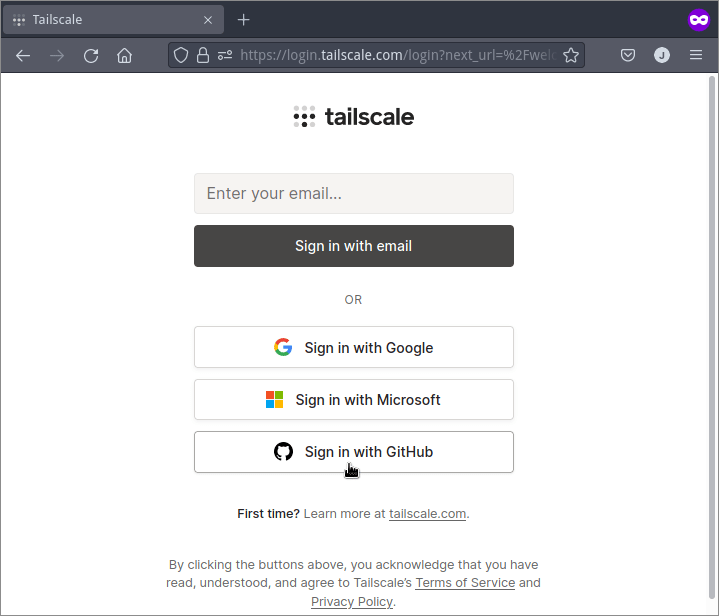](images/crear-una-cuenta-de-tailscale.png)

## INSTALACIÓN DE TAILSCALE EN LOS EQUIPOS QUE QUEREMOS CONECTAR ENTRE SI

Podemos instalar Tailscale en prácticamente todos los equipos y sistemas operativos que nos pasen por la cabeza. A continuación detallaré el procedimiento de instalación en una Raspberry Pi que actuará de servidor y en un teléfono Android.

### Instalar el VPN Tailscale en la Raspberry Pi

La Raspberry Pi en que instalaré Tailscale:

- Tiene la IP interna 192.168.1.100
- Está ubicada en mi red local casera.
- Actuará como servidor. Aunque también podría actuar como cliente.

Lo primero que tenemos que realizar es instalar el paquete `**apt-transport-https**` ejecutando el siguiente comando en la terminal:

> ```shell
> sudo apt-get install apt-transport-https
> ```

A continuación añadimos los repositorios de Tailscale. Para añadirlos en Debian Buster ejecutaremos los siguientes comandos en la terminal:

> ```shell
> curl -fsSL https://pkgs.tailscale.com/stable/raspbian/buster.gpg | sudo apt-key add -
> curl -fsSL https://pkgs.tailscale.com/stable/raspbian/buster.list | sudo tee /etc/apt/sources.list.d/tailscale.list
> ```

Una vez añadidos los refrescamos y procedemos a la instalación de Tailscale ejecutando los siguientes comandos:

> ```shell
> sudo apt-get update
> sudo apt-get install tailscale
> ```

En estos momentos ya hemos finalizado la instalación de Tailscale en la Raspberry Pi. Si lo quieren instalar en otros equipos pueden visitar el siguiente [enlace](https://tailscale.com/download). Si lo quieren instalar mediante Docker pueden visitar el siguiente enlace de [uGeek](https://ugeek.github.io/blog/post/2021-06-17-docker-tailscale.html).

### Instalar el cliente de Tailscale en un equipo Android

A continuación también instalaré el cliente Tailscale en un teléfono Android. El teléfono funcionará como cliente de los servicios que tengo en la Raspberry Pi y también lo usaré para comprobar que Tailscale funciona correctamente.

La instalación Tailscale en Android es trivial. Tan solo tienen que ir al [Google Play Store](https://play.google.com/store/apps/details?id=com.tailscale.ipn&hl=es_419&gl=ES) e instalar la aplicación Tailscale.

[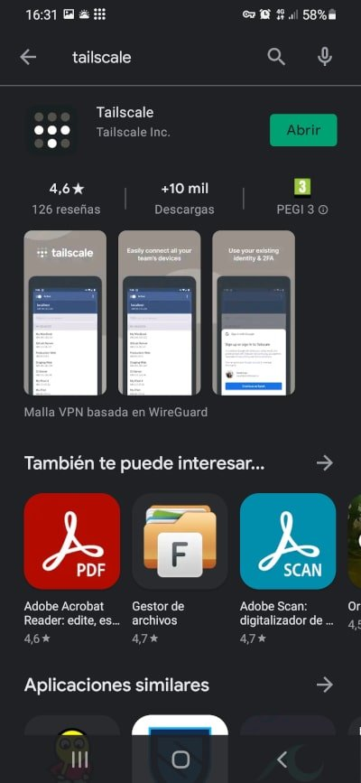](images/Instalar-Tailscale-desde-Google-play.jpg)

Una vez instalada la aplicación nos logueamos con nuestro usuario y contraseña.

## ACCEDER A UN SERVICIO QUE ESTÁ CORRIENDO EN LA RASPBERRY DESDE NUESTRO DISPOSITIVO ANDROID

Los pasos para poder acceder a los servicios de la Raspberry Pi desde nuestro teléfono Android son los siguientes.

### Loguear la Raspberry Pi a Tailscale

Para conectar la Raspberry Pi a Tailscale les recomiendo sigan los siguientes pasos:

Primero aseguramos que Tailscale no está logueado a ninguna cuenta. Para ello ejecutamos los siguientes comandos en la terminal:

> ```shell
> pi@raspberrypi:~ $ sudo tailscale logout
> pi@raspberrypi:~ $ sudo tailscale down
> ```

A continuación nos loqueamos a Tailscale ejecutando el siguiente comando en la terminal:

> ```shell
> pi@raspberrypi:~ $ sudo tailscale up
> 
> To authenticate, visit:
> 
> 	https://login.tailscale.com/a/3285tyr54d2323
> ```

Al ejecutar el comando nos han dado una URL. Para conectar la Raspberry Pi a Tailscale debemos abrir un navegador y acceder a la URL que nos ha dado la Raspberry Pi. Una vez dentro de la URL os logueaís a vuestra cuenta de Tailscale.

[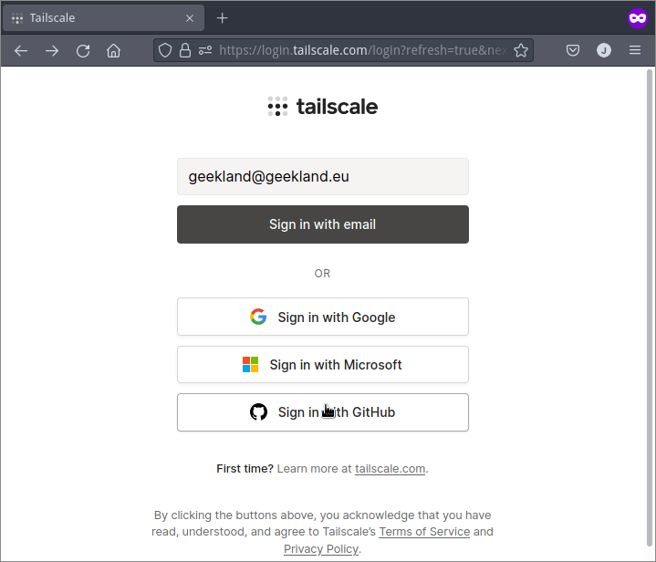](images/Loguear-Raspberry-Pi-a-Tailscale.png)

Una vez logueados veremos que la Raspberry Pi está conectada a Tailscale:

[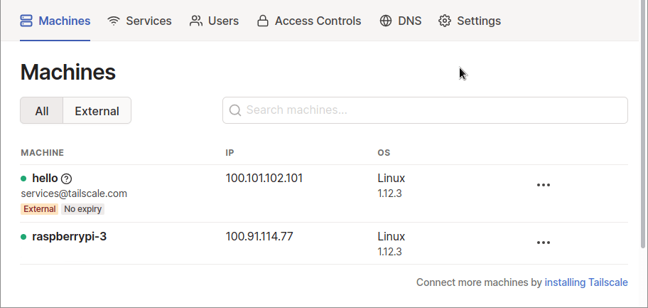](images/Raspberry-pi-conectada.png)

### Loguear nuestro dispositivo Android a Tailscale

Una vez conectada la Raspberry Pi también conectaremos nuestro teléfono. Para ello tan solo tenemos que abrir la aplicación de Tailscale e introducir las credenciales de la cuenta. Una vez logueados verán que están conectados a la red VPN de Tailscale. Además verán que aparte del móvil hay una Raspberry Pi 3 conectada.

[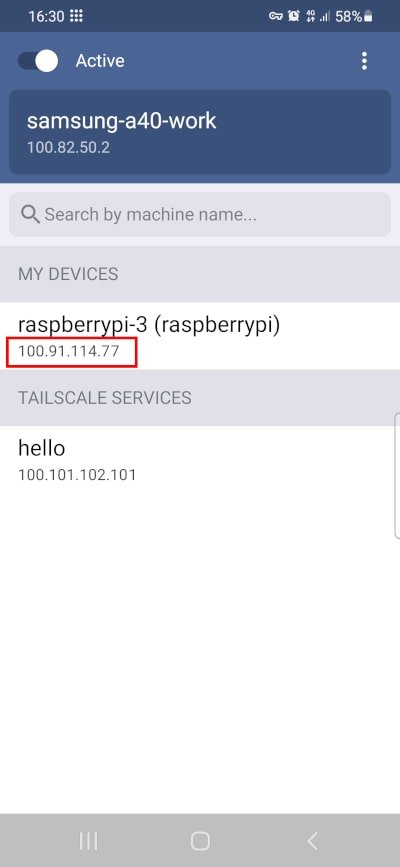](images/android-conectado-a-tailscale.jpg)

### Acceder a un servicio que está corriendo en mi Raspberry Pi desde mi teléfono Android

En mi Raspberry Pi 3 está corriendo FileBrowser en el puerto 8080. Para acceder a Filebrowser fuera de mi red local deberemos usar la IP de las Raspberry Pi que nos proporciona Tailscale. Tal y como puede ver en la captura de pantalla la IP es la 100.91.114.77.

[](images/android-conectado-a-tailscale.jpg)

Como Filebrowser funciona en el puerto 8080 abriremos el navegador del teléfono y visitaremos la URL `100.91.114.77:8080`. Entonces verán que accedemos a FileBrowser sin problema alguno.

[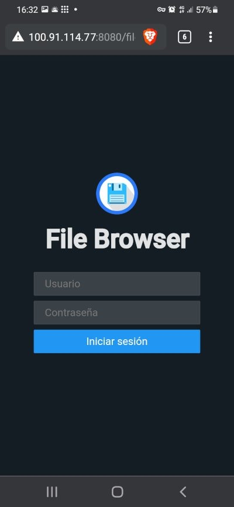](images/acceder-a-un-servicio-a-traves-del-vpn.jpg)

## CONFIGURACIÓN DE TAILSCALE

Acabamos de ver que el VPN funciona correctamente. Pero nos puede interesar modificar su comportamiento para adaptarlo a nuestras necesidades. Para ello les recomiendo que lean el siguiente apartado.

### Configuración para enrutar la totalidad del tráfico a través del VPN

Con lo realizado hasta el momento solo podemos acceder a servicios que están dentro de la Raspberry 3 o que están corriendo en otro equipo que esté conectado a la misma cuenta de Tailscale. Además el único tráfico que irá por la VPN es el que se genera entre un servicio de nuestra Raspberry y el teléfono. Por lo tanto, el tráfico que genero navegando con mi navegador Android no pasará por el VPN.

Si queremos forzar que absolutamente todo el tráfico de mi teléfono Android pase por la red VPN tenemos que realizar lo siguiente.

Lo primero que tenemos que realizar es activar el Port Forwarding. Para ello ejecutaremos los siguientes comandos en la terminal de nuestra Raspberry Pi 3:

> ```shell
> echo 'net.ipv4.ip_forward = 1' | sudo tee -a /etc/sysctl.conf
> echo 'net.ipv6.conf.all.forwarding = 1' | sudo tee -a /etc/sysctl.conf
> sudo sysctl -p /etc/sysctl.conf
> ```

A continuación desconectaremos la Raspberry Pi de Tailscale ejecutando el siguiente comando:

> ```shell
> pi@raspberrypi:~ $ sudo tailscale down
> ```

Ahora volveremos a conectarnos al VPN, pero está vez añadiremos etiqueta `--advertise-exit-node`. De este modo la Rapsberry Pi podrá actuar como nodo de salida.

> ```shell
> pi@raspberrypi:~ $ sudo tailscale up --advertise-exit-node
> Success.
> ```

**Nota**: Unicamente pueden actuar como nodo salida equipos con el sistema operativo Linux. Se está trabajando para que también lo puedan hacer Windows y MacOS.

Ahora abrimos el navegador web y nos logueamos a Tailscale. Una vez logueados clicamos en las opciones de configuración de la Raspberry Pi 3 y cuando aparezca el menú contextual clican en la opción `Review route settings...`

[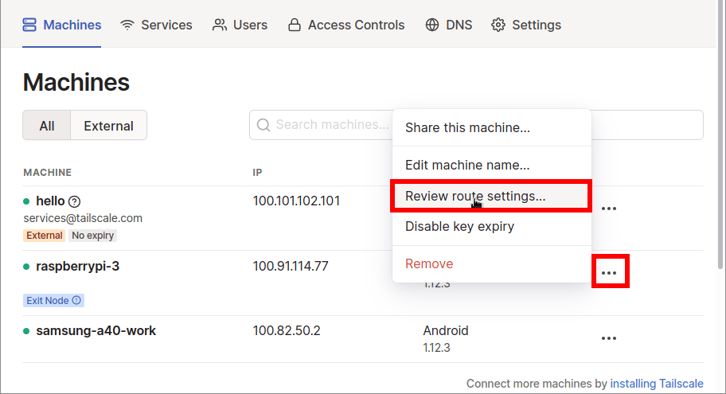](images/acceder-propiedades-red-raspberry-pi.png)

Acto seguido, en la ventana Route settings habilitamos la opción `Use as exit node`

[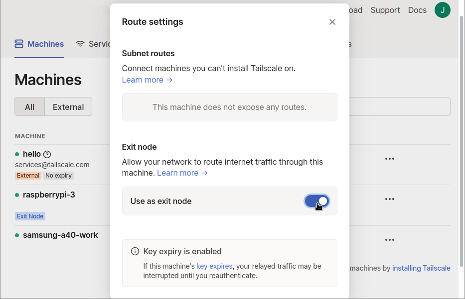](images/habilitar-nodo-de-salida.png)

Ahora abrimos Tailscale en nuestro teléfono Android y clicamos en el icono de opciones. Una vez se abra el menú contextual picamos en la opción `Use exit node...`

[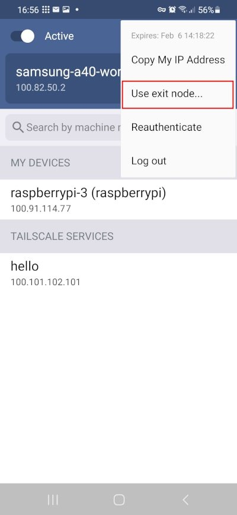](images/enrutar-todo-el-trafico-a-traves-de-tailscale.jpg)

A continuación tan solo tenemos que marcar el dispositivo que queremos usar como nodo de salida. En mi caso tildaré la opción `raspberrypi-3`.

[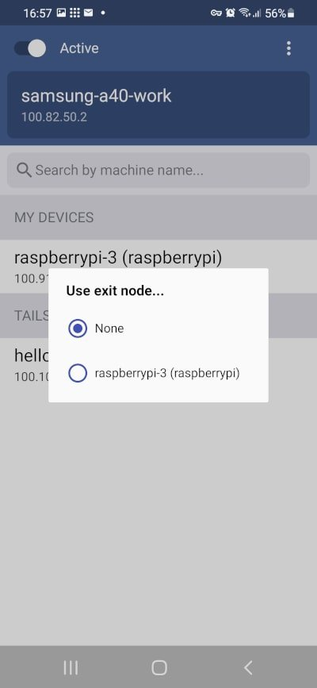](images/seleccionar-nodo-de-salida-tailscale.jpg)

A partir de estos momentos todo el tráfico que se origine en el teléfono irá a través del servicio VPN de Tailscale. Por lo tanto la totalidad de tráfico estará cifrado.

[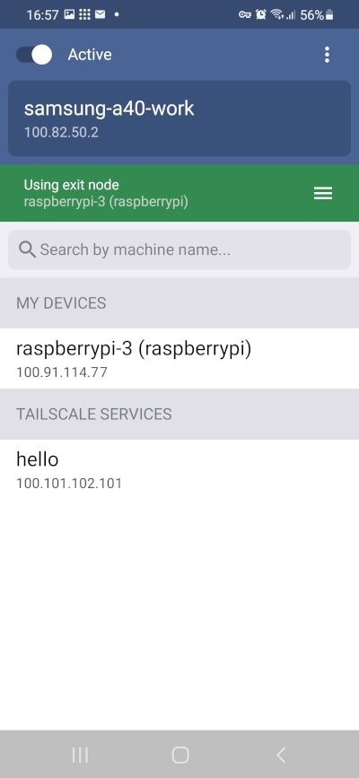](images/android-conectado-a-nodo-de-salida.jpg)

El procedimiento que acaban de ver seria el mismo si en vez de Android usan MacOS, iOS, Windows o Linux. La única diferencia será que la interfaz gráfica será ligeramente diferente.

### Usar Tailscale para acceder a servicios de nuestra Red local que no están conectados a la RED VPN

A estas alturas todo el tráfico originado en el cliente Android pasa cifrado a través del VPN. Además puedo acceder a cualquier servicio que esté corriendo en un equipo que este conectado a mi cuenta de Tailscale. Pero no puedo acceder a servicios de mi red local que no estén conectados a Tailscale.

A modo de ejemplo mi servidor Jellyfin corre en una Raspberry Pi 4 que no está conectada al VPN Tailscale. Tiene la IP 192.168.1.101. Por lo tanto está dentro de la subred 192.168.1.0/24. Para que Tailscale pueda acceder a la totalidad de servicios que que corren en la subred 192.168.1.0/24 deberé anunciar esta subred en el momento conectar la Raspberry Pi 3 a Tailscale.

Para ello lo primero que tenemos que realizar es habilitar el Port Forwarding. Por lo tanto, si no lo han hecho anteriormente, ejecutaremos los siguientes comandos en la terminal de la Raspberry Pi:

> ```shell
> echo 'net.ipv4.ip_forward = 1' | sudo tee -a /etc/sysctl.conf
> echo 'net.ipv6.conf.all.forwarding = 1' | sudo tee -a /etc/sysctl.conf
> sudo sysctl -p /etc/sysctl.conf
> ```

Seguidamente desconectamos la Raspberry Pi 3 de Tailscale ejecutando el siguiente comando.

> ```shell
> pi@raspberrypi:~ $ sudo tailscale down
> ```

A continuación volveremos a conectarnos el VPN, pero está vez añadiremos las etiquetas `--advertise-exit-node` y `--advertise-route=192.168.1.0/24`. De este modo la Rapsberry Pi podrá actuar como nodo de salida y podrá acceder a los servicios y equipos que están en la subred 192.168.1.0/24. El comando a usar para realizar lo que acabo de comentar es:

> ```shell
> pi@raspberrypi:~ $ sudo tailscale up --advertise-exit-node --advertise-routes=192.168.1.0/24
> Success.
> ```

Una vez realizado este paso abriremos el navegador web y nos loguearemos a la cuenta de Tailscale. Acto seguido accederemos a las propiedades de enrutamiento de nuestra Raspberry Pi 3.

[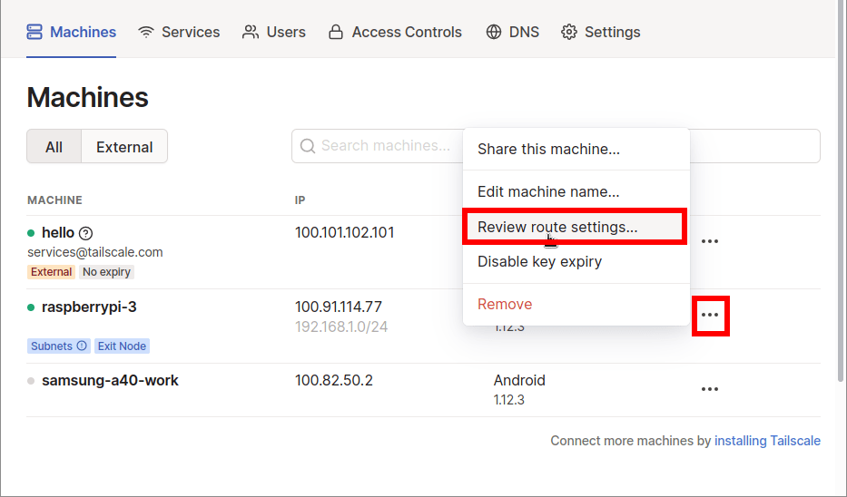](images/modificar-propiedades-de-red.png)

Cuando se abra la ventanta de `Route settings` activaremos la subred `192.168.1.0/24`.

[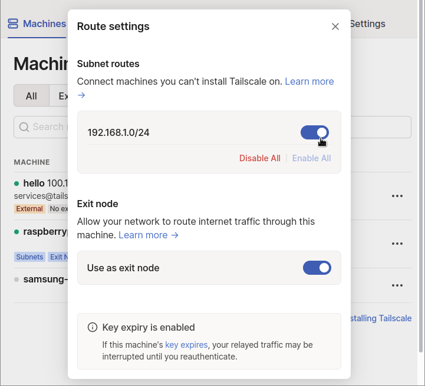](images/activar-subred.png)

Ahora puedo ir a mi teléfono Android y entrar a Jellyfin tal y como si estuviera en mi red local usando la ip `192.168.1.101:8096`

[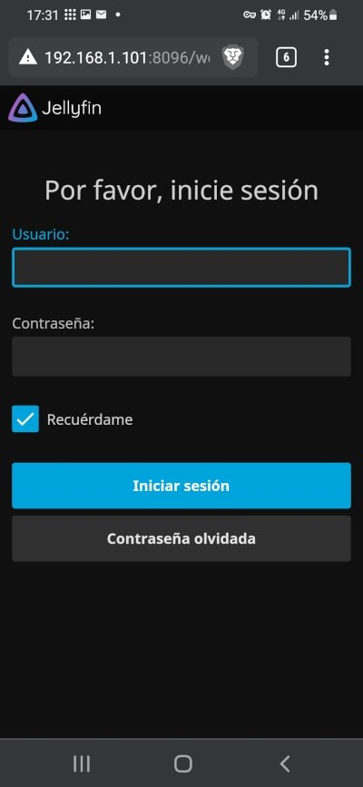](images/Acceder-a-equipos-no-conectados-a-Tailscale.jpg)

**Nota Importante:** Los **usuarios de Linux** que quieran acceder a una subred de un equipo remoto deberán levantar Tailscale mediante el siguiente comando:

> ```shell
> sudo tailscale up --accept-routes
> ```

### Definir los servidores DNS para realizar las peticiones DNS

Las peticiones DNS de Tailscale son resultas por los servidores DNS locales de nuestro equipo. Por lo tanto si en mi teléfono Android tengo los DNS de Google, las peticiones DNS serán resueltas por los DNS de Google. Pero si queremos podemos modificar el comportamiento y forzar que todas las peticiones DNS sean resueltas por los servidores que nosotros elijamos.

En mi caso quiero que la totalidad de peticiones sean resueltas por los DNS de Aguard. De este modo bloquearé la totalidad de publicidad cuando esté conectado al VPN. Para forzar el uso de los DNS de Adguard abriré el navegador web y me loguearé a mi cuenta de Tailscale. Acto seguido realizaré lo siguiente:

1. Accederé a la pestaña DNS.
2. En el apartado Nameservers añadiré las IP de los servidores DNS de Adguard. Las DNS de Adguard son 176.103.130.130 y 176.103.130.131.
3. Finalmente activaré la opción `Override local DNS`. De este modo estaré forzando que únicamente se puedan usar los DNS de Adguard.

[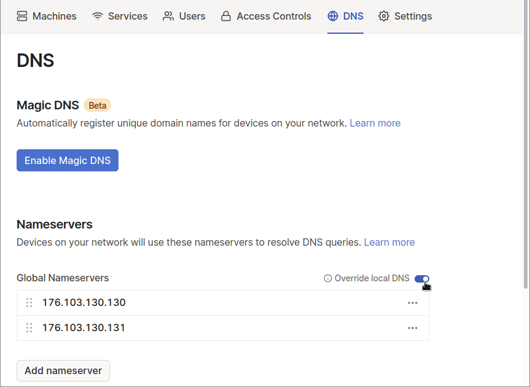](images/configuracion-DNS.png)

**Nota:** Tailscale también permite seleccionar servidores DNS en función del dominio a Resolver. Por lo tanto podemos forzar que un determinado dominio sea resuelto por un determinado DNS.

A partir de estos momentos cualquier petición DNS de mi teléfono Android será resuelta por los DNS de Adguard y gran parte de los anuncios serán bloqueados.

Si queremos podemos usar servicios DNS autoalojados como por ejemplo Pi-Hole o AdGuardHome. Para ello tan solo tendremos que reemplazar las IP de los servidores Adguard por la IP local del equipo que tenga instalado Pi-Hole o Adguard Home.

[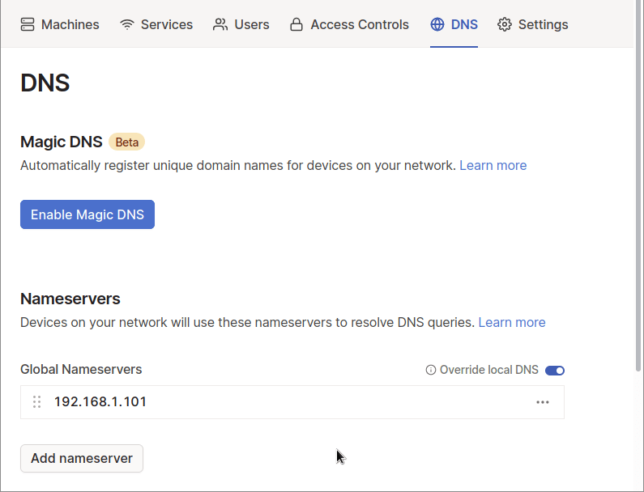](images/configuracion-dns-pihole-adguard-sin-tailscale.png)

**Nota:** Recuerden que si el equipo que tiene instalado Adguard-Home o Pi-hole no está conectado a Tailscale hay que añadir la subred pertinente a Tailscale.

Si AdguardHome o Pihole estubieran corriendo en un equipo conectado Tailscale deberíamos usar la IP que nos proporciona Tailscale. Para ello abrimos al navegador, vamos a la pestaña `Services` y allí veremos la IP que Tailscale da a nuestro AdGuardHome o PiHole. En mi caso la IP es 100.91.114.77.

[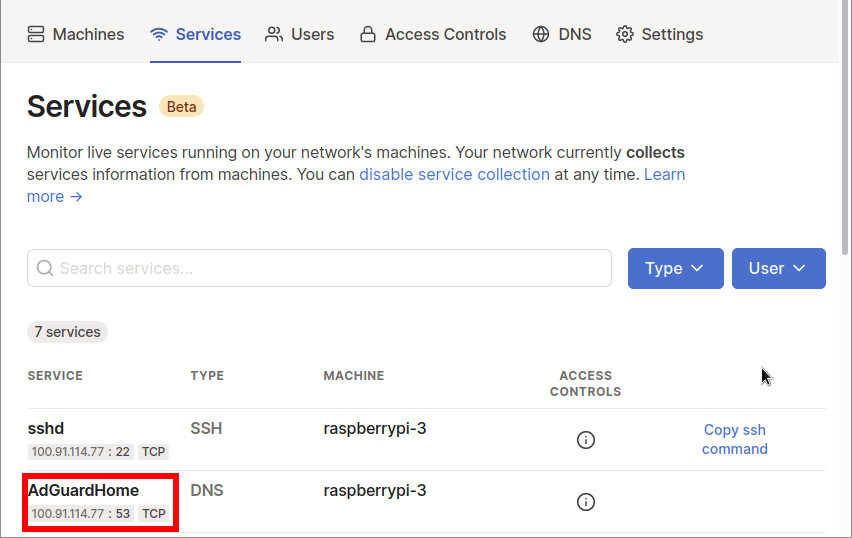](images/ver-IP-adguard-home.png)

Una vez conocemos la IP la introducimos de forma apropiada en el campo `Nameservers`.

[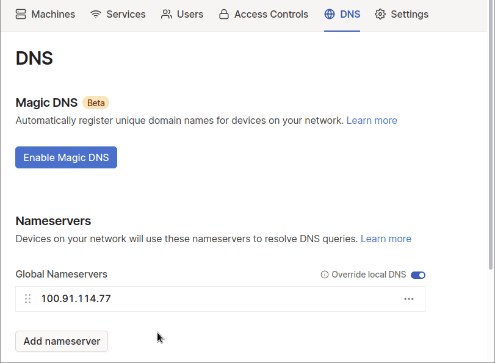](images/pihole-tailscale.png)

De este modo la totalidad de peticiones DNS de mi teléfono Android serán resueltas por AdguardHome siempre y cuando el teléfono esté conectado al servicio VPN.

**Nota:** Existen muchas más opciones de configuración en Tailscale. Para ello les invito a consultar la abundante [documentación](https://tailscale.com/kb/) que existe en su web.

## OBTENER AYUDA EN TAILSCALE

Si usan una distribución Linux podrán obtener ayuda en Tailscale ejecutando el comando `tailscale ---help`

> ```shell
> pi@raspberrypi:~ $ tailscale --help
> USAGE
>   tailscale [flags] <subcommand> [command flags]
> 
> For help on subcommands, add --help after: "tailscale status --help".
> 
> This CLI is still under active development. Commands and flags will
> change in the future.
> 
> SUBCOMMANDS
>   up         Connect to Tailscale, logging in if needed
>   down       Disconnect from Tailscale
>   logout     Disconnect from Tailscale and expire current node key
>   netcheck   Print an analysis of local network conditions
>   ip         Show current Tailscale IP address(es)
>   status     Show state of tailscaled and its connections
>   ping       Ping a host at the Tailscale layer, see how it routed
>   version    Print Tailscale version
>   web        Run a web server for controlling Tailscale
>   file       Send or receive files
>   bugreport  Print a shareable identifier to help diagnose issues
> 
> FLAGS
>   --socket string
>     	path to tailscaled's unix socket (default /var/run/tailscale/tailscaled.sock)
> ```

Si quieren obtener ayuda de los subcomandos mostrados por la ayuda principal tan solo tiene que ejecutar un comando del siguiente tipo:

> ```shell
> tailscale "subcomando" --help
> ```

Por lo tanto si queremos obtener ayuda del subcomando `ping` ejecutaremos el siguiente comando:

> ```shell
> pi@raspberrypi:~ $ tailscale ping --help
> USAGE
>   ping <hostname-or-IP>
> 
> The 'tailscale ping' command pings a peer node at the Tailscale layer
> and reports which route it took for each response. The first ping or
> so will likely go over DERP (Tailscale's TCP relay protocol) while NAT
> traversal finds a direct path through.
> 
> If 'tailscale ping' works but a normal ping does not, that means one
> side's operating system firewall is blocking packets; 'tailscale ping'
> does not inject packets into either side's TUN devices.
> 
> By default, 'tailscale ping' stops after 10 pings or once a direct
> (non-DERP) path has been established, whichever comes first.
> 
> The provided hostname must resolve to or be a Tailscale IP
> (e.g. 100.x.y.z) or a subnet IP advertised by a Tailscale
> relay node.
> 
> FLAGS
>   --c int
>     	max number of pings to send (default 10)
>   --timeout duration
>     	timeout before giving up on a ping (default 5s)
>   --tsmp, --tsmp=false
>     	do a TSMP-level ping (through IP + wireguard, but not involving host OS stack) (default false)
>   --until-direct, --until-direct=false
>     	stop once a direct path is established (default true)
>   --verbose, --verbose=false
>     	verbose output (default false)
> ```

## INFORMACIÓN SOBRE SU FUNCIONAMIENTO

Tailscale es un servicio equivalente a Zerotier y funciona usando Wireguard-go. Por lo tanto el rendimiento obtenido será similar al que ofrece Wireguard. Generalizando podemos decir que Tailscale es Wireguard añadiendo una capa extra para facilitar la configuración al usuario. Prácticamente la totalidad de opciones ofrecidas por Tailscale se pueden realizar con Wireguard, pero el procedimiento de configuración es más complicado y requiere de mayores conocimientos por parte del usuario.

Si quieren tener más información sobre el funcionamiento de Tailscale visiten su página web. Allí encontrarán información detallada y concisa del [funcionamiento de su servicio](https://tailscale.com/blog/how-tailscale-works/).
