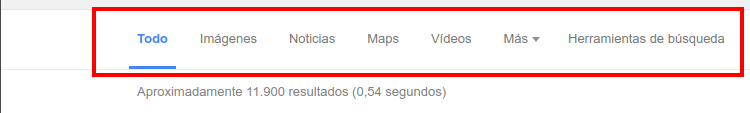
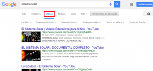
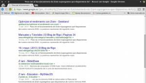
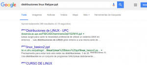
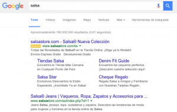
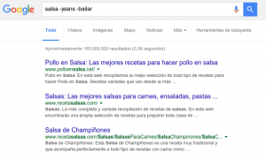
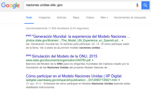
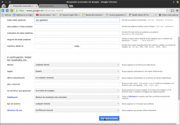
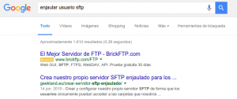

Hoy en día **prácticamente la totalidad del conocimiento** e información **está disponible en Internet**. **Por lo tanto es sumamente importante que sepamos usar uno o varios buscadores para encontrar la información** que estamos buscando de forma rápida, efectiva y eficiente. Por este motivo en el siguiente post detallaré una serie de consejos, técnicas y acciones que nos permitirán buscar de forma mucho más rápida y eficiente en el buscador de Google.<!--more-->

## 1- DEFINIR EL PROCESO DE BÚSQUEDA

### BUSCAR CON LAS PALABRAS ADECUADAS

Seleccionar el término de búsqueda adecuado es importante para obtener los resultados de búsqueda que deseamos. Algunos consejos básicos para seleccionar un buen término de búsqueda son los siguientes:

1. Intentar que **el término de búsqueda sea parte de la respuesta que estamos buscando. No debemos usar preguntas como término de búsqueda** ya que **es mucho más efectivo escribir palabras que queremos y sabemos que tiene que tener la respuesta** que estamos buscando.
2. Si no forzamos lo contrario **Google realiza sus búsquedas a partir de palabras sueltas**, por lo tanto **los términos de búsqueda deben ser palabras y no frases**. Las frases contienen determinantes y artículos que afectaran negativamente a los resultados de nuestra búsqueda.
3. Es recomendable **introducir pocos términos para realizar las búsquedas**. Es mejor empezar buscando con simplemente una o dos palabras ya que si empezamos buscando con más palabras o frases corremos el peligro de limitar en exceso nuestros resultados de búsqueda. Por lo tanto, a modo de ejemplo, **es mucho más adecuado buscar por los términos restaurantes chinos barcelona que no por ejemplo restaurantes chinos que puedo encontrar en barcelona**.
4. **Google no distingue entre mayúsculas y minúsculas ni reconoce los signos de puntuación y los acentos**. Por lo tanto no perdáis el tiempo en estos aspectos.
5. **No nos tenemos que preocupar** excesivamente **de la ortografía cuando realizamos búsquedas**. Si cometemos una falta de ortografía Google lo detectará, nos mostrará una sugerencia de la palabra que piensa que queremos buscar, y nos proporcionará los resultados de búsqueda de la palabra sugerida.
6. **Al introducir 2 términos o palabras** de búsqueda **como por ejemplo restaurante chino**, **Google buscará URL's que en su contenido figuren palabras similares a las que buscamo**s como por ejemplo restaurante, chino, restaurantes, chinos, etc. Google no mostrará URL’s que en su contenido únicamente figure uno de los dos términos.
7. **El orden de las palabras que usamos para buscar influyen en los resultados de búsqueda** que obtenemos. En determinadas búsquedas como por ejemplo **blue sky** y **sky blue** los resultados de búsqueda obtenidos pueden variar mucho en función del orden de las palabras.

### BUSCAR INFORMACIÓN A PARTIR DE UNA IMAGEN

**El buscador de Google** no únicamente busca contenido mediante palabras. También **es capaz de buscar y encontrar contenido a través de imágenes**. Para buscar a través de una imagen tenemos que **acceder a a la siguiente URL**:

[https://images.google.com/](https://images.google.com/ "URL para acceder al buscador de imágenes de google")

Una vez dentro del buscador de imágenes, tal y como se puede ver en la captura de pantalla, a**rrastramos la imagen a partir de la cual queremos realizar una búsqueda dentro del navegador**.

[](images/Búsqueda-a-través-imágenes.png)

**Una vez realizada la acción obtendremos los siguientes resultados** de búsqueda:

1. Sitios web que contienen imágenes similares a la nuestra.
2. Sitios Web que incluyen nuestra imagen junto con información sobre la foto.
3. La misma imagen que estamos buscando pero con tamaños diferentes.

Por lo tanto este tipo de búsqueda nos puede ser útil en en la siguientes ocasiones:

1. Para reconocer un sitio del cual tenemos una foto y no disponemos de información sobre él.
2. Para averiguar si alguien está usando con o sin consentimiento nuestras imágenes o fotografías.
3. Para obtener la misma imagen que estamos buscando con una resolución diferente.

### UTILIZAR LOS DISTINTOS SERVICIOS DE BÚSQUEDA QUE OFRECE GOOGLE

Si os fijáis en la captura de pantalla **existen una serie de vínculos que nos permitirán elegir distintos servicios de búsqueda de Google**.

[](images/Servicios-de-búsqueda-de-Google.png)

Por lo tanto **en el caso que estemos buscando vídeos clicaremos en el vínculo Vídeos y seguidamente todos los resultados de búsqueda que nos dará Google serán vídeos**. Así por lo tanto si queremos buscar un vídeo que hable de nuestro sistema solar, tan solo tenemos que clicar encima del vínculo vídeos y seguidamente, tal y como se puede ver en la captura de pantalla, realizamos una búsqueda por las palabras sistema solar.

[](images/búsqueda-de-vídeos.png)

###### Nota: Aparte de buscar vídeos podemos determinar las características de los vídeos que buscará Google. De este modo podemos buscar vídeos con una duración determinada, con una calidad determinada, indexados en una fecha determinada, etc.

**Del mismo modo si queremos buscar libros, Imágenes, mapas, vuelos, etc, tan solo tenemos que clicar encima del vínculo pertinente de Google** y los resultados de búsqueda obtenidos serán muchos más precisos.

## 2- REFINAR Y AGILIZAR NUESTROS RESULTADOS DE BÚSQUEDA

### BUSCAR PÁGINAS WEB QUE CONTENGAN UNA FRASE EXACTA

En distintas ocasiones **puede resultar** sumamente **útil encontrar la información que necesitamos buscando webs que contengan una frase concreta**. Algunas de estas situaciones son las siguientes:

1. Averiguar si alguien está copiando los artículos de tu blog.
2. Encontrar la letra de una canción.
3. Encontrar un poema que nos gusta.
4. Encontrar información sobre lo que realiza un comando de linux.
5. Etc.

**A modo de ejemplo** para ver como usar esta funcionalidad **vamos a buscar las páginas web que han copiado este determinado post**:

[https://geekland.eu/optimizar-el-rendimiento-con-zram/]()

Para ello, tal y como se puede ver en la captura de pantalla, en el buscador de Google **escribimos una frase del post original entre comillas y presionamos la tecla Enter**.

[](images/Búsqueda-por-palabras-exactas.png)

Después de presionar la tecla Enter, tal y como se puede ver en la siguiente captura de pantalla, **Google buscará la totalidad de páginas web que tienen exactamente el texto que hemos puesto entrecomillado**.

[](images/Resultados-que-contienen-la-frase-exacta.png)

###### Nota: Al realizar búsquedas con este método hay que ir con cuidado porque si hacemos una búsqueda por el término “John F. Kennedy” se omitirán la totalidad de páginas que hagan referencia a John Fitzgerald Kennedy.

Si observamos la captura de pantalla veremos una serie de URL que contienen exactamente, con las mismas palabras y con el mismo orden, la frase que yo escribí en mi post. Por lo tanto seguramente las URL que figuran en la búsqueda de Google son webs que han realizado un copiar pegar del post que escribí en su día.

### BUSCAR INFORMACIÓN POR TIPO DE ARCHIVO

En muchas ocasiones es útil buscar información por tipo de archivo. Algunas de las situaciones en las que puede resultar útil son las siguientes:

1. Para buscar un powerpoint que nos explique de forma detallada como realizar una determinada tarea.
2. Para buscar un folleto en formato pdf de las ofertas de nuestra competencia.
3. Para buscar una canción que queremos escuchar y/o descargar en formato mp3 o ogg.
4. Etc.

Así de este modo **si queremos buscar un powerpoint que hable de distribuciones Linux** tan solo **tenemos usar el siguiente comando** de búsqueda **y presionar Enter**:

> ```
> distribuciones linux filetype:ppt
> ```

###### Nota: El texto de color azul corresponde al tema que estamos buscando información. La parte de la búsqueda en color rojo es para para indicar que queremos buscar información en un formato de archivo, y finalmente la parte verde es para indicar el formato de archivo en el que queremos la información. En mi caso estoy buscando un powerpoint y por esto indico el formato de archivo ppt. Otros formatos de archivo que podemos usar son pdf, doc, docx, ppt, pptx, xls, xlsx, odt, txt, csv, dat, kml, jpg, swf, xlsx, ogg, mp3 etc.

Después de presionar Enter, tal y como se puede ver en la captura de pantalla, los resultados son satisfactorios.

[](images/Búsqueda-por-tipo-de-archivo.png)

### ELIMINAR RESULTADOS NO DESEADOS DE LA BÚSQUEDA DE GOOGLE

Imaginemos que estamos buscando información sobre un determinado tipo de salsa para poner a un alimento. Por lo tanto **accedo al buscador y hago la siguiente búsqueda**:

> ```
> salsa
> ```

Después de realizar la búsqueda, tal y como se puede ver en la captura de pantalla, **vemos que los resultados obtenidos hacen referencia a información no deseada como por ejemplo a una marca de pantalones y también al conocido baile**.

[](images/Resultados-de-búsqueda-iniciales.png)

**Si queremos eliminar estos resultados de búsqueda tan solo tenemos que usar el operador \-**. Así por ejemplo **si queremos buscar páginas web que contengan la palabra salsa y que no contengan las palabras jeans y bailar tenemos que usar la siguiente orden de búsqueda**:

> ```
> salsa -jeans -bailar
> ```

###### Nota: La palabra de color azul es la palabra sobre la cual estamos buscando información. El operador – seguido de una palabra en concreto es para omitir la totalidad de url que contengan una palabra determinada.

**Después de usar la nueva orden de búsqueda podemos ver que únicamente obtenemos resultados que hablan de salsas de cocina** y por lo tanto hemos conseguido nuestro objetivo.

[](images/Eliminar-resultados-de-la-búsqueda.png)

Si además ahora quisiéramos obtener información sobre salsas de cocina que no contienen tomate podríamos usar el siguiente comando de búsqueda:

> ```
> salsa -jeans -bailar -tomate
> ```

### REALIZAR BÚSQUEDAS QUE CONTENGAN UNA PALABRA U OTRA CON OR

**Si realizamos una búsqueda simple de más de una palabra los resultados de búsqueda de Google serán páginas que contienen las 2 palabras**.

**Si queremos cambiar este comportamiento** y hacer los resultados de búsqueda contengan como mínimo una palabra u otra palabra podemos usar el comando OR.

Así por ejemplo si estamos realizando una búsqueda para encontrar información de la hierba mora, podemos **introducir el siguiente comando de búsqueda**:

> ```
> Solanum nigrum OR hierba mora
> ```

###### Nota: Solanum nigrum es otra palabra para denominar la hierba mora.

Con esta instrucción **los resultados de búsqueda que nos proporcionará Google serán los siguientes**:

1. Webs que como mínimo contienen la palabra Solanum nigrum o la palabra hierba mora.
2. Webs que contendrán ambas palabras en interior.

### REALIZAR BÚSQUEDAS CON UNA PALABRA COMODÍN O DESCONOCIDA (\*)

Realizar búsquedas con el operador \* puede resultar útil para buscar más rápidamente lo que estamos buscando.

**El operador \* sirve para completar una búsqueda en google cuando no sabemos bien lo que estamos buscando**. Así por ejemplo si queremos buscar rápidamente la totalidad de modelos de Seat Ibiza que tienen una cilindrada 1.2 podemos realizar la siguiente búsqueda:

> ```
> ”seat ibiza * 1.2”
> ```

Después de realizar la búsqueda google nos mostrará resultados que nos permitirán conocer los modelos de coche que estamos buscando.

Otro ejemplo sencillo del operador \* seria el de completar un refrán como el siguiente:

una \_\_\_\_\_\_ vale mas que mil \_\_\_\_\_

Si en Google realizamos la siguiente búsqueda:

> ```
> una * vale mas que mil *
> ```

Encontraremos de forma inmediata la palabras que faltan para completar nuestro refrán.

### FORZAR QUE LAS PALABRAS DE BÚSQUEDA ESTÉN EN UN SITIO DETERMINADO DE LAS PÁGINA WEB

En determinados casos puede resultar útil forzar que las palabras usadas para realizar la búsqueda estén incluidas en determinadas partes de las páginas web, de este modo:

**1-** Si queremos obtener resultados en que al menos una de nuestras palabras de búsqueda esté incluida en las URL que nos dará Google tan solo tenemos que usar el comando **inurl**. Por lo tanto **si queremos buscar URL’s o direcciones que contengan la palabra luna, la palabra bella, o ambas, tenemos que realizar la siguiente búsqueda**:

> ```
> inurl:luna bella
> ```

**2-** Si queremos obtener resultados en que todas nuestras palabras de búsqueda estén incluidas en las URL que nos dará Google, tan solo tenemos que usar el comando **allinurl**. Por lo tanto **si queremos buscar URL’s o direcciones de la página web geekland.eu que contengan simultáneamente las palabras deep web podemos realizar la siguiente búsqueda**:

> ```
> allinurl:deep web site:geekland.eu
> ```

###### Nota: Los comandos allinurl y inurl pueden ser útiles para localizar webs que hablan sobre temáticas concretas. Esto puede resultar especialmente útil para el link building.

**3-** Si queremos obtener resultados en que el cuerpo de la página web o body contenga al menos una de nuestras palabras de búsqueda, lo podemos realizar mediante el comando **intext**. Así por ejemplo **si queremos buscar todas las URL’s del blog geekland.eu que en su cuerpo contienen la palabra Ubuntu, la palabra Debian, o ambas podemos realizar la siguiente búsqueda**:

> ```
> intext:ubuntu debian site:geekland.eu
> ```

**4-** Si queremos obtener resultados en que el cuerpo de la página web o body contenga una palabra en concreto lo podemos realizar mediante el comando **allintext**. Así por ejemplo **si queremos buscar páginas web que en su cuerpo contienen la palabra Ubuntu y la palabra devuan, podemos realizar la siguiente búsqueda**:

> ```
> allintext:ubuntu devuan
> ```

**5-** Si queremos obtener resultados en los que al menos una de nuestras palabras de búsqueda esté incluida en el título de los resultados de búsqueda podemos usar el comando **intitle**. Por lo tanto **si queremos buscar páginas web que en su título contengan la palabra SEO, la palabra adwords, o ambas, tenemos que realizar la siguiente búsqueda**:

> ```
> intitle:seo adwords
> ```

**6-** Si queremos obtener resultados en que todas nuestras palabras de búsqueda estén incluidas en el título de los resultados de búsqueda podemos usar el comando **allintitle**. Por lo tanto **si queremos buscar páginas web que en su título contengan de forma simultanea la palabra seo y adwords tenemos que realizar la siguiente búsqueda**:

> ```
> allintitle:seo adwords
> ```

**7-** En el caso que queramos buscar páginas web que contengan un enlace interno o externo con al menos uno de nuestros términos de búsqueda, podemos usar el comando **inanchor**. Así por lo tanto **si queremos buscar páginas web que tengan al menos un enlace con la palabra vpnbook, o la palabra hidemyass, o ambas, tenemos que usar la siguiente búsqueda**:

> ```
> inanchor: vpnbook hidemyass
> ```

**8-** En el caso que queramos buscar páginas web que contengan enlaces internos o externos que contengan la totalidad de nuestros términos de búsqueda, podemos usar el comando **allinanchor**. Así por lo tanto **si queremos buscar páginas web que tengan enlaces con la palabra vpnbook y la palabra hidemyass tenemos que usar la siguiente búsqueda**:

> ```
> allinanchor:ubuntu software
> ```

### BUSCAR WEB DE TEMÁTICAS SIMILARES A OTRA

Es posible que hayamos encontrado una página web o un blog que nos guste como por ejemplo https://geekland.eu. Si queremos descubrir nuevos blogs similares al que nos gusta, tan solo tenemos que usar el operador **related:**. De este modo **si queremos encontrar blogs similares a https://geekland.eu podemos usar el siguiente comando de búsqueda**:

> ```
> related:geekland.eu
> ```

Usando este comando la totalidad de resultados obtenidos serán URL’s de blogs similares que tratan temas similares a geekland.eu.

### BUSCAR EN PÁGINAS WEB CON UN DOMINIOS ESPECIFICO

Si queremos buscar información directamente de páginas web gubernamentales o pertenecientes al ámbito de la educación lo podemos realizar de una forma relativamente sencilla buscando información en páginas web que dispongan de dominios específicos como por ejemplo el .gov y el .edu. Así por lo tanto **en el caso que necesitemos buscar información sobre las naciones unidas de organismos pertenecientes al ámbito gubernamental podemos usar el siguiente comando** de búsqueda:

> ```
> naciones unidas site:.gov
> ```

Tal y como se puede ver en la captura de pantalla, la totalidad de resultados encontrados disponen del dominio .gov y dan información sobre las naciones unidas.

[](images/Buscar-información-en-un-dominio-específico.png)

**Si** nos entramos en la situación que **de antemano sabemos que una página web**, como por ejemplo https://geekland.eu/, **contiene buena información sobre servicios VPN, la podemos buscar** a través de google. Así **si usamos el siguiente comando** de búsqueda:

> ```
> vpn site:geekland.eu
> ```

Tal y como se puede ver en la captura de pantalla, los resultados de búsqueda solo contendrán URL’s de la página web geekland.eu que contienen la palabra vpn:

[](images/Buscar-en-una-página-web.png)

### BUSCAR UN TEXTO DETERMINADO DENTRO DE UNA PÁGINA WEB

Una vez estamos buscando dentro de una página web es interesante usar la función de buscar un texto determinado que ofrecen prácticamente la totalidad de navegadores web.

Así por ejemplo si **estamos en una página** de la wikipedia **que detalla los medallistas olímpicos americanos de las Olimpiadas del 1992**, podemos **presionar la combinación de teclas Ctrl+F**. Seguidamente **aparecerá un cuadro de búsqueda en el que podemos escribir el nombre de un deportista que en mi caso es Carl Lewis**, Después de escribirlo **presionamos la tecla Enter** y, tal y como se puede ver en la captura de pantalla, **el navegador Web nos llevará de forma inmediata a las partes de texto que hablan del deportista Carl Lewis**.

[](images/Buscar-datos-rápidamente-en-una-página-web.png)

De esta forma podremos ver de forma fácil y sencilla el número de medallas obtenidas por Carl Lewis en las olimpiadas de 1992.

Por lo tanto si usamos este sencillo consejo obtendremos los siguientes beneficios:

1. Si estamos buscando datos concretos incrementamos enormemente la velocidad de búsqueda y obtención de la información. De esta forma estamos trabajando de una forma mucho más eficiente y efectiva.
2. Podemos ver de una forma rápida y sencilla si la palabra que estamos buscando figura en la página web que estamos visitando. De este modo, si no aparece la palabra sabemos que la página que estamos visitando es posible que no contenga la información que estamos buscando.

### RESTRINGIR LAS BÚSQUEDAS POR TIEMPO

En muchas ocasiones puede resultar sumamente útil restringir las búsquedas por tiempo. Así por ejemplo **si queremos buscar información que sabemos que ha ocurrido durante las últimas 24** es altamente recomendable restringir los resultados búsqueda a los post que se han publicado/indexado durante las últimas 24 horas. Para ello, tal y como vemos en la siguiente captura de pantalla, **tenemos que buscar por el término que nosotros queramos, seguidamente presionamos el botón Herramientas de búsqueda y finalmente en el apartado Cualquier fecha seleccionamos el periodo temporal en que queremos buscar la información**.

[](images/Restringir-las-Búsquedas-or-tiempo.png)

De este modo tan simple podemos conseguir la información que estamos buscando de una forma mucho más simple y efectiva.

### USAR LAS DISTINTAS VERSIONES DEL BUSCADOR DE GOOGLE

El buscador de **Google dispone de distintas versiones en determinados países y regiones**. Por lo tanto **los resultados de búsqueda de google.es serán diferentes a los resultados de búsqueda de google.com** o de google.com.ar.

**En el caso que queramos usar un motor de búsqueda diferente al actual, tan solo tenemos que ingresar el dominio de búsqueda correspondiente al país o región que precisamos**. Así por ejemplo si queremos buscar información sobre los carnavales en la versión catalana de Google, tenemos que ingresar la siguiente URL en vuestro navegador:

> ```
> google.cat
> ```

Una vez hayas ingresado dentro de la URL se puede realizar la búsqueda con total normalidad.

###### Nota: Para ver los dominios a ingresar para acceder a las distintas versiones del buscador de google pueden acceder al siguiente [enlace](https://en.wikipedia.org/wiki/List_of_Google_domains "Información sobre las distintas versiones del buscador de Google").

En el caso que queramos cambiar nuestro motor de búsqueda de forma permanente, lo podemos realizar fácilmente accediendo a la configuración de nuestro navegador web.

### UTILIZAR LA BÚSQUEDA AVANZADA DE GOOGLE

A lo largo de este apartado 2 hemos visto varias formas para restringir y afinar los resultados de búsqueda mediante comandos específicos del buscador de Google. En caso de no quererer recordar estos comandos específicos pueden usar las búsqueda avanzada de Google que permitirá restringir los resultados de búsqueda mediante una interfaz gráfica.

**Para acceder a la búsqueda avanzada de imágenes lo pueden introduciendo la siguiente URL en el navegador**:

[https://www.google.es/advanced\_image\_search](https://www.google.es/advanced_image_search "link para acceder a la búsqueda avanzada de imágnes")

**En el caso de querer acceder a la búsqueda avanzada normal lo tendrán que hacer introduciendo la siguiente URL en su navegador**.

[https://www.google.es/advanced\_search](https://www.google.es/advanced_search "link para acceder a la búsqueda avanzada de Google")

**Una vez dentro de la búsqueda avanzada**, tal y como se puede ver en la captura de pantalla, **tendrán que introducir los parámetros de búsqueda** que más les convienen **y** finalmente **presionar el botón Búsqueda avanzada**.

[](images/Búsqueda-avanzada-de-Google.png)

Después de presionar el botón Búsqueda avanzada, Google nos proporcionará resultados de búsqueda que cumplen con los requisitos que acabamos de especificar.

Las opciones que se nos ofrecen para restringir la búsqueda son numerosas. Algunas de estas opciones son las siguientes:

1. Restringir las búsquedas por idiomas.
2. Restringir las búsquedas por país.
3. Buscar sitios web que contengan una frase exacta.
4. Buscar URL’s que contengan la información en un determinado tipo de archivo.
5. Buscar imágenes y archivos publicados en una fecha determinada.
6. Forzar que las palabras con las que buscamos aparezcan en la URL, en el título del artículo, en el texto del artículo, en un enlace de la URL, etc.
7. Etc.

## 3- EVALUAR LOS RESULTADOS DE BÚSQUEDA

### NO FIJARSE ÚNICAMENTE EN LOS PRIMEROS RESULTADOS DE BÚSQUEDA

**El contenido que aparece en las primeras posiciones de la búsqueda de Google no es necesariamente un contenido de calidad** o más creíble que el resto. En ocasiones los primeros resultados de búsqueda corresponden a webs grandes con ánimo de lucro que tienen mejor posicionamiento SEO que webs pequeñas, por el simple hecho de que generan más contenido y lo optimizan mejor para el posicionamiento SEO.

Otras veces, tal y como podéis ver a continuación, los primeros resultados en la búsqueda son simplemente anuncios de personas o empresas que pagan a Google para salir en los primero lugares.

[](images/resultados-de-búsqueda-a-evitar.png)

###### Nota: Si queréis evitar que en los resultados de búsqueda aparezcan este tipo de resultados usad un bloqueador de publicidad como por ejemplo uBlock Origin.

Por lo tanto no os limitéis a quedaros con los primeros resultados que os ofrece el buscador de Google ya que en las otras páginas es posible encontrar información de mayor calidad a la inicial.

### EVALUAR Y SER CRÍTICO CON LA INFORMACIÓN ENCONTRADA

**Una vez obtenemos los resultados de la búsqueda es conveniente que los evaluemos para asegurar que la información encontrada es fiable y creíble**. Algunos de los pasos que podemos llevar a término para evaluar la información encontrada son los siguientes:

1. Intentar analizar **quien es el autor de la información publicada**. El resultado encontrado tendrá más credibilidad si la persona que lo ha escrito tiene buena reputación y dispone de formación especifica sobre el tema que está tratando. A modo de ejemplo es mucho mas creíble un artículo que hable sobre Linux de un administrador de sistemas que no uno que podamos encontrar en Taringa que seguramente se ha copiado y pegado en 5 minutos.
2. Para averiguar si el contenido obtenido es relevante podemos **analizar las URL que apuntan a la página web que estamos leyendo**. Si la URL está enlazada por páginas webs prestigiosas, como por ejemplo universidades, el contenido encontrado será más creíble. Esta tarea se podía realizar fácilmente con el comando link del buscador de google, pero parece ya no funciona. Una solución alternativa es acceder al buscador de Yahoo, y tal y como se puede ver en la captura de pantalla, usando el comando **linkdomains:** seguido de la URL que queremos analizar podemos conseguir nuestro objetivo.[](images/Buscar-quien-enlaza-una-URL.png)
3. **Analiza las fuentes de información que ha usado el autor del artículo** ya que nos pueden ayudar a evaluar nuestro resultado de búsqueda.
4. **Analiza el fin que persigue el autor de la información encontrada**. Una publicación con fines altruistas es mucho más fiable y creíble que publicaciones que podamos encontrar en blogs comerciales o con ánimo de lucro.
5. **Analizar la fecha de publicación o actualización del artículo**. En muchas ocasiones ciertas publicaciones quedan obsoletas con el paso del tiempo.
6. Una vez encontrada la información debemos **preguntarnos si el contenido encontrado responde a la totalidad de nuestras preguntas**.
7. **No** es recomendable **tomar como cierto lo que cuenta una determinada página web**. **Es recomendable contrastar la información** **encontrada** **con otras fuentes** para comprobar que en todas la respuesta es similar.

### NO LIMITARSE A UTILIZAR EL BUSCADOR DE GOOGLE

A pesar de que en este artículo me focalizo en el buscador de Google, mi consejo es que **no os limitéis a usar únicamente y exclusivamente el buscador de Google**. No todos los buscadores indexan la web de la misma forma, por lo tanto si usamos otros buscadores obtendremos resultados de búsqueda distintos. Otros buscadores existentes con los que podemos realizar búsquedas son DuckDuckGo, Yahoo, Bing, Google Scholar, etc.
