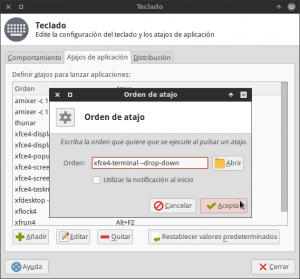
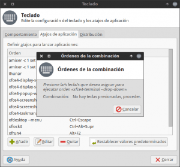
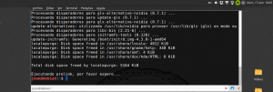
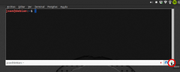
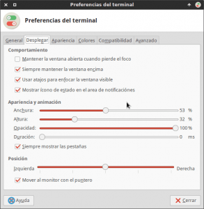

Si queremos disponer en todo momento de una terminal desplegable, en XFCE lo podemos realizar de forma muy fácil, porque a partir de la versión 0.6.0 de la [terminal de XFCE](http://docs.xfce.org/apps/terminal/start "Instrucciones de uso y configuración de la terminal de XFCE"), está característica viene incorporada de serie. Por lo tanto si usamos un entorno de escritorio XFCE actual no hace falta instalar software adicional como por ejemplo Yakuake, Guake, Tilda, etc.<!--more-->

## VENTAJAS DE DISPONER DE UNA TERMINAL DESPLEGABLE

El hecho de poder disponer de una terminal desplegable puede suponer una serie de ventajas. Algunas de las ventajas que me vienen en la cabeza son las siguientes:

1. **En cualquier momento tendremos una terminal disponible** en nuestra área de trabajo ya que aparecerá simplemente presionando una tecla.
2. Una vez arrancada **la terminal quedará residente en nuestra memoria RAM**. **Por lo tanto** siempre tendremos una terminal disponible de forma inmediata y **su carga será inmediata**.
3. **Usando una tecla para abrir la terminal conseguiremos abrirla de forma más rápida** y más cómoda. Bajo mi punto de vista la mejor forma de hacer las cosas de forma rápida y eficiente en un ordenador es mediante atajos de teclado.

## CONFIGURAR EL ATAJO DE TECLADO PARA ABRIR LA TERMINAL

La terminal desplegable está directamente implementada en la terminal de XFCE. Por lo tanto lo único que tenemos que realizar para usar eficazmente y cómodamente la terminal desplegable es asignar un atajo de teclado para poderla activar y desactivar. Para ello el primero paso es **ejecutar el siguiente comando en la terminal**:

> ```
> xfce4-keyboard-settings
> ```

Una vez ejecutado el comando aparecerá la siguiente ventana:

[](images/Pestaña-de-atajos-de-teclado.png)

Tal y como se puede ver en la captura de pantalla **presionamos encima de la pestaña Atajos de Aplicación**. Seguidamente **presionamos el botón Añadir**. Después de presionar añadir aparecerá la siguiente ventana:

[](images/Orden-a-ejecutar-con-el-atajo-de-teclado.png)

Tal y como puede verse en la captura de pantalla, tenemos que introducir el comando que queremos que se ejecute cuando presionaremos la combinación de teclas que seleccionaremos posteriormente. En nuestro caso el comando a introducir corresponde al comando para activar y desactivar la terminal desplegable. Por lo tanto **introduciremos el siguiente comando:**

> ```
> xfce4-terminal --drop-down
> ```

Una vez introducido el comando **presionamos el botón Aceptar**. Después de presionar el botón Aceptar aparecerá la siguiente pantalla:

[](images/Asignar-teclas-para-abrir-la-terminal-desplegable.png)

En estos momentos lo único que tenemos que realizar es **presionar la tecla o la combinación de teclas que deseamos para que se abra y cierra la terminal desplegable. En mi caso** he seleccionado la tecla **F12**.

## EXPLICACIÓN DE COMO USAR LA TERMINAL DESPLEGABLE

Una vez configurado el atajo de teclado, tal y como se puede ver en la captura de pantalla, lo único que tenemos que hacer es **presionar F12 y la terminal desplegable se abrirá**.

[](images/BORRAR-Terminal-desplegable-en-XFCE.png)

Una vez desplegada la terminal **la podemos volver a ocultar** simplemente **presionando de nuevo la tecla F12**.

**En el caso que queramos cerrar por completo la terminal tenemos varias opciones** para realizarlo. Algunas de ellas son las siguientes:

1. **Ejecutando el comando exit** en la terminal.
2. **Cerrando la totalidad de pestañas** de la terminal desplegable.
3. Clicando con le botón derecho del mouse encima del icono de la terminal del panel de XFCE y **clicando sobre la opción cerrar ventana.**
4. **Presionando** la combinación de teclas **Mayús + Ctrl + Q**.

## CONFIGURAR EL ASPECTO DE LA TERMINAL DESPLEGABLE

Obviamente podemos modificar el aspecto y el comportamiento de la terminal desplegable. Para ello, tal y como se puede ver en la captura de pantalla, **una vez abierta la terminal** desplegable **tenemos que clicar encima del icono de configuración**.

[](images/Abrir-configuración-de-la-terminal-desplegable.png)

Una vez hayamos clicado encima del icono de configuración **aparecerá la siguiente ventana**:

[](images/Configuración-de-la-terminal-desplegable.png)

**En esta ventana podremos configurar diversos aspectos como por ejemplo los siguientes**:

1. **Modificar la altura, anchura y posición de la terminal**. Para ello debemos configurar las opciones **Anchura, Altura y Posición**.
2. **Definir la transparencia que queramos que tenga la terminal**. Para ello debemos modificar la opción **Opacidad**.
3. **Definir si queremos que se visualicen la totalidad de pestañas** abiertas mediante la configuración de la opción **Siempre mostrar las pestañas**.
4. **Definir si queremos que aparezca el icono de la terminal desplegable en el panel de** XFCE tildando o destildando la opción **Mostrar icono de estado en el área de notificaciones**.
5. **Indicar la velocidad de animación** en la que queremos que se despliegue la terminal configurando el campo **Duración**.
6. **Hacer que la terminal siga visible aunque no este seleccionada o abramos otra aplicación**. Para ello deberemos tildar la opción **Mantener la ventana abierta cuando se pierda el foco**.
7. **Hacer que la terminal siempre sea la ventana que está en un nivel superior** y que por lo tanto siempre sea visible. Para ello tenemos tildar la opción **Siempre mantener la ventana encima**.

Además si consultamos las otras pestañas de la ventana de configuración podremos configurar otros aspectos como por ejemplo el tipo de letra, los colores, el tamaño de la letra, etc.

## USAR LA TERMINAL DE XFCE EN OTROS ENTORNOS DE ESCRITORIO

Si no utilizan XFCE y quieren aplicar la misma solución detallada en este post es tan fácil como instalar la terminal de xfce en vuestra distribución.

> ```
> sudo apt-get install xfce4-terminal
> ```

Una vez instalada la terminal de XFCE, lo único que tendrán hacer es seguir los pasos que acabo de detallar en este post. En el caso de usar un entorno de escritorio diferente a XFCE, el proceso de asignación del atajo de teclado será diferente y tendrán que buscar información en Google para realizar este paso.
