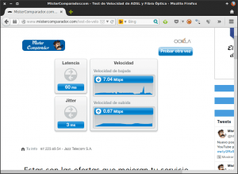
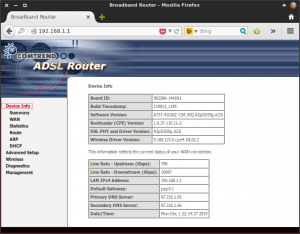
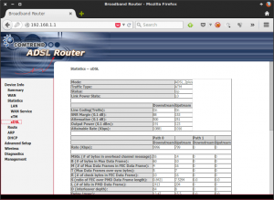

**Muchas personas** estoy seguro que en determinadas ocasiones **se hacen la pregunta de si su operador de Internet les está ofreciendo un servicio decente y un servicio ajustado al que están ofertando**. **Por este motivo me he decidido a escribir este post en el que detallaremos una metodología para poder realizar un test adsl de nuestra conexión a Internet.**<!--more-->

Para realizar el test adsl que se detalla en los siguientes apartados de este post, es estrictamente necesario que solo este conectado a Internet el dispositivo con el que haremos las pruebas. Además se aconseja que esté dispositivo este conectado a Internet vía Cable. En el caso de realizar las pruebas conectados vía Wifi aseguraos que la señal que llega a nuestro dispositivo sea óptima.

## REALIZAR UN TEST DE VELOCIDAD ONLINE

La primera parte del test adsl es un simple test de velocidad. Para realizar el test de velocidad puedes visitar la siguiente página web:

[**Test de Velocidad Online**](https://www.mistercomparador.com/test-velocidad/ "Link para realizar un test de velocidad")

Después de clicar el link se abrirá el navegador web de vuestro ordenador y se accederá a una página web para poder realizar el test de velocidad. Tal y como se puede ver en la siguiente captura de pantalla, para empezar con el test tenemos que **presionar el botón** ****Iniciar****:

Una vez presionado el botón hay que esperar unos segundos para que se realice el test. Una vez realizado obtendréis unos resultados parecidos a los siguientes:

### Velocidad de bajada:

**La velocidad de bajada obtenida en mi caso es de** **7 Mbps**. La velocidad que tengo contratada con mi operador de Internet es de 10 Mbps. Por lo tanto la velocidad de bajada real es 3 megas inferior a la velocidad contratada. Personalmente en mi caso estoy tranquilo ya que estoy obteniendo un 70% de mi velocidad contratada. El valor del 70% no es malo ya que tenemos que tener en cuenta que los operadores de Internet en España que venden ADSL están ofertando velocidades brutas y no netas. Por lo tanto a la velocidad bruta o contratada hay que restarle entre un 12 y un 15% de la velocidad que es la que se comen los diferentes protocoles de datos como por ejemplo PPPoE, PPPoA y TCP/IP.

**Para valorar la velocidad de bajada obtenida pueden utilizar la siguiente guía:**

 
| **% Sobre la velocidad contratada** | **Valoración** |
| --- | --- |
| 90-100 % | Es prácticamente **imposible obtener estos valores en la actualidad en lineas ADSL**. Si obtenemos estos valores no tenemos que preocuparnos. |
| 80-90 % | Es un **excelente resultado** y tenemos que estar más que satisfechos. |
| 60-80 % | Son **valores** que a priori son **normales** y por lo tanto no tenemos que preocuparnos. |
| Inferior al 60 % | Aconsejaría **realizar algún tipo de acción** para solucionar está situación. |

###### Nota: La velocidad de bajada es la velocidad máxima que podemos llegar a tener al descargar una canción, un película o una foto desde internet a nuestro ordenador. La mayoría de veces no alcanzaremos esta velocidad porqué el servidor del cual nos descargamos el contenido tiene una limitación del ancho de banda que ofrece a los clientes que se conectan.

### Velocidad de subida:

En mi caso la velocidad de subida contratada es 1Mbps. **La velocidad de subida real es de** **0,67 Mbps** y por lo tanto, al igual que en el caso anterior, estoy obteniendo un 70% de la velocidad de subida contratada. Por lo tanto por el mismo razonamiento realizado con la velocidad de bajada no debería preocuparme por los resultados obtenidos en el test de velocidad de subida.

###### Nota: La velocidad de subida es la velocidad que tendremos al subir contenido de nuestro ordenador a Internet. Por lo tanto a mayor velocidad de subida, más rápidamente podremos subir contenido Dropbox, colgar fotos en Facebook, enviar mails con archivos adjuntos grandes, etc.

### Ping o tiempo de latencia:

**El valor obtenido en mi caso es de 60ms**. Este valor entra dentro de la normalidad y por lo tanto no tengo que preocuparme en exceso. **Para valorar el ping  obtenido se puede usar la siguiente guía**:

 
| **Ping obtenido** | **Valoración** |
| --- | --- |
| 40-90 ms | Son **valores normales**. No hay que preocuparse. |
| 90-200 ms | **Es posible que haya un problema**. Pero obtener valores de 90 a 200 ms no quiere decir que el servicio del operador sea malo ya que el ping depende de múltiples factores como por ejemplo el estado de la linea, la ubicación del servidor al que nos conectamos para realizar el test, etc. Por lo tanto antes de tomar acciones se recomienda hacer pruebas de ping durante varios días, y probar con distintos tipos de test de velocidad que encontrarán en Internet. |
| Superior a 200ms | **Son valores muy altos**. Es más que posible que tengamos un problema y tendemos que comunicarlo a nuestro proveedor de Internet. |

###### Nota: El Ping es el tiempo que tarda una señal o paquete de datos en viajar desde nuestro ordenador a un servidor ubicado en Internet, y desde el servidor ubicado en Internet a nuestro ordenador.

### Jitter:

**En mi caso la medida de Jitter es de 3ms**. Por lo tanto puedo estar tranquilo ya que en principio 3 ms es un valor que entra dentro de la normalidad. **Para valorar el resultado de Jitter pueden usar la siguiente tabla comparativa**:

 
| **Jitter obtenido** | **Valoración** |
| --- | --- |
| Inferior a 10 ms | Es un valor **Excelente** |
| Entre 10 y 20 ms | Son **buenos valores** que no deberían proporcionar ninguna anomalía. |
| Entre 20 y 50 ms | Se consideran valores que están dentro de un rango que se considera **Aceptable**. |
| Mayor de 50 ms | Si obtenemos valores de Jitter por encima de 50 ms tenemos que **empezar a preocuparnos** y comunicarlo a nuestro operador de Internet. |

###### Nota: El Jitter es un valor que indica la variabilidad entres sucesivas mediciones de ping. Por lo tanto en el hipotético caso que obtuviéramos un Jitter de cero ms significaría que las mediciones de ping siempre nos darían el mismo valor.

**Si Los valores obtenidos hasta el momento son normales, en principio podemos estar tranquilos** y no hace falta profundizar mucho más. En el el caso que los valores obtenidos no sean buenos o quieran indagar un poco más, pueden seguir analizando los parámetros que mostraremos a continuación.

###### Nota: Los resultados obtenidos en este apartado por medio de los test de velocidad deben ser tomados como orientativos. Existen muchas variables que pueden hacer que el valor obtenido en estos tests no sea del todo real como, por ejemplo, la carga de los servidores con los que estamos realizando el test de velocidad, la ubicación geográfica de los servidores con los que realizamos el test, etc.

## VELOCIDAD DE SINCRONIZACIÓN

La segunda parte de nuestro test adsl consiste en analizar la velocidad de sincronización.

La velocidad de sincronización es la velocidad con la que nuestro Router se sincroniza con la central que nos provee servicio de Internet.

Para averiguar nuestra velocidad de sincronización tenemos que acceder a la configuración de nuestro Router. Para ello **abrimos nuestro navegador y en la barra de direcciones tecleamos la puerta de entrada de nuestro Router**, que en la mayoría de casos será ****192.168.1.1****. **Presionamos** ****Enter**** y seguidamente tendremos que **introducir nuestro nombre de usuario y contraseña**. Después de introducir nuestro usuario y contraseña ya estaremos dentro de la configuración de nuestro Router.

Una vez dentro de la configuración de nuestro Router tendremos que **navegar dentro de las distintos menús existentes hasta encontrar las propiedades** ****Line Rate Upstream y Line Rate Downstream**, que es donde se indicará la velocidad de sincronización** de subida y la velocidad de sincronización de bajada.

Tal y como se puede ver en la captura de pantalla, si disponen de un router Comtrend AR-5387un, tendrán que clicar encima del apartado ****Device Info****. Seguidamente nos aparecerán los valores de nuestra velocidad de sincronización.

###### Nota: Cada modelo de Router tiene su propia interfaz web. Por lo tanto es posible que en vuestro caso la velocidad de sincronización se halle en menú diferente a ****Device Info****. Tan solo tienen que buscar un poco y lo encontrarán fácilmente.

**Tal y como se puede ver en la captura de pantalla, la velocidad de sincronización de bajada en mi caso es de 10 Mb, y la de subida es de 0,8 Mb**. Por lo tanto no me puedo quejar en absoluto ya que la velocidad de sincronización es prácticamente la misma velocidad que la que tengo contratada.

La velocidad de sincronización que acabamos de ver no será una velocidad fija, ya que cada vez que apagamos y encendamos el router variará debido al proceso que utiliza el Router para sincronizar con la central.

En este apartado es difícil valorar qué velocidad de sincronización es aceptable y cuál no es aceptable, porqué la velocidad de sincronización que obtengamos estará fuertemente influenciada por la distancia de nuestro domicilio a la central que nos provee de Internet. Como en mi caso estoy solo a 900 metros de la central, los valores obtenidos son buenos. Factores secundarios que pueden influir en la velocidad de sincronización son la temperatura, el modelo de Router, etc.

Como guía indicativa podemos usar las siguientes tablas para realizar una valoración muy superficial.

**En el caso que dispongamos de una conexión ADSL2+ podemos usar los siguientes valores de referencia**:

 
|   **Distancia a la central**   |   **Velocidad de sincronización**   |
| --- | --- |
|   0.9 Km   |   24 Mb   |
|   1.3 Km   |   24 Mb   |
|   1.6 Km   |   23 Mb   |
|   1.8 Km   |   21 Mb   |
|   2.2 Km   |   16 Mb   |
|   2.4 Km   |   14 Mb   |
|   2.6 Km   |   12 Mb   |
|   2.9 Km   |   10 Mb   |
|   3.2 Km   |   8 Mb   |
|   3.5 Km   |   6 Mb   |
|   4.1 Km   |   4 Mb   |
|   5.0 Km   |   2 Mb   |

###### Nota: En el caso de vivir en España podéis tener una idea aproximada de la distancia de la central a nuestra domicilio accediendo al siguiente [link](http://www.adslnet.es/distancia-adsl.html "Distancia ADSL entre domicilio y la central").

**Quien disponga de una conexión ADSL del tipo ADSL2:**

 
| **Distancia a la central** | **Velocidad de Sincronización** |
| --- | --- |
| 0.9 Km | 12 Mb |
| 1.3 Km | 12 Mb |
| 1.6 Km | 11 Mb |
| 1.8 Km | 11 Mb |
| 2.2 Km | 10 Mb |
| 2.4 Km | 10 Mb |
| 2.6 Km | 9 Mb |
| 2.9 Km | 9 Mb |
| 3.2 Km | 8 Mb |
| 3.5 Km | 6 Mb |
| 4.1 Km | 4 Mb |
| 5 Km | 2 Mb |

###### Nota: En el caso de vivir en España podéis tener una idea aproximada de la distancia de la central a nuestro domicilio accediendo al siguiente [link](http://www.adslnet.es/distancia-adsl.html "Distancia ADSL entre domicilio y la central").

**Quien disponga de una conexión ADSL del tipo ADSL,** las velocidades de sincronización esperadas son las siguientes:

 
| **Distancia a la central** | **Velocidad de Sincronización** |
| --- | --- |
| 0.9 Km | 8 Mb |
| 1.3 Km | 8 Mb |
| 1.6 Km | 8 Mb |
| 1.8 Km | 8 Mb |
| 2.2 Km | 8 Mb |
| 2.4 Km | 8 Mb |
| 2.6 Km | 7 Mb |
| 2.9 Km | 7 Mb |
| 3.2 Km | 7 Mb |
| 3.5 Km | 6 Mb |
| 4.1 Km | 4 Mb |
| 5 Km | 2 Mb |

###### Nota: En el caso de vivir en España podéis tener una idea aproximada de la distancia de la central a nuestro domicilio accediendo al siguiente [link](http://www.adslnet.es/distancia-adsl.html "Distancia ADSL entre domicilio y la central").

**Quien disponga de una conexión ADSL del tipo VDSL2, las velocidades de sincronización esperadas son las siguientes**:

 
| **Distancia a la central** | **Velocidad de Sincronización** |
| --- | --- |
| 0 Km | 100 Mb |
| 0.15 Km | 65 Mb |
| 0.3 Km | 54 Mb |
| 0.61 Km | 38 Mb |
| 1 Km | 30 Mb |
| 1.5 Km | 15 Mb |
| 2 Km | 10 Mb |
| 2.6 Km | 8 Mb |
| 3 Km | 6 Mb |
| 4 Km | 3 Mb |
| 5 Km | 1 Mb |

###### Nota: En el caso de vivir en España podéis tener una idea aproximada de la distancia de la central a nuestro domicilio accediendo al siguiente [link](http://www.adslnet.es/distancia-adsl.html "Distancia ADSL entre domicilio y la central").

## ANÁLISIS DE LA ATENUACIÓN

La tercera parte del test adsl será analizar la atenuación de nuestra conexión a Internet.

Explicado de forma sencilla, la atenuación no es nada más que un valor que nos indica la diferencia entre la potencia emitida por la central que nos provee de servicio de Internet y la potencia recibida en nuestro hogar. Por lo tanto cuanto, más baja sea la diferencia entre la potencia emitida y la potencia recibida, mejor será nuestra conexión a Internet.

Para averiguar nuestra atenuación tenemos que acceder a la configuración de nuestro Router. Para ello **abrimos nuestro navegador y en la barra de direcciones tecleamos la puerta de entrada de nuestro Router**, que en la mayoría de casos será ****192.168.1.1****. **Presionamos** ****Enter**** y seguidamente tendremos que **introducir nuestro nombre de usuario y contraseña**. Después de introducir nuestro usuario y contraseña ya estaremos dentro de la configuración de nuestro Router.

Una vez dentro de la configuración de nuestro Router, tendremos que **navegar dentro de las distintos menús existentes hasta encontrar la propiedad** ****Attenuation (line attenuation o ATTEN)**** **que es donde se indicará la atenuación de nuestra nuestra conexión a Internet.**

Tal y como se puede ver en la captura de pantalla, si disponen de un router Comtrend AR-5387un, tendrán que ir en el apartado Device Info, seguidamente presionaremos sobre ****Statics**** y finalmente sobre el subapartado ****xDSL****. Después de esto, tal y como se puede ver en la captura de pantalla, veremos nuestros valores de atenuación.

###### Nota:  Cada modelo de Router tiene su propia interfaz web. Por lo tanto es más que posible que en vuestro caso los valores de atenuación no se encuentren en ****Device Info/Statics/xDSL****. Tan solo tienes que investigar un poco y seguro que encontrarás los valores que buscas en otros apartados.

**En mi caso, la atenuación de bajada es de 50 dB mientras que la atenuación de subida es de 25,1 dB. Para evaluar los valores que acabo de obtener podemos usar la siguiente guía:**

 
| **Velocidad de nuestra conexión** | **Valores de Atenuación recomendados** |
| --- | --- |
| Para 512 Kbps (media mega) | Inferior a 55 dB |
| Entre 1024 Kbps y 6144 kbs | Inferior a 41 dB |
| Entre 6144 Kbps y 20480 kbps | Inferior a 30 dB |
| Más de 20480 kbps (20 megas) | Inferior a 20 dB |

**En mi caso tengo una linea de 10 Megas. Por lo tanto los valores de atenuación obtenidos son bastante altos** ya que los valores de atenuación que debería obtener deberían ser inferiores a 30 dB.

Es posible que el motivo de que los resultados no sean del todo satisfactorios sean los siguientes:

1. La central que provee de Internet a mi domicilio está lejos. Normalmente por cada Kilometro de distancia respecto la central, la atenuación incrementa 10 dB. Diría que este no es mi caso porque parece ser que la central está a 900 metros de mi casa.
2. Es posible que la instalación interior de mi domicilio pueda tener algún tipo de problema. Podría ser que alguno de los microfiltros estuviera en mal estado, que el cableado de cobre tuviera algún desperfecto, que la caja PTR tuviera algún tipo de problema o simplemente que el empalme/puente realizado para disponer de 2 cajas PTR estuviera generando esta atenuación.
3. Es posible que el cableado telefónico que nos proporciona la conexión de Internet desde la central a nuestra vivienda esté en mal estado. Aunque diría que este no es el caso porqué la velocidad de sincronización que tengo es buena.
4. También hay que tener en cuenta que vivo en un pueblo pequeño y lejos de cualquier ciudad grande con infraestructuras de gran envergadura. Por lo tanto este puede ser un motivo por el cual el servicio de Internet de mi pueblo no sea excelente y a veces presente inestabilidades.
5. Las pruebas realizadas para escribir esté artículo las he realizado conectado vía wifi. Sería interesante medir y comprar los resultados estando conectado vía cable directamente al PTR de mi casa.

A pesar de estos valores puedo afirmar por experiencia que en mi caso mi conexión a Internet es estable y fiable. Por lo tanto en mi caso no me preocupo por los valores obtenidos.

## ANÁLISIS DEL RUIDO

Para finalizar nuestro test adsl analizaremos un parámetro llamado ruido. El ruido lo podemos definir como la diferencia existente entre la potencia de la señal que llega a nuestro hogar y la potencia de ruido que corrompe la señal que llega a nuestro hogar. El ruido que perturba la señal que llega a nuestro domicilio puede tener diversas fuentes como, por ejemplo, perturbaciones eléctricas creadas por electrodomésticos u otros aparatos, el mal estado de la instalación interior de nuestra vivienda, el mal estado del alguno de los microfiltros, el mal estado de alguno de los empalmes de nuestra instalación, etc.

Para averiguar nuestro ruido tenemos que acceder a la configuración de nuestro Router. Para ello **abrimos nuestro navegador y en la barra de direcciones tecleamos la puerta de entrada de nuestro Router**, que en la mayoría de casos será ****192.168.1.1****. **Presionamos** ****Enter**** y seguidamente tendremos que **introducir nuestro nombre de usuario y contraseña**. Después de introducir nuestro usuario y contraseña ya estaremos dentro de la configuración de nuestro Router.

Una vez dentro de la configuración de nuestro Router tendremos que **navegar dentro de las distintos menús existentes hasta encontrar la propiedad** ****SNR Margin (Margin, SN Margin o SNT)**** que es donde se indicará el ruido de nuestra nuestra conexión a Internet.

Tal y como se puede ver en la captura de pantalla, si disponen de un router Comtrend AR-5387un, tendrán que ir en el apartado ****Device Info****, seguidamente presionaremos sobre ****Statics**** y finalmente sobre el subapartado ****xDSL****. Después de esto, tal y como se puede ver en la captura de pantalla veremos nuestros valores de ruido de nuestra conexión a Internet.

###### Nota: Cada modelo de Router tiene su propia interfaz web. Por lo tanto es más que posible que en vuestro caso los valores de ruido no se encuentren en ****Device Info/Statics/xDSL****. Tan solo tienen que investigar un poco y seguro que encontrarán los valores que buscan en otros apartados.

**En mi caso, el ruido, en lo que a velocidad de bajada se refiere es de** **8,8 dB,** **mientras que el ruido en lo que ha velocidad de subida se refiere es de 15,3 dB. Para evaluar los valores que acabo de obtener podemos usar la siguiente guía:**

 
| **Valores de ruido** | **Valoración** |
| --- | --- |
| Inferior a 6 dB | **El valor obtenido es malo**. Es lo más probable es que esto genere inestabilidad y deficiencias en nuestra conexión |
| Entre 7 dB y 10 dB | **Estos valores no son óptimos** y es posible que pueda aparecer algún tipo de inestabilidad en nuestra conexión como por ejemplo cortes. |
| Entre 11 dB y 20 dB | Estos valores son **óptimos**. |
| Más de 20 dB | Valores de Ruido superiores a 20 dB son **excelentes**. |

**En mi caso los valores de ruido obtenidos no son óptimos ya que el ruido de bajada no llega a alcanzar los 11 dB**. Los posibles motivos para obtener estos resultados los he detallado en el principio de este apartado.

###### Nota: En días posteriores a la medición realizada para escribir este post mis valores de ruido tenían valores normales.

## ACCIONES SI OBTENEMOS MALOS RESULTADOS EN EL TEST ADSL

En el caso que los resultados obtenidos en el test adsl presenten alguna anomalía importante, lo que debemos hacer es **informar a la compañía que nos proporciona servicio de Internet para intentar buscar una solución**. **En el caso de no encontrar ninguna solución no nos queda más que aguantarnos y cruzar los dedos para que no tengamos firmado un tiempo de permanencia** mínimo con ellos. En el caso de no tener firmado un tiempo de permanencia lo más recomendable seria buscar un nuevo proveedor de Internet.

Desafortunadamente la ley española, a día de hoy, no obliga a ninguna de las compañías a proporcionarnos unas condiciones de servicio mínimas. Simplemente están obligadas a informar al usuario que la velocidad contratada puede ser inferior a la anunciada.
