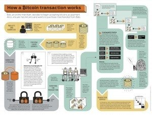
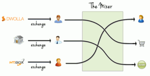

Seguidamente les comento una serie de aspectos básicos sobre el bitcoin. Una vez comentados los aspectos básicos espero que todo el mundo sea capaz de entender que es bitcoin, los riesgos y beneficios que conlleva, y que sean capaces de conseguir bitcoin y usarlos con total seguridad. Así que empecemos con la explicación.<!--more-->

## ¿QUÉ ES UN BITCOIN?

**Un Bitcoin es una moneda virtual**. Pero para entender entender más acerca de lo que es la moneda virtual y de las características de un bitcoin lo primero que tenemos que hacer es saber lo que es el dinero.

El dinero es una invención de los humanos para el mero intercambio de productos. Así por lo tanto si una persona quiere un producto X, intercambiará una determinada cantidad de dinero para obtener el producto X. A cambio la persona que ha cedido el producto X recibirá una cantidad de dinero que podrá usar a posteriori para intercambiarlo por otro producto que podemos denominar Y.

En el pasado este medio de intercambio, que podemos denominar dinero, eran metales preciosos como oro, plata, cobre, etc. Actualmente este medio de intercambio son los típicos monedas y billetes.

Una de las características básicas del dinero actual, las monedas y los billetes, es que solo pueden ser emitidos y aprobados por el gobierno de un país. Por lo tanto los gobiernos actuales son quienes tienen el control total sobre el dinero y sobre la economía mundial.

Pero resulta que hace pocos años, concretamente el 3 de Enero de 2009, apareció un programador o un grupo de programadores que se dan a conocer con el seudónimo de Satoshi Nakamoto. Este señor o grupo de señores han creado **un sistema o software informático que intercambia códigos entre distintos usuarios. Cada uno de estos códigos informáticos que intercambiamos tiene un valor y es lo que conocemos como bitcoin o moneda virtual** y en definitiva es lo que usaremos para realizar el intercambio entre comprador y vendedor. Así por ejemplo nosotros ofreceremos al vendedor una serie de códigos informáticos al vendedor que tienen un determinado valor y el vendedor nos entregará un producto o servicio.

###### Nota: Para quien quiera conocer un poco más sobre Satoshi Nakamoto puede consultar el siguiente [link](https://en.wikipedia.org/wiki/Satoshi_Nakamoto "Quien es Satoshi Nakamoto").

###### Nota: Para quien quiera ver el tipo de cambio del bitcoin y otro tipo de datos relaciones puede consultar el siguiente [enlace](https://blockchain.info/es/charts "Gráficos de Bitcoin"). http://blockchain.info/es/charts

## DESCRIPCIÓN PASO A PASO DEL PAGO VÍA BITCOIN

Para entender bien lo que acabo de citar lo mejor que podemos hacer es poner un ejemplo que sea didáctico y fácil de comprender.

**1-** Imaginamos que nosotros como usuarios **descargamos un programa informático llamado monedero**, como por ejemplo [Bitcoin Qt](https://bitcoin.org/es/descargar "Link de descarga de Bitcoin QT") (Ordenador) o [Bitcoin Wallet](https://play.google.com/store/apps/details?id=de.schildbach.wallet "Link descarga Bitcoin Wallet (Android)") (Dispositivo móvil), en nuestro ordenador o dispositivo móvil y lo instalamos. **Una vez instalado el monedero tenderemos un Identificador público**, o clave pública que puede ser a modo de ejemplo **marcbitcoin**. En el momento de crear el monedero también se creará un archivo wallet.zip que es donde guardará el historial de nuestras transacciones y nuestros bitcoin.

###### Nota: Para ver los distintos tipos de monederos existentes pueden consultar el siguiente [enlace](https://bitcoin.org/es/elige-tu-monedero "Tipos de monedero existentes"). Una vez instalado el monedero deberemos esperar aproximadamente unas 24 horas para poder usar nuestra cartera. Durante el tiempo de espera se estará descargando la cadena de bloques de los distintos nodos de la red.

###### Nota: En realidad el identificador o clave publica no será marcbitcoin. En realizad será una clave alfanumérica de 34 dígitos como por ejemplo 35sDtU6Rdqeeg3HvREereww1E. No hay ningún problema en hacer público nuestro identificador público. De hecho sin dar a conocer nuestro identificador público no se podrá hacer ninguna transacción.

**2-** Ahora imaginamos que otra persona que se llama joan también ha instalado este mismo programa monedero en su ordenador y su identificador público único es **joanbitcoin**.

**3-** **Dentro de su monedero**, o programa informático, **tanto Joan como Marc tienen una serie de códigos informáticos**. Cada uno de estos códigos tiene asignado un valor determinado de bitcoin.

**4-** Supongamos ahora que **Joan quiere comprar un coche que tiene Marc** y Marc acepta bitcoin como medio de pago.

**5-** Marc y Joan se ponen en contacto y llegan al siguiente acuerdo. Marc acepta vender el coche por 50.000 Euros y a día de hoy 1 Euro equivale a 1000 bitcoin. Por lo tanto Joan deberá ingresar 50 bitcoin al monedero de Marc y entonces Marc dará el coche a Joan.

**6-** **Joan** se irá a su casa, encenderá su ordenador y **abrirá su monedero de bitcoin**. **Seleccionará una serie de códigos informáticos** cuyo valor sume 50 bitcoin. Una vez seleccionados los códigos **los enviará a Marc** usando el identificador público de Marc que como hemos dicho anteriormente es es marcbitcoin.

**7-****Justo después de que Joan haya enviado los bitcoin a Marc se iniciará un proceso de verificaciones y comprobaciones para comprobar que la transacción es válida**. Sin entrar en tecnicismos las comprobaciones que se realizarán son las siguientes:

- \- De la misma forma que tenemos un identificador público (o clave pública) también disponemos de un identificador privado (o clave privada) que no debemos revelar a nadie.
- \- Joan envía la transacción de dinero a Marc. Antes de realizar la transacción Joan, usando su clave privada, introducirá una firma digital al mensaje que envía a Marc.
- \- El mensaje se difundirá por la red. Mientras el mensaje se difunde por la red los equipos de mineros comprueban que la transacción es correcta usando la firma pública de Joan. Los mineros a cambio del servicio que dan recibirán ingresos en forma de bitcoin. Los ingresos que reciben los mineros para realizar esta función son mínimos.
- \- Aparte de la verificación que acabamos de comentar existen verificaciones adicionales para evitar que los usuarios puedan gastar dinero del que no disponen, y también para evitar que las personas puedan replicar moneda y usar la misma moneda en más de una transacción.

**8-** **Marc** en su casa, después de que se hayan realizado la serie de comprobaciones y verificaciones que acabamos de mencionar, **recibirá los códigos que Joan le ha enviado. Una vez recibidos los códigos Marc procederá a entregar el coche a Joan.**

En la siguiente figura se puede ver de forma esquematizada y ampliada la información que acabamos de explicar:

## UTILIDAD DE LOS BITCOIN A DÍA DE HOY

A día de hoy **la utilidad del bitcoin como moneda es prácticamente nula** ya que la sociedad actual de momento no ha asumido el bitcoin como moneda o medio de intercambio. Es decir en otras palabras la sociedad actual no acepta el bitcoin como un medio de intercambio para conseguir algún producto o servicio.

###### Nota: Es poco frecuente que personas o sociedades que acepten el bitcoin como medio de intercambio. Algunos casos a destacar podrían ser los supermercados [7Eleven](https://www.7-eleven.com/ "Web de 7-eleven"), [Walmart](http://www.walmart.com/ "Web de Walmart"), [Starbucks](http://www.starbucks.com/ "Web de starbucks") o la [librería Gandhi](http://www.gandhi.com.mx/ "Web de libreria gandhi") entre otros.

**El principal uso del bitcoin a día de hoy es como producto especulativo**. La gente se dedica a comprar y a vender bitcoin para simplemente obtener un beneficio. Para entender esto pondremos un ejemplo que se podría haber dado perfectamente:

1. Estamos en el año 2010 y decido cambiar 100,000 Euros a bitcoin. En el 2010 el tipo de cambio era 1 a 1 y por lo tanto por 100,000 euros me habrían dado 100,000 bitcoin.
2. Guardamos los bitcoin durante 4 años. Estamos en 2014 y ahora vemos que el tipo de cambio en vez de ser de 1 a 1 es de uno a 1000 aproximadamente. Por lo tanto si ahora cambiará el dinero de bitcoin a Euro me tendrian que dar 100 millones de Euros.

###### Nota: El ejemplo que he puesto es simplemente para mostrar el uso principal que se le da hoy en día a los bitcoin. La operación descrita hoy en día no se podría llevar a termino porqué la cantidad de bitcoin a Euros que se puede intercambiar por día está limitada a una determinada cantidad para evitar el fraude y el desplome de valor de bitcoin.

Precisamente esta especulación lo que hace es que el valor del bitcoin sea muy variable y que de una semana para otra el valor del bitcoin se pueda duplicar o dividir por dos. Esta característica hace que la gente actualmente no esté adoptando el bitcoin como moneda ya que representa un riesgo muy elevado ya que sus ingresos o gastos pueden subir o bajar mucho en un periodo de tiempo muy corto. Para poner un ejemplo del riesgo que actualmente supone el bitcoin tan solo tenemos que imaginar lo que le podría pasar a Marc que acaba de vender su coche por 50 bitcoin. Si el valor del bitcoin se desploma de un día para otro, se puede decir literalmente que Marc habrá regalado su coche a Joan. Marc se estará tirando de los pelos mientras que Joan estará más que satisfecho con su compra.

**Otro uso que se le da al bitcoin es para comprar productos o servicios prohibidos**. Por ejemplo para contratar un asesino o para comprar productos ilegales como por ejemplo drogas. Para todos imagino que es conocido el caso **Silk Road**, en que multitud de usuarios podían adquirir todo tipo de productos ilegales como por ejemplo drogas. Para más información acerca de Silk Road pueden consultar el siguiente [enlace](https://es.wikipedia.org/wiki/Silk_Road "Información de lo que es Silk Road").

Otros usos alternativos que podemos dar al bitcoin son los siguientes:

1. Monetizar bitcoin directamente a un paraíso fiscal como por ejemplo suiza y de esta forma **intentar evadir impuestos**.
2. **Para enviar dinero a familiares que viven en otros países** ya que las tasas de transferencias son bajas.
3. **Para invertir nuestros ahorros en países con problemas graves de inflación**. De esta forma los ahorros que tenemos no perderían valor ya que el bitcoin es deflacionario.

## ALGUNAS CARACTERÍSTICAS DE LOS BITCOIN

Las Principales características del bitcoin son las que defino a continuación:

**1-** Bitcoin **no es una moneda completamente anónima** ya que todas las transacciones realizadas con bitcoin se almacenan de forma pública y permanente en la red. Por lo tanto podría darse el caso que la policía viera que la dirección pública **35sDtU6Rdqeeg3HvREereww1E** ha comprado un coche por 50 bitcoin. Se van al concesionario y bajo una orden judicial sacan los nombres de las personas que compraron un coche en este concesionario averiguando así la identidad de la persona que posee la cartera **35sDtU6Rdqeeg3HvREereww1E**. **Frente a esta situación lo que podemos hacer es**:

- **Usar varios monederos de bitcoin** para así disponer de múltiples identificadores públicos.
- **Anonimizar nuestra IP mediante herramientas como Tor**.

De esta forma nadie podrá recopilar nuestras transacciones. **Otra opción podría ser usar una servicio de cartera compartida** como [https://blockchain.info/es](https://blockchain.info/es "Servicio de cartera compartida")

Como se puede ver en la imagen, en el servicio de cartera compartida de [blockchain.info](https://blockchain.info/es "Servicio de blockchain") tenemos 3 usuarios. Los bitcoin de estos 3 usuarios en vez de ir directamente al destinatario final primero van a una cartera compartida. Después de la cartera compartida irán al usuario final enmascarando nuestra identificación pública **35sDtU6Rdqeeg3HvREereww1E**.

**2-** **Los costes de cada una de las transacciones son prácticamente nulos**. Este es uno de los puntos por los que hoy en día hay gente que utiliza este sistema para enviar dinero a familiares que viven en el extranjero.

**3-** Al contrario que los dolares, los Euros, o por ejemplo el Peso, el bitcoin **no está controlado por ningún gobierno ni por ningún organismo centralizado**. Por lo tanto si usas el bitcoin es fácil vulnerar la ley no declarando bienes que has adquirido mediante el intercambio de bitcoin. También cabe considerar que en el caso que adoptáramos el bitcoin como moneda nuestro gobierno perdería el control total sobre la economía.

**4-** Debido a la especulación que existe en la actualidad el valor del bitcoin **es altamente fluctuante**. Por lo tanto, como ya hemos visto, esto implica un riesgo elevado. A quién le guste realizar inversiones de riesgo sin duda el bitcoin es una buena opción.

**5-** **El número de bitcoin está limitado a 21 millones**. Los bitcoin se van generando progresivamente y van creciendo a un ritmo constante y suave. La previsión es que al ritmo actual en el año 2040 se hayan generado los 21 millones de bitcoin y cuando se hayan descubierto todos no se crearan más. Por lo tanto **el número de bitcoin es finito** **como lo son el oro y otros materiales preciosos**. Esta característica lo que hace es evitar la devaluación que tiene la moneda convencional. Con la moneda convencional lo más probable es que si a día de hoy ingresamos 100.000 Euros, y los guardamos en la banco indefinidamente, dentro de 40 o 50 años su valor será prácticamente nulo ya que el banco central se pondrá a imprimir moneda generando devaluación.

**6-** Acabamos de citar en el punto anterior que el número de bitcoin es limitado. Esta característica hace que podamos definir el bitcoin como **una moneda deflacionaria**. Cabe tener en cuenta que a medida que se van descubriendo más bitcoin su valor disminuye. Pero como contrapartida cuanta más gente quiera disponer de bitcoin para especular o para usarlos como si fuera moneda sube el valor. Cuando los bitcoin se agoten y no se puedan generar más, si la gente los usa lo que pasará es que irán incrementando su valor progresivamente porqué son escasos y la gente los necesita

**7-** **Las operaciones o pagos realizados con bitcoin no son reversibles**. Por lo tanto si compramos algún producto con bitcoin, únicamente la persona que ha recibido los Bitcoin podrá reembolsarlos si el quiere. Por lo tanto hay que ir con cuidado que los pagos y transacciones se realizan con personas o entidades de confianza.

**8-** **El valor del bitcoin se rige por la ley de la oferta y la demanda y no hay nadie que determine su valor**. El bitcoin tendrá el valor que está dispuesta a pagar la gente en cada momento.

## ¿EXISTEN OTRA MONEDAS SIMILARES A LOS BITCOIN?

La respuesta es que sí. Según la revista Forbes **como mínimo existen otras 29 monedas virtuales existentes similares al bitcon**. Estas monedas son las siguientes:

[Litecoin](https://litecoin.org/ "Web Lirecoin"), [Peercoin](http://www.peercoin.net/ "Web peercoin"), [Namecoin](http://namecoin.info/ "Web namecoin"), [Primecoin](http://primecoin.org/ "Web Primecoin"), [Feathercoin](https://www.feathercoin.com/ "Web feathercoin"), [Megacoin](http://www.megacoin.co.nz/ "Web Megacoin"), [Novacoin](http://novaco.in/ "Web Novacoin"), [ProtoShares](http://invictus.io/ "Web Protoshares"), [QuarkCoin](http://www.qrk.cc/es/ "Web Quarkcoin"), WorldCoin, [Infinitecoin](http://infiniteco.in/ "Web infinitecoin"), [Freicoin](http://freico.in/ "Web Freicoin"), [CryptogenicBullion](http://cryptogenicbullion.org/ "Web CruptogenicBullion"), [Tickets](https://github.com/LotteryTickets/LotteryTickets "Web tickets"), [BBQCoin](http://bbqcoinfoundation.org/ "Web BBQcoin"), [Terracoin](http://terracoin.org/ "Web Terracoin"), [Anoncoin](https://anoncoin.net/ "Web Anoncoin"), Ixcoin, [Devcoin](http://devcoin.org/ "Web Devcoin"), [Digitalcoin](http://digitalcoin.co/en/ "Web Digitalcoin"), [Mincoin](https://mincoin.io/ "Web Mincoin"), [GoldCoin](http://gldcoin.com/ "Web Goldcoin"), [Yacoin](http://www.yacoin.org/ "Web Yacoin"), [Copperlark](https://copperlark.com/ "Web Cooperlark"), [Zetacoin](https://github.com/zetacoin/zetacoin "Web Zetacoin"), [Fastcoin](http://www.fastcoin.ca/ "Web Fastcoin"), [TagCoin](https://bitcointalk.org/index.php?topic=317408 "Información de Tagcoin"), [I0Coin](http://i0coin.snel.it/ "Web i0coin"), [Luckycoin](https://cryptocointalk.com/forum/188-luckycoin-lky/ "Foro Luckycoin")

Para quien quiera consultar el valor real de cotización de la mayoría de las 29 monedas que acabo de mencionar pueden consultar los siguientes enlaces:

[http://coinmarketcap.com/](http://coinmarketcap.com/ "Ver cotización de las monedas criptográficas")

[http://www.coinwarz.com/cryptocurrency](http://www.coinwarz.com/cryptocurrency "Ver cotización de las monedas criptográficas")

[http://www.cryptocoincharts.info/](http://www.cryptocoincharts.info/ "Ver cotización de las monedas criptográficas")

A pesar de existir, como mínimo, 29 monedas similares al bitcoin podemos afirmar con rotundidad que **a día de hoy el Bitcoin es la moneda criptográfica más popular y podríamos afirmar que la segunda en popularidad es el Litecoin**. A pesar de que en estos momentos el Bitcoin sea la moneda más popular, esto puede cambiar en un breve periodo de tiempo, ya que muchas veces quien acaba imponiendo su hegemonía no es quien llega primero sino que es quien lo hace mejor.

## SEGURIDAD QUE OFRECE EL BITCOIN

**Bitcoin** en lo que a seguridad se refiere y a los mecanismos que implementa **podemos afirmar que es una moneda segura**. Es prácticamente imposible falsificar o duplicar bitcoin. **No obstante** cabe tener en cuenta las siguientes consideraciones:

El bitcoin **no ofrece las garantías que puede ofrecer la moneda que tenemos en la actualidad**. Por ejemplo en el caso que alguien nos robe nuestra tarjeta de crédito y la usen tenemos hasta 2 meses para ir a nuestro banco y denunciarlo. En el caso de comprobarse la veracidad de los hechos el banco nos devolverá el dinero. Con el bitcoin esta situación a día de hoy no se da. **Si te roban el dinero estas completamente indefenso y no podrás hacer nada al respecto.**

**El archivo .zip** que tenemos en nuestro ordenador es sumamente importante y **es de vital importancia no perderlo**. Además **hay que hacer copias de de seguridad de este archivo ya que es el que contiene todo nuestro dinero en forma de bitcoin**. Si no tenéis cuidado os puede pasar como el ciudadano galés James Howells que tiro al vertedero un disco duro que contenía 7500 bitcoin que a día de hoy equivalen a un valor de cerca de 6 millones de dólares.

[http://actualidad.rt.com/actualidad/view/112589-disco-bitcoins-uk-perdido-vertedero](http://actualidad.rt.com/actualidad/view/112589-disco-bitcoins-uk-perdido-vertedero "Disco duro que contiene 75 millones de Dolares") (_Si este señor tuviera una copia de seguridad ahora mismo no estaría mirando en los vertederos_)

###### Nota: Se recomienda guardar la copia de seguridad en varios sitios. Por ejemplo, en el correo electrónico, en la nube, en varios ordenadores, etc. Así conseguiremos minimizar el riesgo en caso de un gran desastre natural.

###### Nota: Para realizar una copia o respaldo de nuestro bitcoin también es posible realizar una copia en papel. Este papel recibe el nombre de cartera de papel. Una cartera de papel es un trozo de papel que imprimimos con nuestra impresora. La impresión contiene la clave privada de nuestra cartera de bitcoin en forma de código QR. Una vez impreso el papel lo podemos dar a una tercera persona y con su teléfono y una aplicación de bitcoin leerá el código QR del billete. A posteriori podrá retirar el contenido del billete. Este billete puede ir protegido por contraseña por lo que si alguien nos roba el billete o cartera y no sabe nuestra contraseña no podrá retirar el dinero.

**Es importante que los archivos donde almacenamos nuestros bitcoin no estén en manos de terceras personas**. Si alguien consiguiera apoderarse de nuestros archivos podría traspasar la totalidad de bitcoin de nuestra cartera a su cartera o simplemente gastar los bitcoin directamente de nuestra cartera. Por lo tanto **nuestros bitcoin tienen que ser almacenados de forma segura y tenemos que securizar bien nuestro ordenador** para evitar que hackers o determinados virus o malware puedan robar nuestros bitcoin.

**Hay que tener mucho cuidado que nadie nos robe el ordenador**. Como alguien nos robe el ordenador y sepa lo que es un bitcoin habremos perdido la totalidad de nuestro dinero. Frente a esta situación **es aconsejable cifrar el disco duro de nuestro ordenador** para evitar este problema. También **es muy altamente recomendable cifrar nuestra cartera de bitcoin haciendo que para acceder a ella se tenga que introducir una contraseña.**

También si investigan un poco verán que hay distintos tipos de cartera. Hasta el momento hemos hablado de carteras en nuestro ordenador personal y carteras de papel. Pero también **existen carteras de bitcoin en la nube** como por ejemplo [https://blockchain.info/es/](https://blockchain.info/es/ "Web que ofrece cartera en la nube"). **Hay que ir muy en cuenta en este tipo** **de carteras** y pienso que la mejor opción es guardar los bitcoin en nuestro ordenador personal. Las carteras de bitcoin son susceptibles de ataques y **un hacker preferiría atacar una de estas páginas en la nube antes que atacar nuestro ordenador** ya que podrá obtener más beneficio. De hecho ya hay varias de estas carteras que han sucumbido a ataques. Si queréis una prueba de ello tan solo tenéis que leer el siguiente [artículo](http://www.coindesk.com/czech-bitcoin-exchange-bitcash-cz-hacked-4000-user-wallets-emptied/ "Robo de carteras de bitcoin en la nube").

## ¿CÓMO PUEDO CONSEGUIR BITCOIN?

Una forma simple de conseguir bitcoin es **ir a un “market exchange” e intercambiar moneda tradicional por bitcoin**. Actualmente hay diversos market exchange pero siempre es recomendable acudir a sitios de confianza. **Algunos de los market exchange de confianza son los siguientes**:

1\. [bitcoin.de](https://www.bitcoin.de/es "Market Exchange bitcoin.de") : Portal de compra/venta de reciente creación. A pesar de esto este portal esta muy bien considerado. 2. [btc-e.com](https://btc-e.com/ "Market exchange btc-ecom") : Portal similar al primero que hemos visto. La única diferencia es que para poder comprar te obligan a tener una cuenta en [OK PAY](https://www.okpay.com/es/index.html "Servicio okpay"). En este portal se acostumbra a encontrar buenos precios de compra. 3. [localbitcoins.com](https://localbitcoins.com/es/ "Market exchange localbitcoins"): También es otro portal que tiene una reputación aceptable. Este portal acepta el pago por transferencia bancaria estándar. Además tiene la particularidad que **los contactos se establecen entre los usuarios del portal, y las transacciones se realizan entre usuarios sin la existencia de ningún intermediario**. Existen sistemas de seguridad para asegurar que la transacción se realice por ambas partes. 4. [mtgox.com](https://www.mtgox.com/ "market exhange mtgox"): Es el portal más conocido en lo que a compra de bitcoin se refiere. A pesar de incidencias recientes ([https://www.mtgox.com/press\_release\_20140207.html](https://www.mtgox.com/press_release_20140207.html "Problema de la maleabilidad del bitcoin")), en este portal tenéis la seguridad garantizada y encontraréis buenos precios de compra. Si quieren profundizar acerca del problema que tubo mtgox pueden consultar el siguiente [enlace](http://www.genbeta.com/actualidad/por-que-mtgox-y-bitstamp-tuvieron-que-restringir-la-retirada-de-dinero "Problema de maleabiliodad Bitcoin"). 5. [bitstamp.net](https://www.bitstamp.net/ "market exhange bitstamp.net"): Portal fiable e ideal para integrantes en la unión Europea y miembros de la SEPA (Single Euro Payments Area).

Todos **los market exchange mencionados son reconocidos, fiables** y algunos de ellos tienen licencia para operar banco. Para cambiar Euros por bitcoin lo primero que tenemos que hacer es **seleccionar una de las páginas**, y **comprobar que pueda operar en nuestra área** (España (SEPA), Sudamerica, Estados Unidos, etc.).

**Seguidamente tenemos que registrarnos aportando una serie de documentación** de acreditación como por ejemplo un permiso de residencia, DNI o pasaporte, etc.

Una vez registrados en la página tan solo tenemos que **coger dinero de nuestro banco y realizar una transferencia bancaria**, de por ejemplo 100 euros, **al banco de la página web** que hayamos seleccionado. **Una vez los 100 Euros están al banco de la página web podremos cambiarlos a bitcoin**. El número de bitcoin que nos darán dependerá exclusivamente del precio de mercado que tenga el bitcoin en el día que realizamos el cambio. Una vez adquiridos los bitcoin en nuestro monedero/ordenador tendremos una serie de códigos informáticos que en el día de hoy valdrán 100 Euros.

###### Nota: El tipo de cambio del bitcoin se rige por la ley de la oferta y la demanda y no hay nadie que determine su valor. Así por lo tanto los precios de compra serán distintos en cada uno de los portales a los que accedáis.

Otra forma de poder adquirir bitcoin **es encontrar a una persona que tenga bitcoin y los quiera vender**. Nosotros ingresamos dinero convencional en la cuenta bancaria del vendedor, y el vendedor mediante un programa informático nos enviará los bitcoin que equivalen al dinero que hemos ingresado. Para poder utilizar es método es aconsejable que uséis uno de los portales de los que he hablado anteriomente. El portal se llama [localbitcoins](https://localbitcoins.com/es/ "Cambiar bitcoin entre personas").

Finalmente **otra forma de conseguir bitcoin es mediante la minería de bitcoin**. De la misma forma que el gobierno decide crear moneda mediante la impresión de papel, los bitcoin se crean mediante la minería de bitcoin. Para hacer mineria de bitcoin tienes que descargarte un software especial para la resolución de problemas matemáticos. El software lo podemos descargar desde este [enlace](https://deepbit.net/ "Enlace de descarga de programas de minería de bitcoin"). https://deepbit.net/

**Una vez descargado e instalado el software empezaremos a resolver una serie de problemas matemáticos denominados “challenge”. Una vez resuelto el problema seremos recompensados con bitcoin.**

A medida que avanzan los años quedan menos bitoin para descubrir, el número de mineros se incrementa, y como consecuencia la dificultad de los problemas matemáticos a resolver se incrementa en función de la velocidad en que los mineros resuelven los problemas. Todo esto deriva en que a los primeros años de existencia del bitcoin los problemas matemáticos se resolvían mediante la CPU de nuestros ordenadores. A medida que se ha incrementado la dificultad de los problemas también han evolucionado las formas de resolver los problemas. Así que en la actualidad en vez de usar la CPU de nuestros ordenadores para resolver los problemas estamos usando nuestra GPU, ya que es mucho más rápida a la hora de resolver estos problemas matemáticos. También han aparecido dispositivos dispositivos mineros de bitcoin que han sido diseñados para hacer más efectiva la resolución de los problemas matemáticos mencionados.

A pesar de disponer de una GPU potente y un dispositivo minero potente puede que sea necesario invertir mucho tiempo para resolver un problema matemático. Por lo tanto en la actualidad los mineros han desarrollado una forma de trabajar conjuntamente denominada “mining pools”. Una pool es un grupo de mineros minando conjuntamente de forma que incrementan sustancialmente su potencia de cálculo y por lo tanto pueden resolver el problema con mucho menos tiempo. Una vez el grupo de mineros ha resuelto el problema se reparten los beneficios proporcionalmente en función de lo que ha aportado cada uno en la resolución del problema. Hoy en día existen varias “mining pool” pero una de las más famosas es la “[slush mining pool](https://mining.bitcoin.cz/ "Mining pool de bitcoin")”.

## FUTURO Y ESTABILIDAD DEL BITCOIN

**El futuro del bitcon a día de hoy es incierto** y nadie sabe que va a pasar. Bajo mi punto de vista **el futuro** del bitcoin como una moneda normal **dependerá básicamente de los siguientes aspectos**:

1. De si la gente acepta el bitcoin como un medio de intercambio para obtención de bienes.
2. Que las empresas paguen a sus trabajadores y a sus proveedores con bitcoin y que acepten que sus clientes les paguen con bitcoin.
3. Que los gobiernos acepten el bitcoin como moneda. Si alguno de los gobiernos, como por ejemplo el Americano, decide declarar esta moneda ilegal es posible que el bitcoin desaparezca o tenga un futuro difícil. Recientemente el gobierno chino ha prohibido a sus entidades financieras realizar transacciones con Bitcoin. Justo en el momento de producirse la noticia el valor del bitcoin bajo un 50%. Para quien quiera profundizar sobre esta noticia les dejo el siguiente [enlace](http://www.eluniversal.com.mx/finanzas-cartera/2013/china-bitcoins-970751.html "Gobierno Chino prohíbe las transacciones con Bitcoin").

**Afortunadamente o desafortunadamente pienso que las condiciones para que el bitcoin acabe siendo usado como una moneda normal y corriente no se cumplirán por los siguientes motivos:**

1.  Que la gente adopte el bitcoin como moneda o medio de intercambio me parece difícil porqué como hemos visto anteriormente su valor puede fluctuar un 50% en simplemente una semana. Esto representa un riesgo demasiado elevado ya que puede hacer que tus ingresos puedan subir o bajar un 50% en 4 días.
2. Los gobiernos pienso que no aceptarán el bitcoin como moneda. En el momento que el bitcoin fuera aceptado por todo el mundo competería directamente con la moneda de los gobiernos que son los euros, dolares, etc. Ya hemos visto que a la mínima que el gobierno chino se sintio amenazado por el bitcoin decidió tomar cartas en el asunto.
3. El bitcoin es una moneda que con ciertas precauciones podríamos calificar como anónima. Las operaciones de compraventa con bitcoin se realizan de usuario a usuario sin que haya ningún organismo que registre las operaciones realizadas. Esto implica que en el caso que no queramos pagar impuestos y necesitemos realizar operaciones ilegales la gente usará el bitcoin. Si esto llegará a pasar significaría que los gobiernos perderían el control sobre la economía y dejarían de recaudar gran parte de los impuestos que están recaudando actualmente.
4. En el caso que bitcoin funcionará saldrían otras moneda similares replicando un modelo similar, y lógicamente entre 20 o 30 monedas que acabarían saliendo no podrían sobrevivir todas. Solo sobrevivirían las monedas mejor consideradas por los ciudadanos y entre ellas cabria la posibilidad que no estuviera el bitcoin.

Por todos los puntos citados pienso que el futuro del bitcoin y de la moneda virtual no será para nada fácil. No obstante no sabemos que va a pasar y más ahora que parece que el mundo esta evolucionando hacia la electrónica.

## INFORMACIÓN ADICIONAL

Quién precise de información adicional puede consultar los siguientes enlaces:

[http://cert.inteco.es/extfrontinteco/img/File/intecocert/EstudiosInformes/int\_bitcoin.pdf](http://cert.inteco.es/extfrontinteco/img/File/intecocert/EstudiosInformes/int_bitcoin.pdf "explicación detallada de lo que es un bitcoin")

[http://www.fixyt.com/watch?v=Lx9zgZCMqXE](http://www.fixyt.com/watch?v=Lx9zgZCMqXE "Explicación de como funciona un bitcoin")
