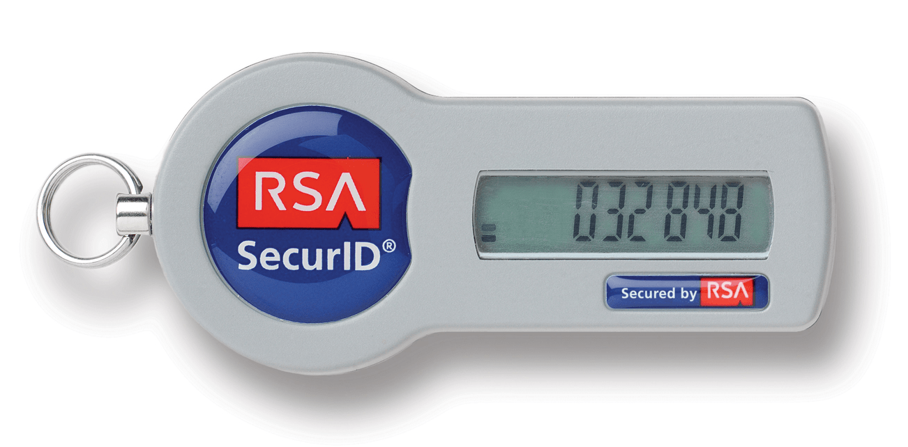
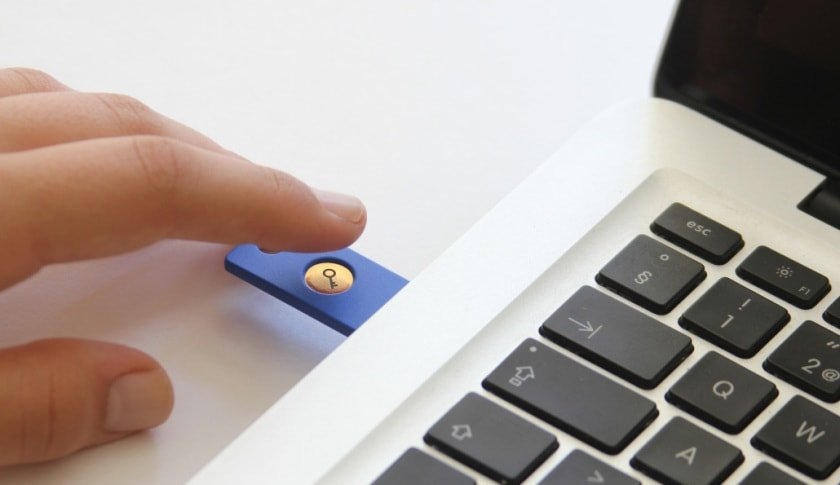

La seguridad a la hora de realizar tareas que requieren una protección esencial de datos, tales como contraseñas, transacciones bancarias, o cualquier tipo de operación que conlleva un componente económico o pone en riesgo nuestra identidad, sigue siendo uno de los temas que más preocupa en la actualidad, tanto a los usuarios como a los servicios que las ofrecen.<!--more-->

## ¿QUÉ SON LOS RIESGOS EN CONCRETO?

Las nuevas tecnologías han aportado muchas comodidades al permitirnos realizar desde el propio hogar o lugar de trabajo una serie de tareas que de otro modo nos obligarían en muchos casos a desplazarnos y dedicar un preciado tiempo a realizarlas. La autonomía que nos proporciona un simple correo electrónico, una firma digital, o una contraseña para realizar cualquier tipo de actividad, es incalculable hoy en día. A su vez, el robo de identidades y el phishing se está convirtiendo en una obsesión para quienes trabajan en la seguridad de sus clientes.

Nadie está libre de un hacker o un ataque cibernético. Si recientemente hemos visto como compañías del calibre de Twitter, Netflix o Spotify, acusaban los efectos del ataque a una empresa de gestión de Internet, ya podemos imaginar lo que puede suceder con un usuario de a pie.

## COMO EVITAR EL FRAUDE ELECTRÓNICO

La idea es protegernos al máximo de nuestras posibilidades y más en este momento en que los smartphones se están convirtiendo en un instrumento que viaja por la calle con nuestros datos más privados y claves de acceso a distintos servicios, en la mayoría de los casos exento de cualquier tipo de seguridad contra amenazas. Sin duda esta es una de las causas de que el [ransomware continúe aumentando](http://www.ituser.es/seguridad/2016/09/escalada-de-ataques-de-malware-movil-y-ransomware "Incremento del número de ataques de Ransomware") en estos dispositivos.

Desde hace ya años hemos visto como principalmente las entidades financieras han tratado de protegerse a sí mismas y a sus clientes con más o menos éxito de esta amenaza utilizando diferentes métodos como puede ser el asistente [Vini](https://be.ceca.es/2000/vini/index.html "Explicación de lo que es Vini") para tarjetas virtuales, que sin embargo no están exentos de otros inconvenientes.

\[caption id="attachment\_7636" align="alignnone" width="426"\] Fuente: itcd.hq.nasa.gov\[/caption\]

Entre otras, una interesante alternativa que ha surgido a los primeros métodos y que puede servir de respaldo para estos, es el token de seguridad. En su versión más simple se trata de un dispositivo portátil que nos permite almacenar contraseñas o firmas digitales que nos dan acceso a nuestros servicios.

## LOS TIPOS DE TOKEN

Entre las distintas clases nos encontramos las que operan a través de un OTP (One Time Password). Este es uno de los tokens más frecuentes y su funcionamiento consiste en generar una clave operativa durante un breve lapso de tiempo, que se introduce en el sitio al que queremos acceder como complemento a nuestro password personal. Dependiendo del token, la clave permanece activa durante unos segundos o hasta que generamos una nueva.

Aunque son varias las que lo utilizan, este dispositivo no es exclusivo de las entidades bancarias y son varias las compañías que lo proporcionan a sus usuarios como en el caso del [token RSA de PokerStars](https://www.pokerstars.es/poker/room/features/security/rsa-token/ "Empresas que ofrecen token de seguridad a sus clientes"), un sitio de póker online que trabaja de forma regular con transacciones económicas y que con este servicio colabora con la seguridad de sus clientes.

En lo negativo de este aparato hay que apuntar la contrariedad que supone en caso de pérdida. En esta situación no podremos acceder a la cuenta que nuestro token protege hasta haber contactado con su proveedor y realizar el protocolo establecido para estos casos.

\[caption id="attachment\_7637" align="alignnone" width="364"\] Fuente: fortune.com\[/caption\]

### Y aún más avanzados...

Existen otros modelos como el token USB que se ajusta mejor a otro tipo de servicios. Este dispositivo permite almacenar claves criptográficas con firmas digitales o datos biométricos que nos proporcionan el acceso a unos determinados sitios que requieren de esta condición.

En resumen, se trata de un método más para reforzar nuestra seguridad. No debemos olvidar que ninguno de ellos es infalible y una combinación de varios puede ser la mejor solución a nuestros temores.
