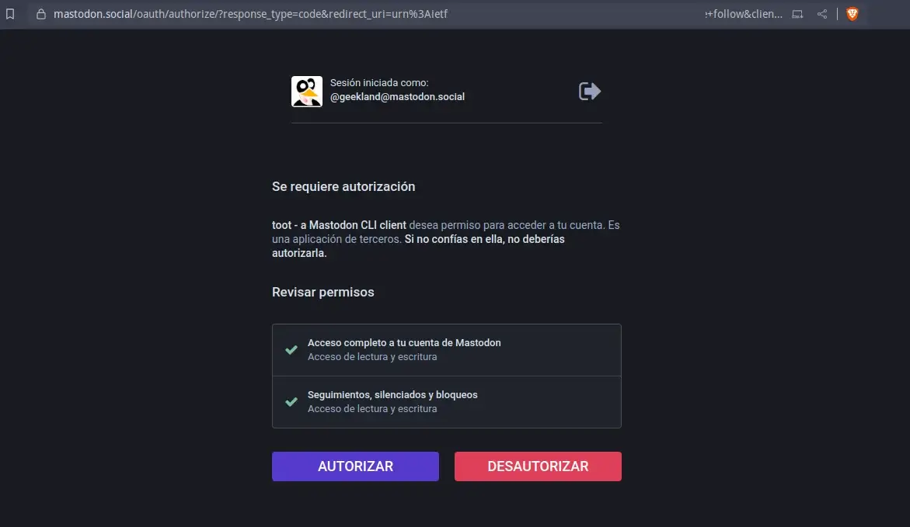
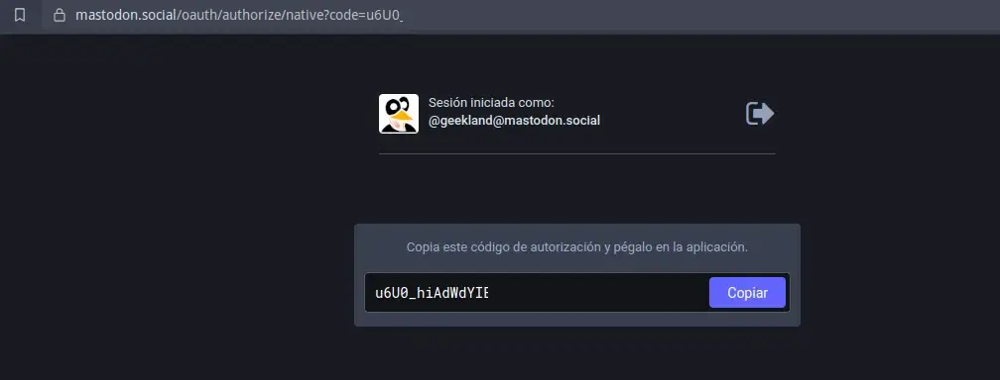
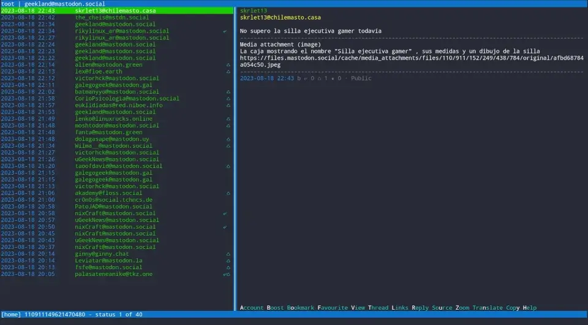

Toot es un cliente de Mastodon que permite interactuar con instancias de Mastodon desde la línea de comandos y la terminal. Algunas de las características que ofrece Toot son:<!--more-->

- Publicar, responder y eliminar estados.
- Soporte para subir archivos multimedia, texto de advertencia y contenido sensible.
- Búsqueda por cuenta o hashtag.
- Seguir, silenciar y bloquear cuentas.
- Cambiar fácilmente entre cuentas autenticadas en Mastodon.
- Automatizaciones para publicaciones automáticas mediante scripts.
- etc.

## VENTAJAS DE TOOT Y TOOT TUI FRENTE A LA INTERFAZ WEB DE MASTODON

Toot TUI ofrece algunas ventajas en comparación con la interfaz web de Mastodon:

- **Acceso rápido y eficiente** a través de la terminal, lo que permite a los usuarios experimentados realizar acciones rápidamente sin depender de un navegador web.
- **Menor consumo de recursos** del sistema en comparación con la interfaz web, lo que puede ser beneficioso para dispositivos con recursos limitados.
- **Mayor enfoque en la funcionalidad y el contenido**, ya que la interfaz de usuario de texto elimina distracciones visuales y elementos innecesarios.
- **Automatización:** Los comandos de Toot se pueden utilizar para generar scripts y automatizar publicaciones.

## COMO INSTALAR EL CLIENTE PARA TERMINAL DE MASTODON TOOT TUI

Existen diversas formas para instalar el cliente de mastodon para terminal toot. Una de ellas es mediante la paqueteria de la distribución que estéis usando. En el caso que estéis usando Debian testing tan solo hay que ejecutar el siguiente comando:

> ```shell
> sudo apt install toot
> ```

Otra forma alternativa de instalar toot es mediante el gestor de paquetes pip. El comando a usar para instalarlo es:

> ```shell
> pip3 install toot
> ```

Una vez finalizada la instalación nos tendremos que loguear a mastodon del siguiente modo.

## LOGUEARSE AL CLIENTE DE MASTODON TOOT

Para loguearse a toot tendremos que ejecutar el comando `**toot login**` en la terminal. Una vez ejecutado el comando tendréis que introducir:

1. La URL de nuestra instancia de mastodon y presionar Enter.
2. Acto seguido, se nos preguntará si queremos ver abrir el enlace para autorizar al cliente toot a acceder a nuestra cuenta de mastodon con nuestro navegador predeterminado. Escribiremos `**Y**` y presionaremos enter.

> ```shell
> ❯ toot login
> Enter instance URL [https://mastodon.social]: https://mastodon.social
> Looking up instance info...
> Found instance Mastodon running Mastodon version 4.2.0+pr-26409-f82b3c9
> Registering application...
> Application tokens saved.
> 
> This authentication method requires you to log into your Mastodon instance
> in your browser, where you will be asked to authorize toot to access
> your account. When you do, you will be given an authorization code
> which you need to paste here.
> 
> This is the login URL:
> https://mastodon.social/oauth/authorize/?response_type=code&redirect_uri=urn%3Airt%3Bwg%2Aoauth%32.0%3Aoob&scope=read+write+follow&client_id=MYGvm0cTknaUNCgQ0uRf3fnf_MSgYPpBLLYtNAN2FvR
> 
> Open link in default browser? [Y/n]Y
> Authorization code: Se está abriendo en una sesión de navegador existente.
> ```

Acto seguido presionaremos sobre el botón Autorizar.



A continuación nos aparecerá el código de autenticación que tendremos que usar para autorizar la cuenta. Lo copiamos.



Finalmente pegamos el código de autorización a la terminal y presionamos Enter. Una vez realizadas estos pasos Toot estará logueada a mastodon.

> ```shell
> Authorization code: Se está abriendo en una sesión de navegador existente.
> aAeUoyYWQlXxTB9lYOV-yhocIrZ3-bGKlpBL-LYtNAN2FvR
> 
> Requesting access token...
> Access token saved to config at: /home/joan/.config/toot/config.json
> 
> ✓ Successfully logged in.
> ```

**Nota:** Los tokens de acceso se guardarán en el archivo de configuración ubicado en `**~/.config/toot/config.json**`

Si alguna vez necesitan desloguearse tan solo tendran que ejecutar el comando:

> ```shell
> toot logout
> ```

## USAR MASTODON MEDIANTE UNA INTERFAZ GRÁFICA DE TERMINAL

Una vez finalizada la instalación, podemos comenzar a utilizar el cliente de terminal para Mastodon. Para iniciar el cliente, simplemente debemos ejecutar el siguiente comando en la terminal:

> ```shell
> toot tui
> ```

Acto seguido, se abrirá la interfaz gráfica de terminal de Toot. Desde esta interfaz, se puede navegar por los Toots publicados en la línea de tiempo utilizando las teclas del cursor. En la parte inferior derecha, aparecerán opciones disponibles como hacer "boost" de un Toot, marcarlo como favorito, verlo y más.



A continuación les dejaré una serie de atajos de teclado que les ayudarán a sacar partido a toot.

### Atajos de teclado para usar la interfaz de terminal del cliente de Mastodon toot

Los atajos de teclado principales para usar la interfaz gráfica de terminal son los siguientes:

| Atajos de teclado | Función de los atajos de teclado |
| --- | --- |
| A | Ver los datos principales de la cuenta de un usuario que ha realizado un toot. |
| B | Hacer un retoot. "Equivalente a retuit". |
| C | Escribir un toot. |
| D | Borrar un toot que has publicado. |
| O | Añadir una publicación a los marcadores. |
| F | Añadir una publicación a favoritos para indicar que te gusta. |
| V | V de View para ver y que se abra el toot en el navegador predeterminado. |
| T | Ver el historial de respuestas del toot seleccionado. |
| I | Mostrar únicamente los link que contiene el toot seleccionado. Útil para abrir los links de las publicaciones en el navegador. |
| R | Responder a un toot. |
| S | Mostrar el texto que está categorizado como sensible. |
| U | Ver el contenido de una publicación en formato json. |
| M | Visualizar las imágenes de los toot. |
| N | Traducir una publicación a tu idioma. |
| Y | Copiar la totalidad de texto de la publicación o de un toot en el portapapeles. |
| Z | Ver el toot seleccionado en una pantalla emergente en la que puedes hacer scroll. |
| , | Refrescar el timeline. |
| G | Aparece un menu para seleccionar los distintos timeline que queremos ver. También para ver las Notificaciones, marcadores, hashtags, etc. |

Otros atajos de teclado interesantes son los siguientes:

| Atajos de teclado | Función de los atajos de teclado |
| --- | --- |
| cursores o H/J/K/L | Para moverse y hacer scroll en la interfaz de la terminal |
| Page up y PageDown | Para hacer scroll del contenido |
| Enter / Espacio | Para acceder dentro de las opciones del programa |
| Esc | Para ir hacia atrás o salir |
| q | Para ir hacia atrás o para Cerrar el cliente |

## COMANDOS DE TOOT PARA REALIZAR SCRIPTS Y AUTOMATIZAR LAS PUBLICACIONES

Hasta estos momentos hemos visto como usar toot a través de una interfaz gráfica de terminal, pero también es posible realizar diversas operaciones mediante comandos que podemos ejecutar en la terminal.

### Utilidad de los comando que toot ofrece vía terminal

La principal ventaja en el momento de usar los comandos es la automatización de tareas. Los comandos de Toot se pueden utilizar en scripts para automatizar nuestras publicaciones en Mastodon.

### Comandos disponibles para poder usar Toot desde la terminal

A continuación y mediante una serie de ejemplos veréis como podéis usar toot mediante la ejecución de comandos en la terminal.

| Acción a realizar | Comando a usar |
| --- | --- |
| Enviar el toot `Hola mundo` | `toot post "Hola mundo"` |
| Enviar un toot con un salto de línea | `toot post "$(echo -e "Hola\nMundo")"` |
| Escribir un toot usando el editor de textos vim | `toot post --editor vim` |
| Subir la imagen `/media/DATOS/geekland.jpg` con el texto `Hola Mundo` | `toot post -m /media/DATOS/geekland.jpg "Hola Mundo"` |
| buscar el usuario y el hashtag `geekland` | `toot search geekland` |
| Ver las notificaciones del usuario logueado | `toot notifications` |
| Ver la información del perfil del usuario `geekland` | `toot whois @geekland` |
| Mostrar el timeline en pantalla | `toot timeline` |
| Ver los 5 últimos toot del timeline | `toot timeline --count 5` |
| Ver el timeline solo de tu estancia de Mastodon | `toot timeline --public --local` |
| Retootear una publicación con ID `110953708024057889` | `toot reblog 110953708024057889` |
| ... | ... |

Existen multitud de comandos adicionales a los que acabo de citar. Para conocerlos tan solo tenéis que ejecutar el siguiente comando en la terminal.

> ```shell
> toot --help
> ```

## CONCLUSIONES

Toot es una herramienta útil para interactuar con Mastodon desde la terminal, ofreciendo una experiencia de usuario eficiente y centrada en el contenido. Puede reemplazar el cliente web de mastodon sin mayores inconvenientes.

### Fuentes

[https://toot.bezdomni.net/](https://toot.bezdomni.net/)

[https://github.com/ihabunek/toot](https://github.com/ihabunek/toot)
