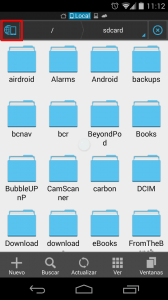
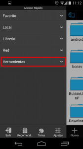
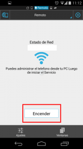
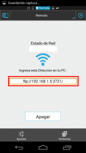
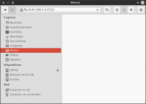
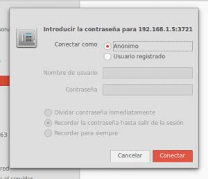
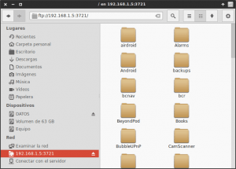
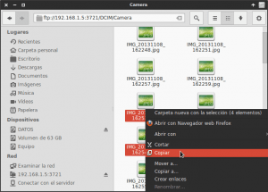
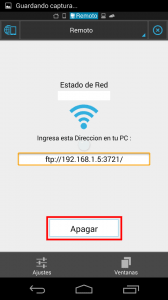

Un problema típico que ocurre a muchos usuarios de Android es que después de hacer multitud de fotografías o grabar algún vídeo con su teléfono o tablet, tienen problemas para transferir esta información del teléfono al ordenador.

Otro problema bastante típico de algunos usuarios de Android es realizar la operación inversa a la que acabamos de describir. Es decir transferir fotos, películas u otros archivos almacenados desde su ordenador hasta su tablet o smartphone.<!--more-->

**Para solucionar este problema existen múltiples soluciones**. Algunas de las primeras soluciones que imagino que acostumbran a venir a la cabeza de la gente son las siguientes:

1. **Enchufar el teléfono o tablet al ordenador mediante un cable USB**. Esta solución no me acaba de gustar por precisar de un cable USB. Además muchas veces el ordenador no nos detecta automáticamente nuestro teléfono o tablet como un dispositivo de almacenamiento USB y esto genera grandes problemas a los usuarios con poca experiencia.
2. Otra opción muy buena y visualmente atractiva **es usar [Airdroid](http://www.airdroid.com/ "Web de Airdroid")**. Airdroid es una app de Android que podréis encontrar fácilmente en la [Google Play Store](https://play.google.com/store/apps/details?id=com.sand.airdroid&feature=search_result "Link de descarga de Airdroid"). Esta aplicación nos permitirá, de forma fácil y sin necesidad de cables, transferir información de nuestros dispositivos móviles a nuestro ordenador y viceversa de forma muy fácil. El principal problema de esta aplicación es que la cantidad de datos a transferir está limitada a 100 Mb mensuales. Quien necesite más capacidad deberá pagar una suscripción Premium. Además esta aplicación no funciona para todas las versiones de Android, necesita que tanto el ordenador como el teléfono estén conectados en la misma red, y es posible que no se pueda acceder a la tarjeta MicroSD de nuestro teléfono.
3. Otra opción para realizar la transferencia **es usar la archiconocida aplicación de [Dropbox](https://www.dropbox.com/ "Web de Dropbox")**, **o alguna otra aplicación similar como por ejemplo [Copy](https://www.copy.com/home/ "Web de Copy")**. Bajo mi punto de vista es una opción efectiva pero lenta. La opción es lenta porqué primero se tiene que subir la información a Dropbox, y a posteriori tenemos que descargar la información a nuestro teléfono. A esto le tenemos que añadir que hoy en día las velocidades de subida de las operadoras telefónicas son bajas y la capacidad de Dropbox es limitada. En fin que si queremos compartir información que ocupe mucho tamaño este método presenta grandes inconvenientes. Como contrapartida este método tendrá la ventaja que no será necesario que nuestro ordenador y nuestro dispositivo Android esten conectados en la misma red local.
4. Otra opción interesante es **usar aplicaciones tipo [EZ Drop](https://play.google.com/store/apps/details?id=co.dropper.ez.android.free&hl=es "Link de descarga de EZ Drop")** en nuestro dispositivo Android. Estas aplicaciones se basan en introducir una URL en en el navegador Web de nuestro ordenador. Una vez introducida la URL podremos ver un código en nuestro monitor. Introducimos el código en la aplicación EZ Drop de nuestro teléfono. Una vez hecho todo esto la totalidad de archivos que arrastremos dentro del navegador web de nuestro ordenador se transmitirán automáticamente a nuestro teléfono. Esta opción tiene la ventaja que no necesitamos que el ordenador y el dispositivo Android estén conectados en la misma red local. Pero como contrapartida la velocidad de transferencia estará limitada por la conexión de internet que tengamos. Además el flujo de tráfico será unidireccional y por lo tanto solo podremos transferir archivos del ordenador al dispositivo móvil.
5. Bajo mi punto de vista el método más interesante es **usar el explorador de archivos [ES Explorer](https://play.google.com/store/apps/details?id=com.estrongs.android.pop&hl=es "Link de descarga de ES Explorer")**. **Considero que es el método más interesante por los siguientes motivos:**

- Es una **solución muy fácil y que ofrece una velocidad de transferencia alta**.
- **Cualquier persona con conocimientos básicos será capaz de aplicar esta solución**.
- Además de la función de transferir archivos de nuestro teléfono a nuestro ordenador y viceversa, **este explorador de archivos dispone de muchas otras funcionalidades** como por ejemplo instalar y desinstalar aplicaciones, gestor de descargas, análisis del espacio que ocupan las carpetas y archivos de nuestro dispositivo móvil, crear un hotspot, conectarse a servidores ftp o sftp, etc.
- Tan solo tenemos que tener instalado ES Explorer en nuestro teléfono. **No precisamos instalar ningún software en nuestro ordenador**.
- Permite realizar la función de transferir archivos de un sitio a otro independientemente del sistema operativo que usemos en nuestro ordenador. **Se trata de una solución multiplataforma**.
- **Podremos acceder a la totalidad de contenido incluyendo nuestra tarjeta MicroSD**.

Por todos estos motivos a continuación veremos de forma detallada como usar ES Explorer.

###### Nota: Existen otras opciones similares a ES Explorer para transferir archivos de nuestro dispositivo móvil al ordenador o Viceversa. Por ejemplo existe [Wifi File transfer](https://play.google.com/store/apps/details?id=com.smarterdroid.wififiletransferpro&hl=es "Link de descarga de Wifi File transfer") con el inconveniente que la transferencia de archivos está limitada a 4 Mb. Quien quiera saltarse la limitación tendrá que comprar la Versión Pro del programa.

## REQUERIMIENTOS NECESARIOS PARA USAR ES EXPLORER

Simplemente **necesitamos cumplir 3 requisitos** que son muy básicos:

1. Disponer de la App **ES Explorer instalada en nuestro dispositivo Android**.
2. **Disponer de un ordenador personal**. Como hemos dicho anteriormente es indiferente el sistema operativo que tenga instalado el ordenador. El método funciona tanto en Linux, como en Windows, como en Mac OS X.
3. **Tanto el ordenador como el dispositivo móvil tienen que estar conectados en la misma red local**. En otras palabras tanto el ordenador como el teléfono tienen que estar conectados en el mismo Router. En caso de necesidad creando un hotspot nos podemos saltar esta restricción.

###### Nota: En el caso que estemos en el aire libre es posible que sea imposible disponer de una conexión a internet y por lo tanto será imposible cumplir el requisito número 3. Una posible solución a este problema es hacer Tethering. Por lo tanto en caso de necesidad crearíamos un hotspot con nuestro dispositivo móvil. Seguidamente nos conectaríamos con nuestro ordenador al hotspot creado por nuestro dispositivo móvil. Una vez realizados estos pasos podemos usar ES Explorer tranquilamente para transferir archivos de un punto a otro sin ningún tipo de limitación.

## PASOS PARA TRANSFERIR ARCHIVOS

#### Instalar ES Explorer a nuestro dispositivo Android

Tan solo tenemos que acceder al Google play Store e instalar la aplicación ES Explorer. Quien lo prefiera también puede usar este [link](https://play.google.com/store/apps/details?id=com.estrongs.android.pop&hl=es "Link de descarga de ES Explorer") para descargar e instalar la aplicación.

#### Ejecutar ES Explorer en nuestro dispositivo Android

Una vez instalado ES Explorer lo ejecutamos en nuestro teléfono móvil o tablet.

#### Activación del FTP Remoto

Es Explorer dispone de un [servidor ftp](https://es.wikipedia.org/wiki/File_Transfer_Protocol "Expicación de lo que es un servidor ftp") incorporado. Para que nuestro PC se pueda conectar a nuestro teléfono tendremos que activar este servidor ftp. Para activar el servidor ftp tendremos seguir adelante con la explicación.

Una vez se abra la aplicación ES Explorer encontraremos un entorno gráfico parecido al siguiente:

Tal y como se puede ver en la captura de imagen tendremos que **dar click con nuestro dedo dentro del recuadro de color rojo en el que se representa un teléfono y un globo terráqueo**. Seguidamente aparecerá el siguiente menú desplegable:

En el menú desplegable que acaba de aparecer, tenemos que **seleccionar la opción Herramientas**. Una vez seleccionada se desplegaran las siguientes opciones:

El siguiente paso es **seleccionar la opción** **Remoto** del menú desplegable. Después de seleccionar la opción remoto aparecerá la siguiente pantalla:

Ahora tan solo tenemos que **presionar el botón Encender**. Una vez presionado, el servidor ftp estará activo y en la pantalla de nuestro dispositivo móvil veremos un contenido similar al siguiente:

Ahora tendremos que **anotar cuidadosamente en un papel, el contenido que aparece dentro del recuadro de color rojo** de la última captura de pantalla. En mi caso el contenido a copiar es **ftp://192.168.1.5:3721/**

#### Conectar el ordenador al FTP Remoto de nuestro dispositivo móvil

Ahora el último paso es conectarnos al servidor ftp que acabamos de activar. Para ello **en nuestro ordenador abrimos el navegador de archivos**.

Tal y como se puede ver en la captura de pantalla, nos vamos **a la barra de direcciones de nuestro navegador de archivos e introducimos la dirección ftp que hace escasos segundos que acabamos de anotar** y que en mi caso era **ftp://192.168.1.5:3721/**. Una vez introducida **presionamos la tecla** **Enter** y automáticamente aparecerá una pantalla parecida a la siguiente:

En la siguiente pantalla tenemos que **elegir la opción** **Anónimo** ya que el servidor ftp por defecto permite las conexiones anónimas. Una vez seleccionada la opción anónimo **presionamos el botón** **Conectar**. Una vez realizados estos pasos, tal y como se puede ver en la siguiente captura de pantalla, tendremos la totalidad del contenido de nuestro dispositivo móvil en el explorador de archivos de nuestro ordenador.

###### Nota:  El método de conexión es el mismo para Linux, para Windows y para Mac OS X. Para introducir la dirección ftp en MAC OS X se tiene que abrir el Finder y presionar la tecla Comando-K. Si usáis Linux es posible que haya navegadores de archivos, como por ejemplo Dolphin o Thunar, que no tengan la barra de direcciones visible. Para hacerla visible tan solo se tiene que presionar la combinación de teclas Ctrl+L y seguidamente introducir la dirección ftp.

#### Transferir los archivos que necesitamos

Tal y como se puede ver en la captura de pantalla, **en nuestro navegador de archivos podemos visualizar la totalidad del contenido que tenemos en nuestro teléfono**. También podemos ver que hemos accedido a la carpeta donde tenemos almacenadas todas la fotografías.

**En este momento**, sin ningún tipo de problema, **podemos transferir la totalidad de fotografías que tenemos en nuestro teléfono y pegarlas en el disco duro de nuestro ordenador**. Otra cosa que por ejemplo podemos realizar es elegir una película que tengamos en nuestro ordenador y copiarla en nuestro teléfono móvil o tablet.

#### Parar el servidor FTP remoto

**Una vez se haya completado la transferencia de archivos es aconsejable desconectar el servidor ftp de nuestro dispositivo Android**. Seguro que nuestra batería la agradecerá.

Para ello nos vamos a nuestro dispositivo Android y lo encendemos. Justo al encenderlo veremos la siguiente pantalla:

Ahora tan solo tenemos que **apretar el botón de** **Apagar**. Una vez hecho esto el servidor ftp se desconectará y el proceso finalizará.
