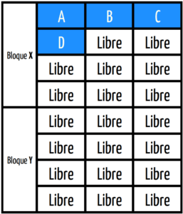
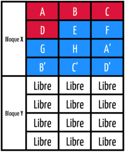
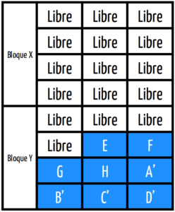
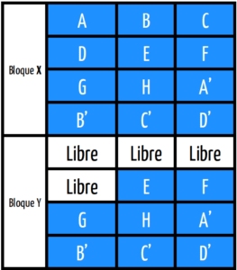
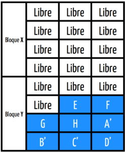

Como muchos sabrán es importante que los usuarios de un SSD tengan activado TRIM en sus ordenadores. Por lo tanto en el siguiente artículo explicaremos que es TRIM y por qué tenemos que activarlo en nuestras unidades de almacenamiento SSD. Sin más dilación empezamos con la explicación.<!--more-->

## ¿QUÉ ES EL SOPORTE TRIM?

Para entender la funcionalidad del soporte TRIM tenemos que conocer el funcionamiento y el proceso de borrado de archivos de una unidad SSD.

### Explicación del funcionamiento de una unidad SSD

Una unidad SSD está formada por bloques y cada uno de los bloques se subdivide en páginas. La unidad mínima de escritura es una página mientras que la unidad mínima de borrado es un bloque. Por lo tanto los datos se pueden escribir dentro de una o varias páginas vacías, pero únicamente un bloque entero puede ser borrado.

A modo de ejemplo, los datos de un archivo se almacenan en las páginas A, B, C y D del bloque X.

\[caption id="attachment\_10123" align="alignnone" width="257"\] Figura 1: Ilustración de 2 bloques con el contenido de un archivo.\[/caption\]

Con el tiempo se crea un nuevo archivo que se almacena en las páginas E, F, G y H del bloque X. A posteriori el contenido del archivo almacenado en las páginas A, B, C y D del bloque X varia y como como las unidades SSD no permiten la reescritura de páginas sin que antes se hayan borrado lo que pasará es que las páginas A, B, C y D del bloque X se marcaran como inválidas en el sistema de archivos y se escribirán las nuevas páginas A’, B’, C’ y D’ que contendrán el contenido modificado del primer archivo. Por lo tanto, en esto momentos tenemos el bloque X lleno y los bloques A, B, C y D estarán ocupando espacio útil que no podemos usar hasta que borremos la totalidad del bloque X.

\[caption id="attachment\_10124" align="alignnone" width="248"\] Figura 2: Bloque X lleno con páginas marcadas como inválidas.\[/caption\]

Para que poder recuperar el espacio de las páginas A, B, C y D se copiará el contenido válido del bloque X al bloque Y. Entonces se podrá borrar el contenido entero del Bloque X. Recordad que el tamaño mínimo de borrado de una unidad SSD es un bloque.

\[caption id="attachment\_10125" align="alignnone" width="248"\] Figura 3: Proceso de borrado de un bloque en un SSD\[/caption\]

### La función del soporte TRIM en el funcionamiento de una unidad SSD

En el proceso descrito en el apartado anterior, TRIM informa de los bloques y páginas que pueden ser borrados a la controladora de la unidad SSD.

Si en el ejemplo del apartado anterior no dispusiéramos de TRIM, la unidad SSD vería el siguiente escenario:

\[caption id="attachment\_10126" align="alignnone" width="263"\] Figura 4: Estado de los bloques X e Y sin TRIM\[/caption\]

Cuando el escenario real con el soporte TRIM seria el siguiente:

\[caption id="attachment\_10127" align="alignnone" width="247"\] Figura 5: Estado de los bloques X e Y con TRIM\[/caption\]

Por lo tanto, sin TRIM la unidad SSD pensará que tenemos multitud de bloques y páginas ocupados que realmente no lo están. Frente a este escenario, cuando la unidad SSD se quede sin espacio iniciará un proceso de varias lecturas para encontrar bloques que no estén en uso. Cuando encuentre un bloque con contenido inválido lo tendrá que borrar y a posteriori escribir el nuevo contenido. Este proceso que acabo de describir ocasiona los siguientes problemas:

1. **Decremento del rendimiento** de la unidad SSD.
2. **Acortar la vida de la unidad SSD** por realizar multitud de lecturas y escrituras que con TRIM se podrían evitar.

### ¿Qué es el TRIM?

Una vez comprendido el contenido de los apartados anteriores podemos elaborar la siguiente definición:

**TRIM informa de los bloques/páginas con datos almacenados que se pueden borrar a la controladora del SSD**. De este modo, los bloques que pueden ser borrados se eliminan de una sola vez evitando lecturas excesivas y pérdida de rendimiento con el paso del tiempo.

## ¿POR QUÉ DEBEMOS ACTIVAR TRIM?

Con la explicación realizada en los apartado anteriores podemos concluir que las ventajas que nos proporciona son las siguientes.

1. **Alargar la vida útil** de nuestra unidad de almacenamiento. Obtendremos mayor vida útil porque se reducirá el número de lecturas y escrituras de nuestra unidad SSD.
2. El **rendimiento del equipo será mejor y constante en el tiempo**. Sin soporte TRIM, la unidad SSD tendrá que realizar multitud de lecturas y escrituras innecesarias que lo único que causaran es lentitud a nuestro equipo.

En estos momentos conocemos que es TRIM, la función que realiza y la ventajas que nos proporciona. **Si quieren activarlo y configurarlo en GNU-Linux** tan solo tienen que seguir las siguientes instrucciones:

https://geekland.eu/activar-trim-correctemente-linux/

En el caso que usen Windows pueden consultar el siguiente enlace:

https://geekland.eu/activar-trim-en-windows/

###### FUENTES

[https://en.wikipedia.org/wiki/Write\_amplification#Garbage\_collection](https://en.wikipedia.org/wiki/Write_amplification#Garbage_collection "Explicación del funcionamiento de una unidad de almacenamiento SSD")
