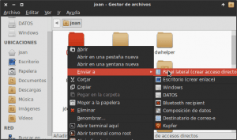
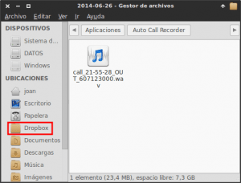
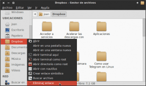
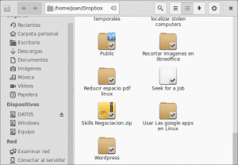
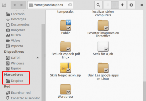
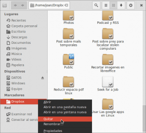
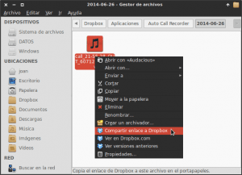

En principio no tenia intención de escribir un post similar a este. Pero resulta que hace unos meses estaba viendo la [keynote de Apple](https://www.youtube.com/watch?v=YLVX6Q3M3lE "Vídeo Keynote Apple Junio 2014") y en un momento de la presentación de OS X se anunció que a partir de Yosemite, iCloud se integrará en sus gestor de archivos Finder. Segundos después del anuncio y de una pequeña demostración, el público enloqueció y empezó a aplaudir como si esto fuera el no va más y el descubrimiento del siglo. Más tarde en un podcast generalista de tecnología citaban este hecho como realmente noticiable.<!--more-->

La verdad no creo que esto sea para tanto ya que si queréis podéis tener una integración similar en Linux con Dropbox y Nautilus o Thunar, lo podéis realizar añadiendo una ubicación o marcador en vuestro gestor de archivos. Quien no sepa hacerlo tan solo tiene que seguir los pasos que detallaremos a continuación.

###### Nota: Francamente a todo el mundo que tiene que presentar un producto a un equipo comercial o a la sociedad firmaría tener un público tan poco crítico como los asistentes de las Keynote de Apple.

###### Nota: Asumo que el usuario que lea este post tendrá instalado Dropbox en su sistema operativo. En el caso que no lo tuviera instalado lo puede instalar siguiendo las recomendaciones de este [post](). En el caso de no usar Dropbox el procedimiento a seguir es exactamente el mismo, tan solo tienen que cambiar la Carpeta de sincronización de Dropbox por la de Copy, Spideroak, etc.

## AÑADIR UBICACIONES EN THUNAR

Como hemos comentado para Integrar Dropbox o cualquier otro servicio en nuestro gestor de archivos Thunar lo podemos realizar añadiendo una ubicación.

Para añadir una ubicación **seleccionamos la carpeta que queremos añadir en ubicaciones** que en mi caso es la de Dropbox. Una vez seleccionada, tal y como se puede ver en la captura de pantalla, **presionamos el botón derecho del mouse, seleccionamos la opción** **Enviar a** **y finalmente clicamos encima de** **Panel lateral (Crear acceso directo)**.

Una vez seguidas las instrucciones veremos que en nuestro panel lateral aparece la Carpeta de Dropbox. Por lo tanto hemos integrado Dropbox a nuestro gestor de archivos añadiendo una simple ubicación.

## ELIMINAR UBICACIONES EN THUNAR

Si queremos eliminar la ubicación que acabamos de crear el proceso es muy sencillo. Tal y como se puede ver en la captura de pantalla **nos posicionamos encima de la ubicación que acabamos de crear**, que en mi caso es Dropbox. Una vez estamos encima **presionamos el botón derecho de nuestro ratón y seguidamente seleccionamos la opción** **Eliminar enlace**.

## AÑADIR MARCADORES EN NAUTILUS

Para crear un marcador en el gestor de archivos Nautilus **entramos dentro de la carpeta de la cual queremos crear el Marcador**. En mi caso como me quiero crear un Marcador de Dropbox, tal y como se puede ver en la captura de pantalla, entraré dentro de la carpeta de Dropbox.

Una vez dentro de la carpeta de Dropbox tan solo tengo que **presionar la siguiente combinación de teclas**:

**Ctrl + D**

**Una vez presionada la combinación de teclas**, tal y como se puede ver en la captura de pantalla, **aparecerá la carpeta de Dropbox en los marcadores de Nautilus**.

## ELIMINAR MARCADORES EN NAUTILUS

Si en algún momento queremos o necesitamos quitar algún marcador de nuestro gestor de archivos, tal y como se puede ver en la captura de pantalla, tan solo tenemos que **seleccionar el marcador que queremos eliminar con el ratón**. Una vez seleccionado **presionar el botón derecho del ratón y seguidamente presionamos la opción** **Quitar**.

###### Nota: Como se puede ver en la captura de pantalla aparte de eliminar el marcador se nos ofrecen opciones adicionales como por ejemplo renombrar el nombre del marcador, etc.

## RESULTADOS DESPUÉS DE TODAS LAS ACCIONES REALIZADAS

Como se puede ver en la imagen **después de añadir los marcadores o ubicaciones** resulta que **tenemos el mismo tipo de integración de la que los asistentes de la Keynote de Junio de 2014 se volvían locos**.

1. **Todas las carpetas y archivos almacenados en Dropbox estarán accesibles desde nuestro gestor de archivos**.
2. Podemos editar los archivos almacenados en Dropbox directamente desde nuestro ordenador o desde nuestros dispositivos móviles.
3. Todo el contenido almacenado en Dropbox se sincroniza automáticamente en todos tus ordenadores y dispositivos móviles vinculados a la misma cuenta de Dropbox.

Si no voy mal este tipo de integración es exactamente la misma que se anuncio en la keynote de Apple para Yosemite. E incluso me atrevería a decir que la integración en Linux es superior porque tal y como se puede ver en la captura de pantalla, desde nuestro gestor de archivos podemos obtener enlaces de descarga que podemos enviar a nuestros contactos, ver versiones antiguas de un archivo en concreto y acceder directamente al contenido del navegador en la web de Dropbox. Y todo esto se puede realizar con Nautilus o incluso con Thunar que según algunos usuarios de Linux es un gestor de archivos un poco limitado.

###### Nota: La misma crítica realizada en la integración de iCloud con Finder se podría realizar con muchas de las novedades presentadas en OS X Yosemite. Algunas características de su Mail, la posibilidad de elegir entre temas claros y temas oscuros, etc. Todas estas funcionalidades no tienen nada de novedoso ya que otros sistemas operativos ya habían aplicado soluciones similares en el pasado.
