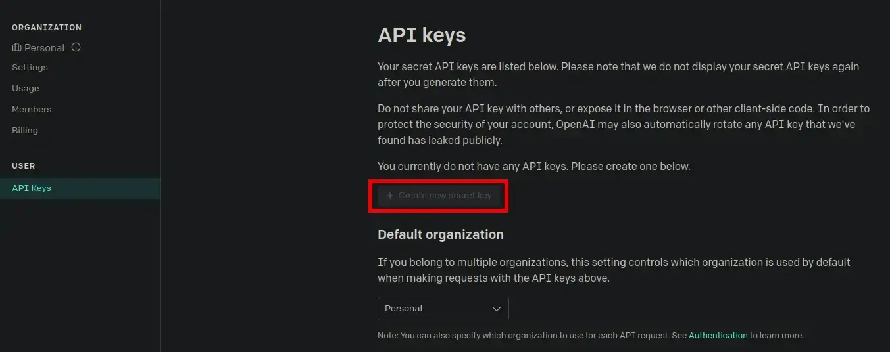
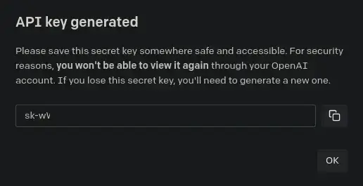
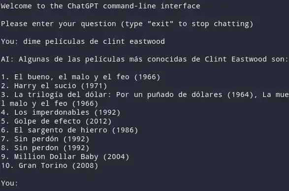

En este artículo te explicaremos cómo instalar y utilizar ChatGPT desde la terminal de Linux. Para esto, existen varias opciones disponibles en Github. En nuestra experiencia, hemos probado dos opciones diferentes, las cuales detallaremos a continuación.<!--more-->

[https://github.com/slithery0/gpt-chatbot-cli](https://github.com/slithery0/gpt-chatbot-cli)

[https://github.com/lmatosevic/chatgpt-cli](https://github.com/lmatosevic/chatgpt-cli)

**Nota:** En este artículo detallaremos el proceso de instalación del primero de los links.

Cada proyecto tiene sus particularidades y puede ofrecer diferentes características a los usuarios. Por tanto, les recomiendo que investiguen y prueben distintas alternativas.

## VENTAJAS DE USAR CHATGPT DESDE LA TERMINAL LINUX

Actualmente, la mejor opción para usar ChatGPT en Linux es a través de la terminal. Esto se debe a los siguientes motivos:

1. La terminal es más liviana, práctica y rápida que un navegador web.
2. Es accesible de forma instantánea una vez que se ha finalizado la configuración. Sólo hay que presionar el atajo de teclado deseado para comenzar a hacerle preguntas a la IA. Además, ChatGPT se integra de forma elegante con el sistema operativo.
3. La velocidad de respuesta es mucho más rápida que aquella que se puede obtener a través de la página web de OpenAI.
4. No es necesario iniciar sesión para utilizar ChatGPT y, además, después de un período de inactividad, se evita que se cierre la sesión automáticamente.
5. No existe un límite en la cantidad de palabras que la IA puede utilizar en su respuesta. Por lo tanto, si le pedimos un texto de 10.000 palabras, obtendremos un texto de 10.000 palabras en respuesta.

A continuación veremos los pasos a seguir para instalar y usar chatgpt-cli en Linux.

## OBTENER UNA CLAVE API DE CHATGPT

Es imprescindible disponer de una clave API. Para ello nos dirigiremos a la siguiente URL:

[https://platform.openai.com/account/api-keys](https://platform.openai.com/account/api-keys)

Una vez dentro, iniciamos sesión con nuestra cuenta de ChatGPT y, a continuación, en el apartado de `API Keys`, presionamos el botón `+ Create new secret key`.



Acto seguido se generará la clave API:



**Nota:** En mi caso la clave API es "**sk-wWf0VKqDrTvQTtrBGVR6T3Bl4kFJ3Z04MqzF3GO9F0q3**"

Recuerden que esta clave API es privada y no la deben compartir con nadie. Además también tenéis que ser conscientes que la API de ChatGPT es de pago, por lo tanto solo podrán usar esta clave hasta que se terminen los 18 dólares de saldo inicial o hasta un determinado periodo tiempo.

## INSTALAR CHATGPT-CLI EN LINUX

Una vez tenemos la clave API podemos proceder a la instalación de ChatGPT-cli. En mi caso he tenido que realizar la instalación a través de un entorno de desarrollo virtual de Python. El procedimiento ha sido el siguiente:

Lo primero es instalar las dependencias necesarias ejecutando el siguiente comando:

> ```shell
> sudo apt install python3-pip python3-venv
> ```

A continuación he creado el directorio `**/home/joan/chatgpt**` que contendrá la totalidad de paquetes del entorno virtual de Python:

> ```shell
> mkdir /home/joan/chatgpt
> ```

Acto seguido creo el entorno virtual de python ejecutando el siguiente comando:

> ```shell
> python3 -m venv /home/joan/chatgpt
> ```

El siguiente paso consiste en activar el entorno virtual que acabamos de crear mediante al ejecución del siguiente comando:

> ```shell
> source /home/joan/chatgpt/bin/activate
> ```

Una vez activado el entorno virtual ya podemos instalar chatgpt-cli mediante el siguiente comando:

> ```
> pip3 install chatgpt-cli-tool python-dotenv openai
> ```

**Nota:** Recuerden que deberán reemplazar `/home/joan/chatgpt` por la ruta en que vosotros queráis instalar vuestro entorno virtual.

## INICIAR  USAR CHATGPT POR PRIMERA VEZ EN LA TERMINAL

A continuación podemos iniciar chatgpt-cli por primera vez. Para ello deberán ejecutar el comando `chatgpt-cli` seguido de su número de API. Por lo tanto en mi caso deberé ejecutaré el siguiente comando:

```shell
chatgpt-cli sk-wWf0VKqDrTvQTtrBGVR6T3Bl4kFJ3Z04MqzF3GO9F0q3
```

Acto seguido podrán interactuar con chatgpt sin ningún tipo de problema.



## MEJORAR LA INTEGRACIÓN DE CHATGPT-CLI EN EL SISTEMA OPERATIVO

Para integrar chatGPT en su sistema operativo y hacer su uso más cómodo les recomiendo que sigan las siguientes instrucciones.

### Definir las variables de entorno para usar chatgpt desde la terminal

Si todo funciona de forma perfecta podemos realizar los siguientes pasos para mejorar la experiencia de uso de chatgpt. Para no tener que estar constantemente añadiendo la clave API al iniciar el software crearemos el directorio `~/.chatgpt-cli/` con el siguiente comando:

> ```shell
> mkdir -p ~/.chatgpt-cli/
> ```

A continuación editaremos el fichero `.env` que almacenará las variables de entorno de la aplicación. Para ello ejecutaremos el siguiente comandado:

> ```shell
> nano ~/.chatgpt-cli/.env
> ```

Cuando se abra el editor de texto nano pegaremos lo siguiente:

```shell
OPENAI_API_KEY=sk-wWf0VKqDrTvQTtrBGVR6T3Bl4kFJ3Z04MqzF3GO9F0q3
GPT_MODEL=gpt-3.5-turbo
GPT_SYSTEM_DESC="You are a very direct and straight-to-the-point assistant."
GPT_IMAGE_SIZE=512x512

HISTORY_SIZE=3
```

**Nota:** Tenéis que reemplazar la clave API del ejemplo por la vuestra.

Una vez introducidos la totalidad de parámetros guardamos los cambios y cerramos el fichero. Ahora podremos arrancar el programa sin tener que introducir la clave API.

### Abrir chatgpt-cli mediante un atajo de teclado

En mi caso soy usuario del escritorio i3 y mi objetivo es abrir chatgpt con un simple atajo de teclado. Para ello crearé un script para iniciar chatgpt-cli. Primero crearé el directorio que almacenará el script del siguiente modo:

> ```shell
> mkdir -p ~/Aplicaciones
> ```

Accederemos dentro del directorio:

> ```shell
> cd ~/Aplicaciones
> ```

A continuación crearemos el script ejecutando el siguiente comando:

> ```shell
> nano chatgpt.sh
> ```

Cuando se abra el editor de textos nano pegaremos el siguiente código:

> ```shell
> #!/bin/bash
> source ~/chatgpt/bin/activate
> python3 ~/chatgpt/bin/chatgpt-cli
> ```

a continuación guardaremos los cambios, cerraremos el fichero y daremos permisos de ejecución al script mediante el siguiente comando:

> ```shell
> chmod +x ~/Aplicaciones/chatgpt.sh
> ```

Finalmente configuraremos el escritorio i3 para que pueda ejecutar el script que acabamos de generar mediante el atajo de teclado `win+i`. Para ello accederemos al fichero de configuración de i3 ejecutando el siguiente comando:

> ```shell
> nano ~/.config/i3/config
> ```

Cuando se abra el fichero de configuración añadiréis la siguiente línea:

> ```shell
> bindsym $mod+i exec kitty -e /home/joan/Aplicaciones/chatgpt.sh
> ```

**Nota:** En el caso que no uséis la terminal kitty deberéis adaptar el comando.

Una vez modificada la configuración tan solo hay que guardar los cambios, cerrar el fichero y reiniciar el equipo.

Ahora cuando presione la combinación de teclas `win+i` se abrirá una terminal con chatgpt y podremos iniciar una conversación.

## LIMITACIONES DE USO CHATGP-CLI

La API de ChatGPT no es gratuita. Una vez que los 18USD de saldo inicial se hayan agotado o haya finalizado el periodo de prueba, la aplicación dejará de funcionar.

#### Fuentes

[https://github.com/lmatosevic/chatgpt-cli](https://github.com/lmatosevic/chatgpt-cli)

[https://github.com/slithery0/gpt-chatbot-cli](https://github.com/slithery0/gpt-chatbot-cli)
