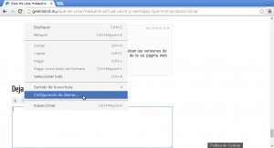
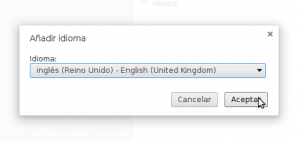
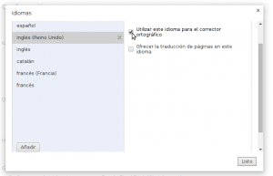
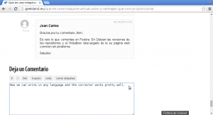
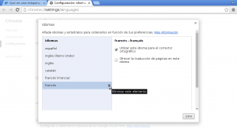

Recientemente ha cambiado la forma de usar el corrector ortográfico en Chrome y en Chromium. Por este motivo he decidido a redactar este post en el que comentaré como usar el corrector ortográfico en estos dos navegadores.<!--more-->

###### Nota: En las próximas semanas redactaré un post similar para usar el corrector ortográfico en Firefox.

## SITUACIONES EN LAS QUE ES ÚTIL UTILIZAR EL CORRECTOR ORTOGRÁFICO EN EL NAVEGADOR

Obviamente existen varias situaciones en las que podemos dar uso al uso del corrector ortográfico en el navegador. Algunas de estas situaciones son las siguientes:

1. **Cuando se escriben emails** mediante clientes web en servicios de correo como por ejemplo Gmail, Yahoo, Openmailbox, Zimbra, etc.
2. **Cuando se utilizan aplicaciones web o aplicaciones en la nube** como por ejemplo la suite ofimática de Google Drive, Owncloud, etc.
3. **Cuando hay que rellenar impresos**, **escribir** en los comentarios de un blog o de un **foro**, etc.

###### Nota: Es importante no cometer faltas de ortografía. En el momento que estás cometiendo faltas de ortografía graves estás proyectando una imagen negativa de ti mismo que te puede incluso llegar a cerrar puertas en la búsqueda de empleo y en otros ámbitos.

## CONFIGURAR EL CORRECTOR ORTOGRÁFICO MULTILINGUE EN CHROME

El proceso es sumamente sencillo. Tal y como se puede ver en la captura de pantalla, **ubicamos el puntero del mouse encima de un cuadro de texto** en el que queramos escribir y **presionamos el botón derecho del ratón**. Seguidamente, tal y como se puede ver en la captura de pantalla, **clicamos en la opción Configuración de idioma…** del menú contextual.

Seguidamente se abrirá la pestaña en la que podremos configurar los Idiomas de Google Chrome. Una vez abierta **presionaremos en el botón Añadir**.

A continuación, tal y como se puede ver en la captura de pantalla, **seleccionamos el corrector ortográfico que queremos añadir que en mi caso es el inglés**. Una vez seleccionado el idioma **presionamos el botón Aceptar**.

Finalmente tenemos que habilitar el corrector del idioma que hemos seleccionado. Para ello hay que **tildar la casilla Utilizar este idioma para el corrector ortográfico y presionar el botón Listo**.

Una vez configurado el inglés podemos añadir otros idiomas. Para añadirlos tan solo tenemos que repetir el proceso que acabamos de seguir, pero en vez de seleccionar el inglés seleccionamos otro lenguaje.

## USAR EL CORRECTOR ORTOGRÁFICO EN GOOGLE CHROME o CHROMIUM

Una vez configurado el corrector ortográfico usarlo es de lo más sencillo. **Chrome y Chromium detectaran automáticamente el idioma en el que estamos escribiendo en cada momento**. **De este modo**, si hemos configurado el corrector adecuadamente, tal y como se puede ver en la captura de pantalla, **tan solo tenemos que empezar a escribir sin preocuparnos de nada más**.

## DESHABILITAR IDIOMAS DEL CORRECTOR ORTOGRÁFICO

En el caso que un día decidamos que queremos deshabilitar alguno de los idiomas del corrector ortográfico lo podemos realizar de la siguiente forma. Tal y como se puede ver en la captura de pantalla, **ubicamos el puntero del mouse encima de un cuadro de texto en el que queremos escribir y presionamos el botón derecho del ratón**. Seguidamente **clicamos en la opción Configuración de idioma…** del menú contextual.

 

Seguidamente se abrirá la pestaña en la que podremos deshabilitar los idiomas que deseemos. Una vez abierta , tal y como se puede ver en la captura de pantalla, **seleccionamos el idioma que queremos deshabilitar** que en mi caso es el Francés, seguidamente **destildamos la opción Utilizar este idioma para el corrector ortográfico** y finalmente **presionamos en el botón **Listo****.

En estos momentos habremos deshabilitado el corrector ortográfico en Francés y, tal y como se puede ver en la captura de pantalla, aún tendremos activos el catalán, el Inglés y el Español.
