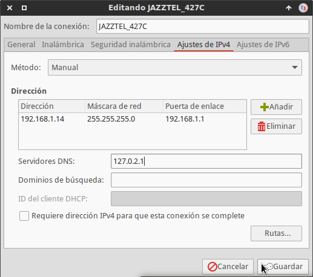
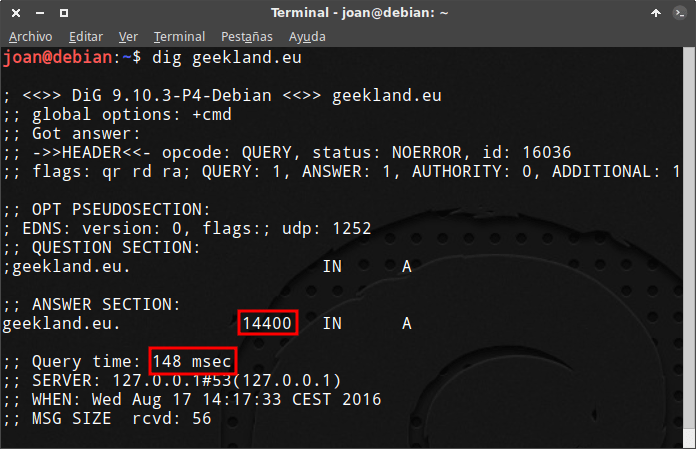

En artículos anteriores vimos los pasos a seguir para instalar, configurar y usar DNSCrypt en Linux y en Windows. Para terminar de completar los artículos que escribí en su día a continuación explicaremos como usar DNSmasq para mejorar el rendimiento de DNSCrypt.<!--more-->

Se recomienda que el punto de partida para aplicar este tutorial sea haber seguido las instrucciones mencionadas en los siguientes enlaces:

https://geeklandlinux.github.io/posts/instalar-dnscrypt-linux-ubuntu-windows/

https://geeklandlinux.github.io/posts/configurar-dnscrypt-en-gnu-linux/

## VENTAJAS OBTENIDAS AL USAR DNSMASQ CON DNSCRYPT

Si queremos podemos optimizar el rendimiento de DNSCrypt usando el servicio DNS cache de DNSmasq.

Las ventajas que obtendremos al usar DNSmasq son las siguientes:

1. Si la petición DNS a resolver está almacenada en nuestra memoria cache se resuelve al instante. De esta forma podremos incrementar nuestra velocidad de navegación.
2. Si la petición DNS está almacenada en nuestra memoria no tendremos que consultar los servidores DNS externos y por lo tanto ganaremos en seguridad.

## INSTALAR DNSMASQ

Para instalar DNSmasq ejecutaremos el siguiente comando en la terminal:

> ```
> sudo apt-get install dnsmasq
> ```

Una vez ejecutado el comando se instalará DNSmasq en nuestro sistema operativo.

###### Nota: Los usuarios que no usen el gestor de paquetes apt-get deberán usar el comando equivalente en su gestor de paquetes.

## CONFIGURAR DNSMASQ PARA TRABAJAR CON DNSCRYPT

Seguidamente modificaremos el archivo de configuración de DNSmasq para que pueda trabajar conjuntamente con DNSCrypt.

Para ello ejecutamos el siguiente comando en la terminal:

> ```
> nano /etc/dnsmasq.conf
> ```

Una vez abierto el editor de textos nano tenemos que realizar las siguientes modificaciones:

### Determinar el puerto de escucha de DNSmasq

Tenemos que buscar la siguiente línea:

> ```
> #listen-address=
> ```

Una vez encontrada la tenemos que descomentar y añadir la IP local loopback en que queremos que DNSmasq escuche las peticiones.

En mi caso selecciono la siguiente IP.

> ```
> Listen-address=127.0.0.1
> ```

###### Nota: La dirección a introducir tiene que ser del tipo 127.x.x.x y que no coincida con la de DNSCrypt que en mi caso es 127.0.2.1

### Hacer que DNSmasq solo pueda resolver peticiones de las direcciones en que escucha

Para garantizar que DNSmasq solo pueda resolver peticiones de las direcciones en que está escuchando tenemos que descomentar la siguiente línea:

> ```
> bind-interfaces
> ```

En estos momentos DNSmasq solo resolverá las peticiones DNS dirigidas a la dirección 127.0.0.1.

### Evitar que DNSmasq tenga en cuenta los hostname especificados en /etc/hosts

Para evitar que DNSmasq tenga en cuenta los hostname especificados en **/etc/hosts** tenemos que buscar la siguiente línea:

> ```
> #no-hosts
> ```

Una vez encontrada, la descomentamos de forma que quede de la siguiente forma:

> ```
> no-hosts
> ```

### Evitar que DNSmasq tenga en cuenta el contenido del archivo /etc/resolv.conf

Con el fin de evitar que DNSmasq tenga en cuenta el contenido del fichero resolv.conf tenemos que buscar la siguiente línea:

> ```
> #no-resolv
> ```

Una vez encontrada la descomentamos de forma que quede de la siguiente forma:

> ```
> no-resolv
> ```

### Determinar el tamaño de la cache de DNSmasq

Para determinar el tamaño máximo de peticiones DNS que almacenará nuestro servidor tenemos que buscar el parámetro cache-size.

En mi caso el parámetro cache-size es el siguiente:

> ```
> cache-size=150
> ```

Como quiero almacenar más de 150 peticiones DNS, incremento el valor del parámetro **cache-size** a 500 quedando de la siguiente forma:

> ```
> cache-size=500
> ```

En estos momentos nuestro servidor DNSmasq será capaz de almacenar 500 peticiones DNS.

### Evitar que las búsquedas inversas de ip locales se resuelvan en un servidor DNS Externo

Para evitar que las búsquedas inversas de IP locales, como por ejemplo **192.168.x.x**, sean resueltas por servidores DNS externos tenemos que asegurar que dentro del archivo de configuración haya la opción:

> ```
> bogus-priv
> ```

### Habilitar DNSSEC en DNSmasq

Al final del archivo de configuración tenemos que añadir la siguiente línea:

> ```
> proxy-dnssec
> ```

Añadiendo esta línea copiaremos las datos de autenticación DNSSEC del servidor DNS de DNSCrypt a la cache de DNSmasq. De este modo podemos evitar ataques DNS Cache poisoning cuando se resuelvan peticiones DNS de forma local.

### Seleccionar el servidor DNS a utilizar en el caso que la petición DNS a resolver no esté almacenada en la cache

Al final del archivo de configuración tenemos que añadir la siguiente línea:

> ```
> server=127.0.2.1
> ```

De esta forma indicamos que en el caso que nuestra petición DNS no esté almacenada en la memoria cache de DNSmasq se resolverá usando los servidores DNS de DNSCrypt.

En mi caso DNSCrypt está escuchando en la dirección 127.0.2.1. Si en vuestros caso estuviera escuchando en otra dirección tendréis que reemplazar 127.0.2.1 por la dirección correspondiente.

###### Nota: En caso de no saber en que dirección escucha DNSCrypt pueden averiguarlo ejecutando el comando sudo netstat -lpn | grep dnscrypt en la terminal u leer el siguiente [tutorial]().

### Mejorar la seguridad evitando ataques DNS Rebinding

Para mejorar la seguridad y evitar ataques del tipo [DNS Rebinding](https://es.wikipedia.org/wiki/DNS_rebinding "Explicación de lo que es un ataque DNS Rebinding"), al final del archivo de configuración añadimos la siguiente línea:

> ```
> stop-dns-rebind
> ```

De este modo evitamos que las peticiones DNS sean resueltas por un servidor que tenga una IP privada del tipo 192.168.1.101.

Por lo tanto añadiendo esta opción tendremos más seguridad de que quien está resolviendo nuestra peticiones DNS no es un servidor malicioso dentro de nuestra red local.

### Mejorar la seguridad evitando ataques vía script

Para evitar que servidores DNS de internet nos puedan devolver una respuesta del tipo 127.0.0.1, añadimos la siguiente línea al final del fichero de configuración:

> ```
> rebind-localhost-ok
> ```

De esta forma conseguiremos evitar ataques vía script procedentes de una página web.

### Evitar que dnsmasq proporcione servicio DHCP

Dnsmasq funciona como servidor DNS cache y como servidor DCHP.

Para evitar que DNSmasq proporcione servicio DHCP en las interfaces lo, wlan0 y eth0 aseguro que la opción **no-dhcp-interface** tenga los siguientes valores:

> ```
> no-dhcp-interface=wlan0, lo, eth0
> ```

De este modo DNSmasq actuará exclusivamente como servidor DNS cache.

###### Nota: Los nombres de vuestras interfaces de red pueden ser distintas a las mías.

### Solo resolver peticiones DNS de dominios completos

Para que únicamente se puedan resolver peticiones DNS de dominios completos tenemos que buscar la siguiente la línea:

> ```
> #domain-needed
> ```

Una vez encontrada la descomentamos quedando del siguiente modo:

> ```
> domain-needed
> ```

De este modo únicamente se podrán resolver peticiones DNS de nombres de dominio completo como por ejemplo **geeklandlinux.github.io**.

Por lo tanto si intentamos resolver la petición del tipo **geekland**, nunca se podrá resolver porqué el el nombre de dominio no es completo.

Una vez realizadas la totalidad de modificaciones de este apartado guardamos los cambios cerramos el fichero.

## MODIFICAR LA CONFIGURACIÓN DE NUESTRO GESTOR DE RED

Una vez finalizada la configuración tenemos que cambiar la configuración de nuestro gestor de red para poder usar DNSmasq.

Para ello accedemos a los ajustes de nuestro gestor de red, que en mi caso es Network Manager, y reemplazamos la IP del puerto de escucha de DNSCrypt (127.0.2.1) por la IP del puerto de escucha de DNSmasq (127.0.0.1).

Por lo tanto en mi caso pasaré de tener esta configuración:

[](images/Configuración-inicial-Gestor-de-red-DNSmasq.png)

A tener la siguiente configuración:

[](images/Configuración-final-Gestor-de-red-DNSmasq.png)

Una vez aplicados los cambios reiniciamos el ordenador para asegurar que se apliquen los cambios efectuados en nuestro gestor de red y en Dnsmasq. Después de reiniciar el equipo ya podremos usar DNSmasq para mejorar el rendimiento de DNSCrypt

## ASEGURAR QUE PODEMOS USAR DNSMASQ

Una vez reiniciado el sistema comprobamos que DNSmasq está activo ejecutando el siguiente comando en la terminal:

> ```
> sudo systemctl status dnsmasq.service
> ```

Si la respuesta del comando es parecida a la siguiente DNSmasq está activo:

> ```
> dnsmasq.service - dnsmasq - A lightweight DHCP and caching DNS server
>  Loaded: loaded (/lib/systemd/system/dnsmasq.service; enabled; vendor preset: enabled)
>  Drop-In: /run/systemd/generator/dnsmasq.service.d
>  └─50-dnsmasq-$named.conf, 50-insserv.conf-$named.conf
>  Active: active (running) since mar 2016-08-16 17:45:44 CEST; 20min ago
> ```

En caso de no esté iniciado lo podemos iniciar ejecutando el siguiente comando en la terminal:

> ```
> sudo systemctl start dnsmasq.service
> ```

Y para asegurar que en cada reinicio del sistema se iniciará de forma automática ejecutamos el siguiente comando en la terminal:

> ```
> sudo systemctl enable dnsmasq.service
> ```

###### Nota: En caso de error al iniciar DNSmasq deberán repasar de nuevo la configuración realizada.

## COMPROBAR EL FUNCIONAMIENTO DE DNSMASQ

Comprobar el funcionamiento de DNSmasq es sumamente sencillo.

Tan solo tenemos que abrir una terminal y ejecutar el comando **dig** seguido de un **dominio cualquiera**. En mi caso ejecuto el siguiente comando:

> ```
> dig geeklandlinux.github.io
> ```

[](images/Tiempo-en-resolver-Petición-DNS.png)

Si observamos el resultado obtenido podemos ver lo siguiente:

1. Los servidores DNS han tardado 148 milisegundos en resolver la petición DNS.
2. La petición DNS ha quedado almacenada en la cache por un período de 14400 segundos.

A continuación aplicaremos de nuevo el mismo comando que aplicamos anteriormente obteniendo el siguiente resultado:

[](images/Tiempo-en-resolver-petición-DNS-con-DNSmasq.png)

El tiempo de resolución de la petición DNS ahora es 0 milisegundos. Esto es signo inequívoco que la petición la ha resuelto DNSmasq. Por lo tanto podemos estar seguros que DNSmasq está funcionando correctamente.

## CONCLUSIONES RESPECTO A LA MEJORA DE RENDIMIENTO APORTADA POR DNSMASQ

El incremento de rendimiento que obtengo al usar DNSmasq no es perceptible.

Los motivos por los cuales pienso que no notaran ninguna mejora son los siguientes:

1. La cache de DNSmasq se almacena en la RAM. Por lo tanto la cache almacenada se pierde en cada uno de los arranques del sistema.
2. La gran mayoría de navegadores web incorporan un servicio de DNS cache propio. Por lo tanto en la navegación Web no notaremos ninguna mejora.
3. Las peticiones DNS almacenadas en la memoria RAM lo hacen por un período de tiempo limitado. Cuando DNSmasq cachea una dirección, lo hará únicamente por un período limitado de tiempo que pueden ser minutos u horas.

###### Nota: El tiempo mínimo y máximo que dnsmasq cachea las peticiones DNS se puede especificar en el archivo de configuración de DNSmasq con las variables min-cache-ttl=<tiempo> y max-cache-ttl=<tiempo>

Por estos motivos pienso que prácticamente no notaréis ninguna mejora de rendimiento usando DNSmasq.

Usar DNSmasq seria interesante y provechoso en el caso que tuviéramos una red local con un número elevado de equipos alimentándose de un mismo servidor DNS.

En este caso probablemente si percibiríamos una mejora de rendimiento importante.
