En el siguiente artículo veremos como monitorear procesos y tareas en Linux mediante el uso del monitor de procesos o el monitor de recursos top. De esta forma podremos monitorizar y analizar el rendimiento de nuestro servidor u ordenador de forma fácil, rápida y eficaz.<!--more-->

## ¿QUÉ ES EL MONITOR DE RECURSOS TOP?

TOP es un **programa informático** que viene preinstalado en la mayoría de distribuciones Linux. TOP sirve para monitorizar y administrar los procesos y tareas en cualquier sistema operativo UNIX como por ejemplo GNU Linux.

Al ejecutar TOP podremos ver una lista de los procesos y tareas que están ejecutándose en nuestro equipo. Los procesos se podrán clasificar y/o ordenar por consumo de CPU, por consumo de memoria, por usuario, por tiempo de funcionamiento, etc.

Como curiosidad solo decirles que TOP es un acrónimo y su significado es Table of processes o tabla de procesos.

## ¿SITUACIONES EN QUE PODEMOS USAR EL MONITOR DE RECURSOS TOP?

Algunas de las situaciones en que puede ser útil usar el monitor de recursos TOP son:

1. **Averiguar** un hipotético proceso **que está consumiendo demasiada memoria o demasiada CPU**.
2. **Detectar** la existencia de **procesos zombie** en nuestro equipo.
3. **Monitorear el tiempo de funcionamiento** de un proceso determinado.
4. **Obtener el PID** de un proceso.
5. **Ver el consumo total de memoria y CPU** de nuestro ordenador o servidor.
6. **Matar procesos**.
7. Modificar la prioridad de un proceso.
8. Etc.

Por lo tanto se trata de una herramienta extremadamente útil para cualquier administrador de sistemas.

## INFORMACIÓN PROPORCIONADA POR EL COMANDO TOP

Para ver los datos que proporciona el monitor de procesos y tareas top tenemos que abrir una terminal y ejecutar el siguiente comando:

> ```
> top
> ```

Acto seguido verán que se muestran los siguientes resultados:

[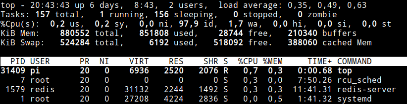](images/resultados-monitor-de-recursos-top.png)

El significado de todos y cada uno de los parámetros mostrados por el monitor de recursos TOP se detalla a continuación.

### Cómo interpretar los resultados de la sección Tiempo de actividad

En la primera línea vemos la salida equivalente al comando **uptime**. Una muestra de la información proporcionada es la siguiente:

[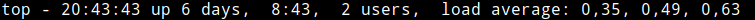](images/tiempo-de-actividad.png)

Por lo tanto los resultados mostrados son los siguientes:

1. **Hora actual**.
2. **Tiempo que nuestro equipo o servidor ha estado encendido** sin reiniciarse.
3. **Número de sesiones de usuario activas**. En mi caso hay 2 sesiones de usuario. La primera es el usuario del sistema operativo y la segunda es un usuario remoto conectado vía SSH. Las sesiones de usuarios activas se pueden obtener ejecutando el comando who.
4. Indicador absoluto de **carga media de la CPU** durante el último minuto, los últimos 5 minutos y los últimos 15 minutos. En función del número de núcleos del sistema operativo se deberán interpretar los valores de carga.

### Interpretar el estado de los procesos y tareas que se ejecutan en el sistema operativo

En la segunda línea podremos ver estadísticas referentes a los procesos y tareas del sistema operativo. A continuación les dejo una muestra de las estadísticas mostradas:

[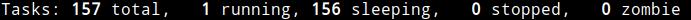](images/estado-de-los-procesos-y-tareas.png)

El significado de los parámetros mostrados en la segunda línea es el siguiente:

 
|   **Parámetro**   |   **Explicación**   |
| --- | --- |
|   **Tasks**   |   Número total de procesos que están cargados en memoria, estén o no ejecutándose.   |
|   **Running**   |   Número procesos que están en ejecución o en la cola de ejecución. En mi caso podemos ver que solamente tenemos una tarea en ejecución que es el monitor de recursos top.   |
|   **Sleeping**   |   Procesos que están detenidos a la espera que se produzca un evento que los active. Un ejemplo del evento que puede activar un proceso es la finalización de un proceso de lectura y escritura en disco.   |
|   **Sopped**   |   Muestra el número de tareas que se han detenido manualmente. Una tarea puede detenerse presionando Ctrl+Z o usando el comando kill -STOP.   |
|   **Zombie**   |   Detalla el número de procesos Zombie en nuestro sistema operativo. Un proceso Zombie es un proceso hijo que permanece en la tabla de procesos porque el proceso padre no ha sido capaz de leer la señal de finalización del proceso hijo.   |

### Estado y uso de la CPU en el monitor de recursos top

En la tercera de las líneas encontramos información relativa el consumo de CPU por parte de las tareas. La información mostrada será la siguiente.

[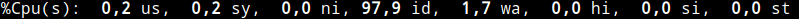](images/estado-y-uso-de-la-cpu.png)

El significado de cada uno de los parámetros es el siguiente:

 
|   **Parámetro**   |   **Explicación**   |
| --- | --- |
|   **us (usuario)**   |   % de CPU que están consumiendo los procesos que se ejecutan en el espacio de usuario. La gran mayoría de programas y aplicaciones que ejecutamos, servidores web, base de datos, etc correarán en el espacio de usuario.   |
|   **Sy (sistema)**   |   % de CPU consumida por los procesos que corren en el espacio del sistema o Kernel. En el espacio del kernel normalmente corren procesos para controlar el hardware de nuestro equipo, procesos para controlar la asignación de memoria, etc.   |
|   **ni (nice)**   |   Muestra el % de CPU consumida por procesos de baja prioridad.   |
|   **Id (idle o inactivo)**   |   Vemos el % de CPU que no está siendo utilizada.   |
|   **Wa (en espera)**   |   Detalla el porcentaje de tiempo que el procesador está esperando para que se completen tareas de lectura y escritura en disco, comunicación con otros dispositivos de la red, obtener información de una base de datos, etc.   |
|   **hi (hardware interrupt)**   |   % del tiempo que la CPU no está procesando debido a interrupciones de hardware.   |
|   **si (software interrupt)**   |   % del tiempo que la CPU no está procesando debido a interrupciones de software. Un ejemplo de una interrupción de software puede ser una lectura y/o escritura en disco.   |
|   **st (steal time):**   |   Únicamente será diferente a cero si estamos corriendo el sistema operativo sobre una máquina virtual. El valor st es el % de tiempo que la CPU virtual ha estado esperando la CPU real mientras el hipervisor da servicio a otro procesador virtual.   |

### Análisis del apartado consumo de memoria en el monitor de recursos top

En la cuarta y quinta línea encontraremos información acerca del uso que nuestro sistema operativo hace de la memoria RAM y SWAP. La información que muestra es la siguiente:

[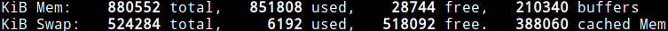](images/consumo-de-memoria.png)

Para ver una explicación de los valores mostrados en este apartado pueden visitar el siguiente enlace:

https://geekland.eu/consumo-de-memoria-ram-en-linux/

### Entendiendo la área de tareas y procesos del monitor de recursos top

Cada una de las columnas de la área de tareas muestra la siguiente información:

[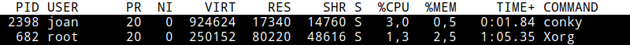](images/area-de-tareas-y-procesos.png)

El significado de los parámetros de la captura de pantalla es el siguiente:

 
|   **Parámetro**   |   **Explicación**   |
| --- | --- |
|   **PID**   |   Identificador del proceso. El identificador de proceso no es más que un número entero que identifica un proceso determinado.   |
|   **USER**   |   El nombre del usuario que ha iniciado el proceso.   |
|   **PR:**   |   Indica la prioridad que tiene un proceso o tarea. Normalmente la prioridad estándar de un proceso es 20 y para incrementarla o disminuirla usaremos la propiedad **NI** “Nice”. Cuando más bajo sea el número de prioridad, más alta será la prioridad.   |
|   **NI:**   |   Mediante el valor NI incrementamos o disminuimos la prioridad **PR** de un proceso. Si la PR estándar de un proceso es 20, pero asignamos un valor NI de -20, entonces la prioridad real del procesoo será 0. Un proceso con prioridad PR 0 tendrá mayor prioridad que un proceso con prioridad PR 20. |
|   **VIRT:**   |   Consumo total de memoria por parte de un proceso incluyendo la memoria de intercambio SWAP, el código del programa, los datos que el proceso pueda almacenar en memoria, etc.   |
|   **RES:**   |   Consumo total de única y exclusivamente la memoria RAM de un proceso determinado.   |
|   **SHR:**   |   Cantidad de memoria Virtual que ocupa un proceso y podría ser compartida con otros procesos.   |
|   **S:**   |   Detalla el estado de cada una de las tareas o procesos. El significado de cada uno de los estados es el siguiente:  **R (Running):** Proceso que está corriendo o está en la cola de ejecución  **S (Interruptible sleep):** Procesos que están esperando a un evento para su ejecución.  **D (Uninterruptible sleep)**: Procesos esperando a que termine una operación I/O. Ejemplos de operaciones de I/O son lecturas y/o escrituras en disco, comunicación con otros dispositivos de la red, obtener información de una base de datos, etc.  **T (Stopped):** Proceso que ha sido detenido mediante señales o comandos como por ejemplo kill o la combinación de teclas Ctrl+Z.  **Z (Zombie):** Indica que es un proceso Zombie.   |
|   **%CPU:**   |   Capacidad de procesamiento que consume cada uno de los procesos o tareas.   |
|   **%MEM:**   |   % de memoria RAM que está consumiendo cada uno de los procesos o tareas.   |
|   **TIME+**   |   Tiempo total de CPU que ha usado una tarea o proceso desde que se inicio.   |
|   **COMMAND**   |   Muestra el nombre del proceso o el comando usado para iniciar la tarea.   |

## COMO MONITOREAR LOS PROCESOS CON TOP

Una vez tenemos clara toda la información proporcionada por TOP veremos como podemos empezar a sacarle partido.

### Iniciar el monitor de recursos Top

Para iniciar el monitor de recursos TOP tan solo tenemos que ejecutar el siguiente comando en la terminal:

> ```
> top
> ```

Una vez iniciado verán la totalidad de procesos y tareas del sistema operativo.

[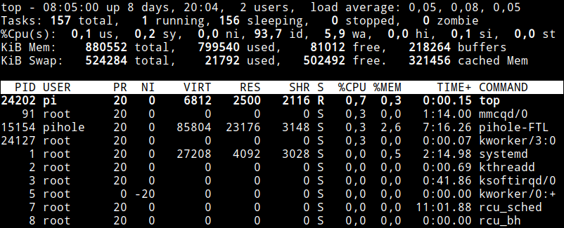](images/resultados-mostrados-en-top.png)

Si observan detalladamente el monitor verán que los resultados se refrescan cada 3 segundos. **En el caso que quieran cerrar el monitor de recursos deberán presionar la tecla** q.

### Configurar la tasa de refresco del monitor de recursos top

El comando top se refresca dinámicamente cada 3 segundos. Si queremos modificar la frecuencia de actualización **presionamos la tecla** d mientras se esté ejecutando top.

Acto seguido **indicamos la frecuencia de actualización en segundos y presionamos Enter**. En mi caso quiero que los resultados de top se actualicen cada 10 segundos, por lo tanto escribo 10 y presiono Enter.

[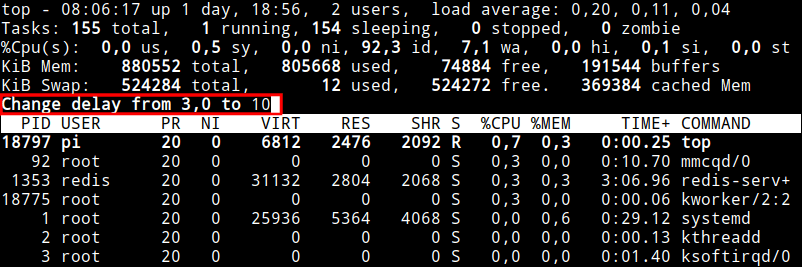](images/frecuencia-refresco-monitor-recursos.png)

Para abrir top con una frecuencia de refresco diferente a la estándar también podemos ejecutar el comando top \-d seguido de la tasa de refresco en segundos. Por lo tanto para abrir top con una tasa de refresco de 10 segundos ejecutaremos el siguiente comando:

> ```
> top -d 10
> ```

### Hacer que top se refresque un número determinado de veces y se cierre

Top se ejecuta de forma indefinida y de forma estándar refresca sus resultados cada 3 segundos.

Si queremos que top se cierre después de refrescarse un número determinado de veces tan solo tenemos que ejecutar el comando top \-n seguido del número de veces que queremos que se refresque.

Por lo tanto si queremos que top se refresque únicamente 2 veces y se cierre ejecutaremos el siguiente comando:

> ```
> top -n 2
> ```

Con el comando ejecutado, top tan solo estará abierto 3 segundos. Se abrirá mostrando los resultados, pasarán 3 segundos y se refrescarán los resultados. Justo después de refrescarse los resultados se cerrará.

Si queremos que top se refresque 5 veces y que entre refresco y refresco pasen 10 segundos ejecutaremos el siguiente comando en la terminal:

> ```
> top -n 5 -d 10
> ```

### Mostrar los procesos ordenados por el consumo de memoria RAM

Si queremos que TOP muestre los procesos ordenados de mayor a menor consumo **presionaremos la tecla** M mientras se esté ejecutando top.

[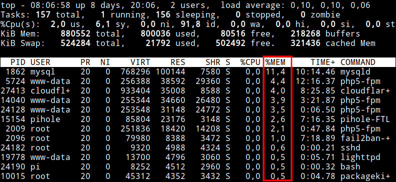](images/procesos-ordenados-consumo-memoria.png)

**En el caso que quisiéramos revertir el orden**, y por lo tanto mostrar los procesos ordenados de menor a mayor consumo de memoria RAM, tendríamos que **presionar la tecla** R.

[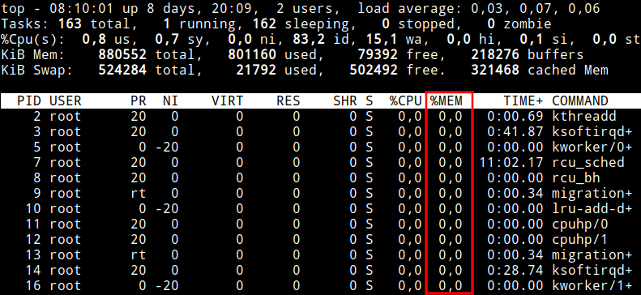](images/procesos-ordenados-de-menor-a-mayor-consumo-memoria.png)

### Mostrar los procesos ordenados por el uso de CPU

Para mostrar los procesos ordenados por consumo de CPU tenemos que **presionar la tecla** P mientras se está ejecutando top. En mi caso el resultado obtenido es el siguiente:

[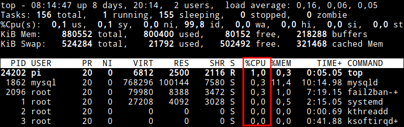](images/procesos-ordenados-consumo-CPU.png)

Del mismo modo que en el caso anterior podemos ordenarlos de menor a mayor uso presionando la tecla R.

### Ver las tareas y/o procesos ordenados por tiempo de uso

Para obtener una lista de tareas ordenadas por su tiempo de ejecución tenemos que **presionar la tecla** T mientras se está ejecutando el monitor de recursos top.

[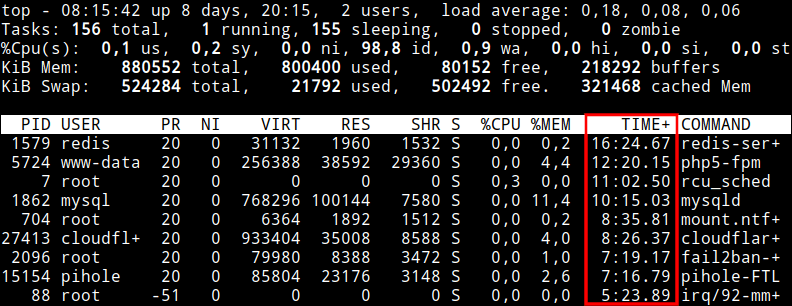](images/procesos-ordenados-por-tiempo-uso.png)

### Ordenar los procesos por su número de identificador

Para ordenar los procesos por su número de identificador **presionen la tecla** N mientras se está ejecutando top.

[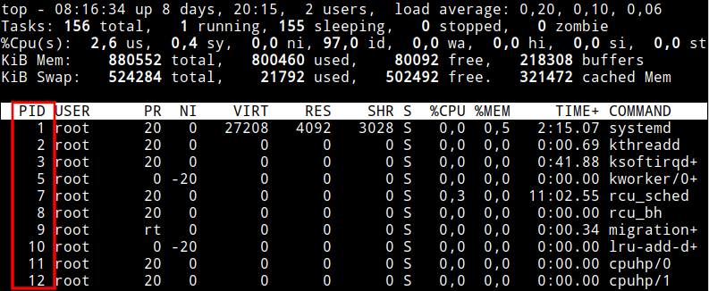](images/ordenar-procesos-por-PID.png)

### Resaltar las columnas que tenemos ordenadas

Acabamos de ordenar los datos mostrados en pantalla por consumo de CPU, consumo de memoria, por proceso y por tiempo de ejecución. Si queremos resaltar la columna que estamos ordenando realizaremos lo siguiente.

**Inicialmente presionaremos** la tecla x mientras se esté ejecutando top. De este modo, el texto de la columna ordenada se mostrará en negrita.

**Acto seguido presionaremos** la tecla b para que se resalte la columna que estamos ordenando. El resultado obtenido será parecido al siguiente:

[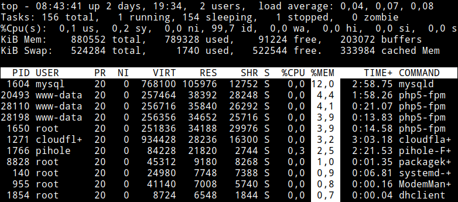](images/resaltar-las-columnas-ordenadas.png)

### Matar una tarea con el monitor de recursos top

Simplemente tenemos que **presionar la tecla** k cuando top se está ejecutando. Acto seguido se nos preguntará el **número de proceso que queremos matar**. Como en mi caso quiero eliminar conky tecleo el proceso 2398 y presiono Enter.

[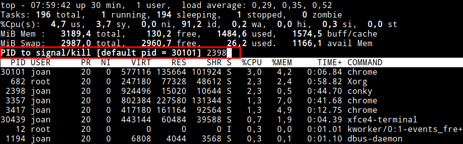](images/seleccionar-proceso-a-matar.png)

Acto seguido, **si queremos matar el proceso sin forzarlo tan solo tenemos que presionar** otra vez la tecla Enter. En el caso que quisiéramos forzar el cierre del proceso escribiríamos SIGKILL o el número 9 y presionaríamos la tecla Enter.

[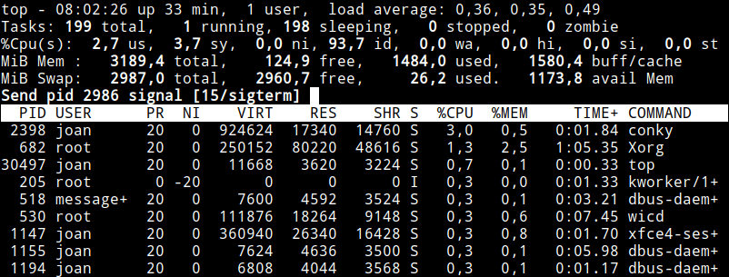](images/matar-un-proceso.png)

### Reiniciar una tarea con el monitor de procesos top

El proceso para reiniciar una tarea es similar al de matar una tarea, pero en vez de presionar la tecla k hay que presionar la tecla r.

Por lo tanto, mientras se esté ejecutando top **presionamos la tecla** r. Acto seguido **tecleamos el número de** PID y presionamos Enter.

[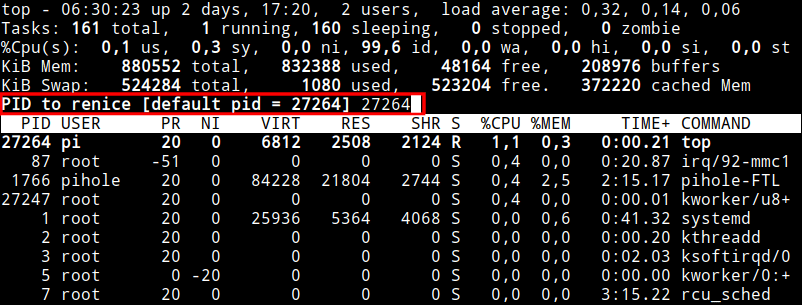](images/reiniciar-un-proceso.png)

Justo al presionar Enter volvemos a presionar la tecla Enter para confirmar el reinicio de la tarea.

### Modificar la prioridad de un proceso

Top permite modificar la prioridad de un proceso modificando la propiedad Nice (Ni)

Para ello mientras se está ejecutando top **presionamos la tecla** r. A continuación **escribimos el número de proceso** al que queremos cambiar la prioridad y presionamos Enter. Como en mi caso quiero modificar la prioridad de la tarea top escribo el PID 4970 y presiono Enter.

[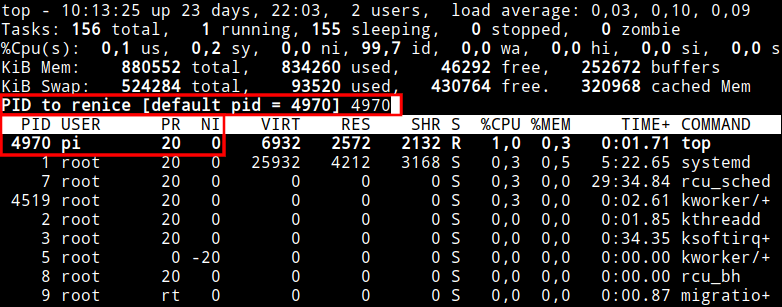](images/seleccionar-proceso-para-cambiar-prioridad.png)

A continuación tenemos que **introducir el valor Ni** que incrementará o disminuirá la prioridad de la tarea top. Como en mi caso quiero disminuir la prioridad de la tarea escribiré el número 10 y presionaré Enter.

[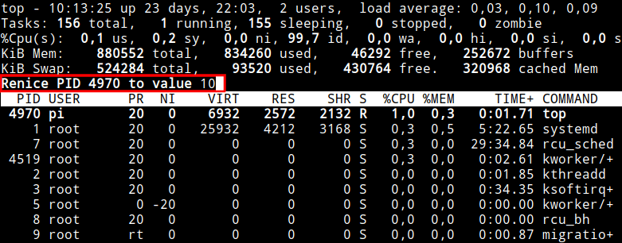](images/definir-prioridad-de-un-proceso.png)

Tal y como pueden ver a continuación, en estos momentos la tarea top tiene una prioridad de 30 en vez de 20.

[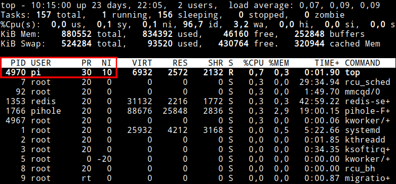](images/cambiar-prioridad-de-un-proceso.png)

### Usar el monitor de recursos top en modo seguro

Acabamos de ver que top sirve para tareas como por ejemplo matar o reiniciar procesos, modificar su intervalo de refresco, modificar la prioridad de un proceso, etc. Si queremos evitar que se realicen estas tareas de forma accidental podemos abrir top en modo seguro ejecutando el siguiente comando en la terminal:

> ```
> top -s
> ```

De este modo top evitará que se realicen modificaciones accidentales en nuestro equipo.

### Monitorear los procesos de un determinado usuario

Para monitorear los procesos de un determinado usuario tan solo tenemos que **presionar la tecla** u mientras estamos ejecutando top. Acto seguido **escribiremos el nombre del usuario** en cuestión y presionaremos Enter.

[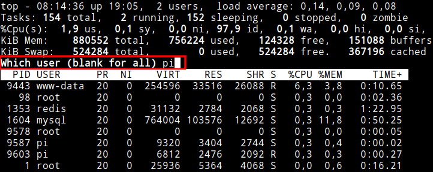](images/seleccionar-usuario-monitorear-proceso.png)

Después de presionar Enter podremos monitorear los procesos sin ningún tipo de problema. Tal y como se puede ver en la captura de pantalla, en mi caso estoy monitoreando los procesos del usuario pi.

[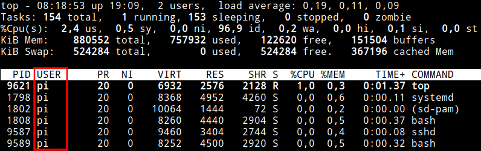](images/viendo-tareas-y-procesos-usuario-pi.png)

Para abrir top de forma directa mostrando los procesos de un usuario tenemos que teclear top \-u seguido del nombre de usuario. Por lo tanto para monitorear los procesos del usuario pi tan solo tenemos que ejecutar el siguiente comando en la terminal:

> ```
> top -u pi
> ```

Para obtener un listado con la totalidad de usuarios existentes pueden ejecutar el siguiente comando en la terminal:

> ```
> getent passwd
> ```

### Monitorizar uno o varios procesos concretos

Para monitorizar un proceso o una lista de procesos deberemos actuar de la siguiente forma.

**Averiguamos el identificador de proceso** (PID) de la tarea que queremos monitorizar. Para ello ejecutamos el comando:

> ```
> ps -aux
> ```

En mi caso quiero monitorizar el proceso Cloudflare, Pi-hole y Openvpn Pivpn que tienen respectivamente los identificadores de proceso 1271, 1766 y 1140. Por lo tanto **ejecutaré el comando** top -p seguido de los números de procesos separados por una coma:

> ```
> top -p 1271,1766,1140
> ```

El resultado obtenido será el siguiente:

[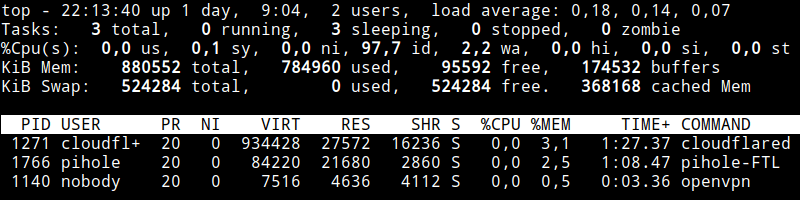](images/consumo-procesos-determinados.png)

###### Nota: Podemos introducir una lista de hasta 20 procesos.

### Seleccionar el número de procesos que se muestran en pantalla

Al ejecutar el comando top aparecen la totalidad de procesos que están cargados en la memoria.

Si queremos limitar el número de procesos que vemos en pantalla **presionamos la tecla** n mientras se está ejecutando el monitor de recursos. Acto seguido tecleamos el número de tareas que queremos que aparezcan en pantalla que en mi caso son 5.

[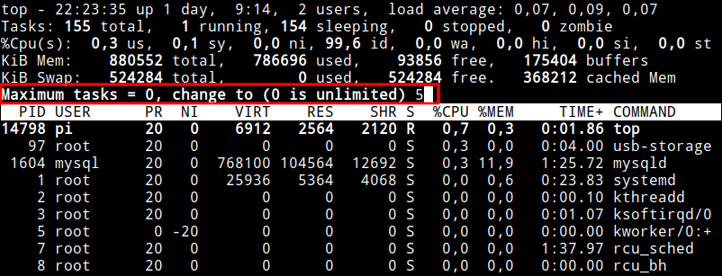](images/definir-numero-tareas-en-pantalla.png)

Finalmente presionamos Enter y tan solo veremos 5 procesos en pantalla.

### Sacar instantáneas o snapshot de los procesos y tareas

Las instantáneas o snapshot del monitor de procesos top pueden ser útiles para:

1. Enviar información del monitor de recursos a un programa.
2. Almacenar los datos obtenidos por top en un archivo.

Para enviar los resultados mostrados por top en un archivo ejecutaremos un comando del siguiente tipo:

> ```
> top -b -n 5 > archivo_top
> ```

El significado de cada uno de los parámetros es:

- \-b: Para indicar que queremos que tomar una o varias instantáneas.
- \-n: Indicar que top se cierre después de que se haya refrescado un número determinado de veces.
- 5: Número de veces que se refrescará top antes de cerrarse.
- \> archivo\_top: Nombre del archivo en que se almacenaran los resultados de top.

Una vez almacenados los datos los podemos consultar con el comando cat o con cualquier editor de archivos, como por ejemplo nano. En mi caso consultaré el archivo con nano ejecutando el siguiente comando en la terminal:

> ```
> nano archivo_top
> ```

Los resultados obtenidos son los que se muestran a continuación:

[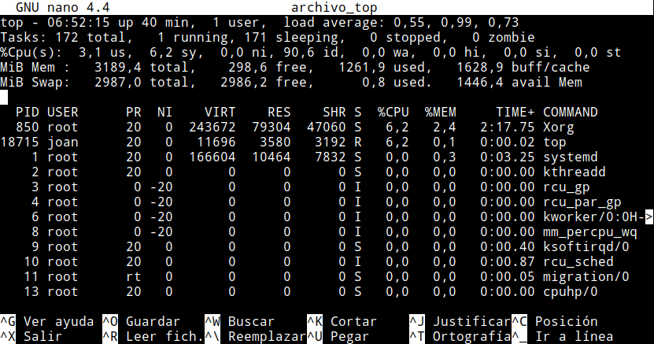](images/instantanea-top-almacenada-archivo.png)

De esta forma tan simple podemos crear un log en el que podamos analizar el funcionamiento de nuestro equipo o servidor.

### Configurar los colores del monitor de procesos top

Top muestra los resultados en blanco y negro. Si queremos que nos los muestre en color podemos **presionar la tecla** z mientras estamos ejecutando top. El resultado obtenido es el siguiente:

[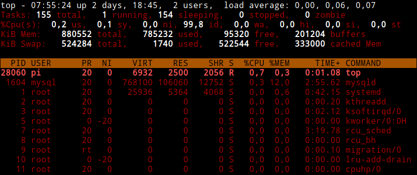](images/top-resultados-en-color.png)

###### Nota: Al presionar z también se resaltan los procesos que están activos.

###### Nota: Para resaltar los procesos activos cuando estamos en modo monocolor tenemos que presionar la tecla b.

Si queremos modificar el esquema de colores podemos presionar la tecla Z mientras estamos ejecutando el monitor de recursos. Acto seguido nos aparecerá un menú de configuración en el que podremos cambiar los colores. Una vez cambiados los colores podemos obtener resultados similares a los siguientes:

[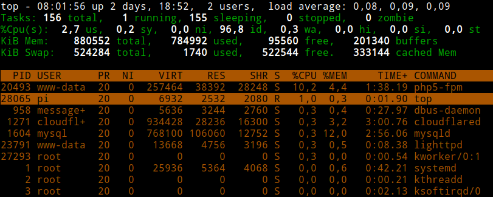](images/top-esquema-colores-cambiados.png)

### Usar filtros para seleccionar la información que monitorizamos

Top permite aplicar filtros para que la monitorización de procesos y tareas sea más precisa y práctica.

Para ello tan solo tenemos que **presionar la tecla** o mientras se está ejecutando top. A continuación se nos preguntará el filtro que queremos aplicar. En mi caso quiero que solo se muestren las tareas que tengan un consumo de CPU superior al 0,2%. Por lo tanto escribiré el siguiente filtro:

> ```
> %CPU>0.2
> ```

[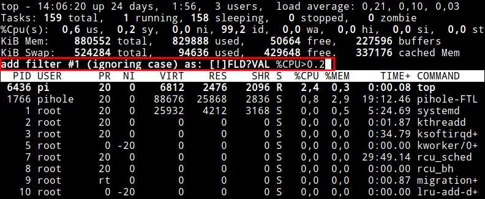](images/filtrar-procesos-por-cpu-consumida.png)

###### Nota: Para definir una filtro tan solo tenemos que teclear el nombre del campo seguido de un operador (<, \>, \=) y un valor numérico.

Acto seguido presionaremos Enter y obtendremos el siguiente resultado:

[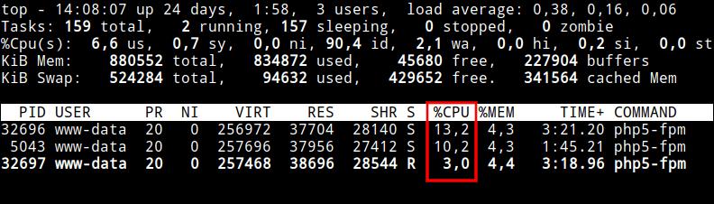](images/tareas-filtradas-consumo-cpu.png)

Si en vez de mostrar los procesos que tienen un consumo de CPU superior a 0,2% quisiéramos excluir la totalidad de procesos que tienen un consumo superior a 0,2% deberíamos haber aplicado el siguiente filtro:

> ```
> !%CPU>0.2
> ```

Otros ejemplos de filtro que podríamos haber aplicado son:

 
|   **Filtro**   |   **Acción**   |
| --- | --- |
|   !%PR\=20   |   Excluir la totalidad de procesos que tienen prioridad igual a 20   |
|   %COMMAND\=chrome   |   Monitorizar la totalidad de procesos de Chrome   |
|   !%COMMAND\=chrome   |   Excluir la totalidad de procesos de Chrome   |
|   !%MEM\=5   |   Excluir la totalidad de procesos con un consumo de RAM inferior al 5%   |
|   ...   |  |

 

**Una vez aplicado un filtro podemos aplicar otro filtro**. Para ello, una vez hayamos aplicado el primer filtro volvemos a presionar la tecla o. Acto seguido introducimos el segundo filtro que en mi caso será el siguiente:

> ```
> USER=pi
> ```

Finalmente presionaremos Enter. En estos momentos el monitor únicamente mostrará los procesos del usuario pi que consuman más de un 0,2% de CPU.

**Para ver los filtro activos presionamos la combinación de teclas** Ctrl + o.

[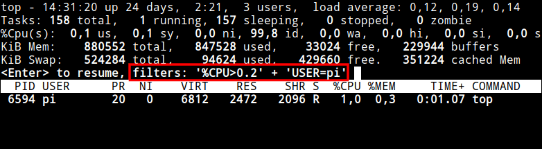](images/ver-filtros-activos.png)

**Para eliminar los filtros activos** de la ventana que tenemos abierta **presionamos** la tecla \=.

### Mostrar el comando usado para iniciar una determinada tarea

El campo COMMAND muestra un nombre asociado a una tarea/proceso determinada/o. Si en vez de mostrarse el nombre queremos que se muestre el comando usado para iniciar la tarea tendremos que **apretar la tecla** c mientras se está ejecutando top.

[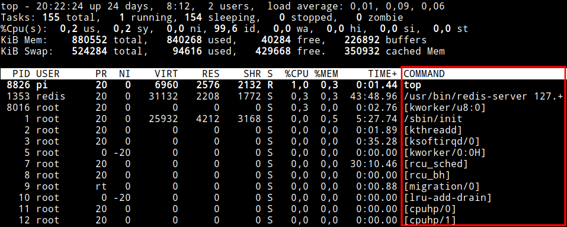](images/comando-usado-iniciar-tarea.png)

Otra solución alternativa seria iniciar Top mediante el siguiente comando:

> ```
> top -c
> ```

### Ver la versión de Top que tenemos instalada

Para ver la versión de Top que tenemos instalada tan solo tenemos que ejecutar el siguiente comando en la terminal:

> ```
> top -v
> ```

## ATAJOS DE TECLADO ÚTILES PARA USAR EL MONITOR DE RECURSOS TOP

Los atajos de teclado indispensables para trabajar con el monitor de recursos top son las que se muestran a continuación:

 
|   **Operación**   |   **Combinación de teclas o comando a usar**   |
| --- | --- |
|   Ordenar los procesos por consumo de CPU   |   Mayus + p   |
|   Ordenar los procesos por consumo de memoria   |   Mayus + m   |
|   Ordenar los procesos por tiempo de uso   |   Mayus + t   |
|   Ordenador los procesos por número de identificador PID   |   Mayus + n   |
|   Resaltar las columnas que estamos ordenando   |   x + b   |
|   Revertir/Invertir el orden de los procesos que aparecen en pantalla   |   R   |
|   Resaltar proceso activo   |   b   |
|   Mostrar la carga por separada de cada uno de los núcleos de la CPU   |   1   |
|   Modificar la tasa de refresco   |   d + número de segundos   |
|   Mostrar los proceso de un usuario determinado   |   Mayus + u + usuario   |
|   Seleccionar los procesos que queremos monitorizar   |   \-p PID\_1,PID\_2,PID\_3   |
|   Matar una tarea   |   k + PID de la tarea   |
|   Reiniciar una tarea   |   r + PID de la tarea   |
|   Modificar la prioridad de un proceso o tarea   |   r + PID + valor\_Ni   |
|   Aplicar un filtro   |   o + filtro que queremos aplicar   |
|   Mostrar los filtros aplicados   |   Ctrl + o   |
|   Borrar los filtros aplicados   |   \=   |
|   Avanzar en la lista de procesos que se muestran en pantalla   |   Avpág o cursor abajo   |
|   Retroceder en la lista de procesos que se muestran en pantalla   |   RePág o cursor arriba   |
|   Mostrar la ayuda   |   h   |
|   Para indicar el número de procesos que se muestran en pantalla   |   n + número de procesos a visualizar en pantalla   |
|   Cambiar de blanco y negro a color y resaltar los procesos activos   |   z   |
|   Configurar la paleta de colores   |   Z   |
|   Mostrar el comando usado para iniciar una tarea   |   c   |
|   Detener el monitor de recursos   |   Ctrl + Z   |
|   Salir y parar el monitor de recursos   |   q   |

Para finalizar solo remarcar que esté articulo solo muestra parte de las funcionalidades de top. Si quieren indagar y ver opciones adicionales abran una terminal y consulten las páginas man de top.
