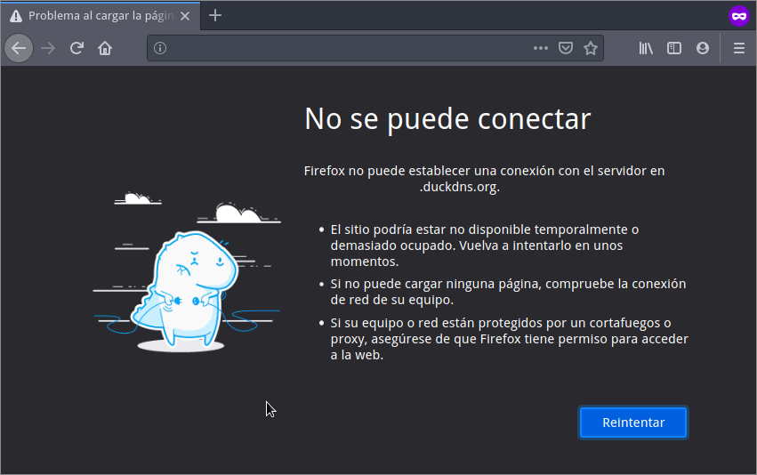

Para proteger los servicios que tenemos montados con Docker a través del proxy inverso Traefik podemos usar Fail2ban. De este modo podremos evitar los ataques de fuerza bruta bloqueando a todo usuario o bot que introduzca las credenciales de autenticación incorrectamente de forma reiterada. Para ello deberemos proceder del siguiente modo.<!--more-->

## INSTALAR FAIL2BAN PARA EVITAR ATAQUES DE FUERZA BRUTA EN LOS SERVICIOS DOCKER DETRÁS DE TRAEFIK

Obviamente tenemos que instalar Fail2ban. Fail2ban será el encargado de bloquear la totalidad de ataques de fuerza bruta a nuestros servicios autoalojados mediante Traefik. Podemos instalar Fail2ban directamente en nuestro servidor o mediante un contenedor de Docker. Ambos métodos funcionan, pero en mi caso lo he instalado locamente usando los repositorios de mi distribución Linux. Para ello he ejecutado el siguiente comando en la terminal:

> ```shell
> sudo apt-get install fail2ban
> ```

**Nota**: En el caso que usen un gestor de paquetes diferentes a apt deberán adaptar el comando de instalación. Por ejemplo si usan una distro que use el gestor de paquetes yum deberán ejecutar `sudo yum install epel-release && sudo yum update -y && sudo yum install -y fail2ban`

Si por lo contrario quieren instalar Fail2ban usando un contenedor de Docker pueden usar el siguiente Docker-Compose:

> ```shell
> version: '2'
> services:
>   fail2ban:
>     image: crazymax/fail2ban:latest
>     restart: unless-stopped
>     network_mode: "host"
>     cap_add:
>     - NET_ADMIN
>     - NET_RAW
>     volumes:
>     - /var/log:/var/log:ro
>     - /home/geekland/services/fail2ban/data:/data
>     env_file:
>       - ./fail2ban.env
> ```

**Nota**: El docker-compose lo he probado y funciona, pero lo dejaremos de lado en este artículo. Si quieren usar el Docker tendréis que cambiar las rutas de los volúmenes de persistencia.

## HACER QUE TRAEFIK GUARDE LOS LOGS EN UN **VOLUMEN** DE PERSISTENCIA

En su día [instalamos Traefik v2 siguiendo las siguientes indicaciones](). La configuración estándar no genera ningún tipo de log y esto es un problema importante para que fail2ban pueda funcionar con Traefik. Para activar y filtrar los logs de autenticación en Traefik deben modificar el fichero de configuración `traefik.toml` para que quede del siguiente modo:

> ```shell
> [entryPoints]
>   [entryPoints.web]
>     address = ":80"
>     [entryPoints.web.http.redirections.entryPoint]
>       to = "websecure"
>       scheme = "https"
> 
>   [entryPoints.websecure]
>     address = ":443"
> 
> [api]
>   dashboard = true
> 
> [certificatesResolvers.lets-encrypt.acme]
>   email = "tuemail@geekland.com"
>   storage = "acme.json"
>   [certificatesResolvers.lets-encrypt.acme.tlsChallenge]
> 
> [providers.docker]
>   watch = true
>   network = "web"
> 
> [providers.file]
>   filename = "traefik_dynamic.toml"
> 
> [accessLog]
>   filePath = "/var/log/access.log"
> 
>   [accessLog.filters]
>     statusCodes = ["400-499"]
>     retryAttempts = true
>     minDuration = "10ms"
> ```

**Nota:** Lo único que tienen que hacer es añadir la parte de color azul en su fichero de configuración.

Los nuevos parámetros introducidos en el fichero de configuración tienen el siguiente significado:

`filePath = "/var/log/access.log"`: Definimos que la ruta de los logs de Traefik sea `/var/log/access.log`

`statusCodes = ["400-499"]`: Definimos/filtramos los logs que almacenará Fail2ban. Con el rango 400-499 se registrarán los intentos de autenticación en la totalidad de servicios que están detrás de Traefik.

`retryAttempts = true`: Se loguearan y almacenarán la totalidad de intentos/reintentos de autenticación.

`minDuration = "10ms"`: Se registran todas las peticiones que tardan más de 10ms en resolverse en el log.

Una vez realizada la configuración guardan los cambios, cierran el fichero y borran el contenedor actual de Traefik mediante los siguiente comandos:

> ```shell
> docker stop traefik
> docker rm traefik
> ```

A continuación generan el siguiente docker-compose para levantar un nuevo contenedor de Traefik. Si os fijáis, el siguiente docker-compose tiene la particularidad de crear un volumen de persistencia de los logs de Traefik en la ubicación `/var/log/traefik`. El docker-compose para levantar el nuevo contenedor de Traefik es el siguiente:

> ```shell
> version: '2'
> services:
>   traefik:
>     image: traefik:latest
>     restart: unless-stopped
>     container_name: traefik
>     volumes:
>     - /var/run/docker.sock:/var/run/docker.sock
>     - /home/geekland/traefik.toml:/traefik.toml
>     - /home/geekland/traefik_dynamic.toml:/traefik_dynamic.toml
>     - /home/geekland/acme.json:/acme.json
>     - /var/log/traefik:/var/log
>     ports:
>     - 8080:8080/tcp
>     - 80:80/tcp
>     - 443:443/tcp
>     networks:
>     - web
> ```

**Nota:** Deberéis reemplazar las partes verdes por la ruta en que querías montar vuestro volumen de persistencia.

Una vez generado el docker-compose guardan los cambios, cierran el fichero y levantamos el contenedor ejecutando el siguiente comando en la terminal:

> ```shell
> docker-compose up -d
> ```

Una vez levantado el Docker habrán realizado el paso más importante para poder usar Fail2ban con la totalidad de servicios montados usando Traefik.

## CONFIGURACIÓN PARA PODER USAR FAIL2BAN CON TRAEFIK

Para que Fail2ban pueda detectar los ataques de fuerza bruta debemos definir filtros y acciones. A modo de ejemplo crearemos un filtro y una acción para bloquear a los usuarios o bots que excedan el número límite de intentos de autenticación al panel web de Traefik.

### Filtro de fail2ban para detectar los intentos fallidos de autenticación al panel web de Traefik

Lo primero que tenemos que realizar es acceder a la ruta donde Fail2ban almacena los filtros. Para ello ejecutaremos el siguiente comando en la terminal:

> ```shell
> pi@raspberrypi:~ $ cd /etc/fail2ban/filter.d/
> ```

A continuación crearemos el filtro `traefik-auth.conf` ejecutando el siguiente comando en la terminal:

> ```shell
> pi@raspberrypi:/etc/fail2ban/filter.d $ sudo nano traefik-auth.conf
> ```

Cuando se abra el editor de textos nano pegaremos el código para generar el filtro para este servicio.

> ```shell
> [Definition]
> failregex = ^<HOST> \- \S+ \[\] \"(GET|POST|HEAD) .+\" 401 .+$
> ignoreregex =
> ```

**Nota**: El filtro no es nada más que una expresión regular que coincide con lo que registra el log de Traefik cuando un usuario introduce la contraseña de forma incorrecta al autenticarse.

A continuación crearemos un segundo filtro con nombre `traefik-botsearch.conf` ejecutando el siguiente comando en la terminal:

> ```shell
> pi@raspberrypi:/etc/fail2ban/filter.d $ sudo nano traefik-botsearch.conf 
> ```

Una vez se abra el editor de textos nano pegaremos el código para el segundo de los filtros.

> ```shell
> [INCLUDES]
> before = botsearch-common.conf
> 
> [Definition]
> failregex = ^<HOST> \- \S+ \[\] \"(GET|POST|HEAD) \/<block> \S+\" 404 .+$
> ```

Con el segundo de los filtros creados guardamos los cambios y cerramos el fichero. En estos momentos deberemos definir una acción para cada uno de los filtros que acabamos de crear.

### Definir las acciones para los filtros que acabamos de crear

Para definir las acciones de los filtros `traefik-auth` y `traefik-botsearch` accederemos el directorio /etc/fail2ban/filter.d. Para ello en mi caso tengo que ejecutar el siguiente comando:

> ```shell
> pi@raspberrypi:/etc/fail2ban/data/filter.d $ cd .. && cd jail.d
> ```

A continuación crearemos el fichero `traefik.conf` que contendrá la totalidad de acciones para los filtros definidos para detectar los intentos fallidos de autenticación. Para ello ejecutaremos el siguiente comando:

> ```shell
> pi@raspberrypi:/etc/fail2ban/data/jail.d $ sudo nano traefik.conf
> ```

Cuando se abra el fichero de texto pegaremos el siguiente código:

> ```shell
> [traefik-auth]
> enabled = true
> chain = DOCKER-USER
> port = http,https
> filter = traefik-auth
> logpath = /var/log/traefik/access.log
> maxretry = 6
> bantime  = 30m
> 
> [traefik-botsearch]
> enabled = true
> chain = DOCKER-USER
> port = http,https
> filter = traefik-botsearch
> logpath = /var/log/traefik/access.log
> maxretry = 6
> bantime  = 30m
> ```

Una vez pegado el código guardamos los cambios y cerramos el fichero. A partir de estos momentos lo único que tenemos que realizar es reiniciar fail2ban ejecutando el siguiente comando en la terminal:

> ```shell
> pi@raspberrypi:/etc/fail2ban/data/jail.d $ sudo service fail2ban restart
> ```

A partir de este momento todo usuario o bot que introduzca las credenciales de autenticación de forma incorrecta en el panel de administración web de Traefik más de 6 veces se le bloqueará el acceso durante 30 minutos.

Para entender más el funcionamiento de Fail2ban les recomiendo que lean los siguientes artículos:

https://geeklandlinux.github.io/posts/instalar-configurar-y-usar-fail2ban-para-evitar-ataques-de-fuerza-bruta/

https://geeklandlinux.github.io/posts/como-consultar-logs-de-fail2ban/

## COMPROBAR EL FUNCIONAMIENTO DE FAIL2BAN

A partir de esto momento entráis en vuestro panel de administración web de Traefik y lo único que tenéis que realizar es introducir las credenciales de acceso erróneamente de forma deliberada. Después de introducir la contraseña erróneamente 6 veces se os bloqueará el acceso al servicio durante media hora. Lo que veréis en pantalla será lo siguiente:

[](images/fail2ban-bloqueando-el-acceso-a-filerun.png)

## ¿COMO AÑADIR MÁS SERVICIOS DETRÁS DE TRAEFIK A FAIL2BAN?

Para añadir más servicios tan solo tenemos que crear filtros y acciones. A modo de ejemplo crearemos un filtro y una acción para la nube Filerun.

Si observamos el log de Traefik ubicado en `/var/log/traefik` vemos que cada vez que un usuario se autentica de forma incorrecta se registra lo siguiente:

> ```shell
> 23.34.173.XXX - - [17/Apr/2021:08:10:40 +0000] "POST /?module=fileman&page=login&action=login HTTP/2.0" 200 67 "-" "-" 295 "filerun@docker" "http://172.20.0.4:80" 64ms
> ```

Por lo tanto tendremos que crear un filtro para detectar la aparición de esta línea en el log de Traefik. Para ello ejecutaremos el siguiente comando:

> ```shell
> pi@raspberrypi:~ $ sudo nano /etc/fail2ban/filter.d/filerun-auth.conf 
> ```

Una vez se abra el editor de textos nano introduciremos el filtro que en mi caso es el siguiente:

> ```shell
> [Definition]
> failregex = ^<HOST> \- \S+ \[\] \"(GET|POST|HEAD) .+\" 200 [6-6][0-9] .+$
> ignoreregex =
> ```

**Nota**: En failregex he introducido una expresión regular que concuerde con lo que registra el log de Traefik cada vez que un usuario introduzca la contraseña de forma incorrecta en Filerun.

A continuación guardamos los cambios, cerramos el fichero y ejecutamos el siguiente comando en la terminal para definir la acción.

> ```shell
> pi@raspberrypi:~ $ sudo nano /etc/fail2ban/jail.d/filerun.conf 
> ```

Cuando se abra el editor de textos nano introducís la siguiente acción:

> ```shell
> [filerun-auth]
> enabled = true
> chain = DOCKER-USER
> port = http,https
> filter = filerun-auth
> logpath = /var/log/traefik/access.log
> maxretry = 6
> bantime  = 30m
> ```

Ahora tan solo tenemos que guardar los cambios, cerrar el fichero y reiniciar el servicio Fail2ban mediante el siguiente comando:

> ```shell
> sudo service fail2ban restart
> ```

A partir de estos momentos Fail2ban también estará protegiendo el servicio Filerun.

## SOLUCIÓN A POSIBLES PROBLEMAS AL INTENTAR COMBINAR EL USO DE FAIL2BAN Y TRAEFIK

En mi caso he aplicado el tutorial que acabáis de ver en una Raspberry Pi y no me ha funcionado a la primera. El momento en que fail2ban tenia que bloquear la IP fallaba y me daba el siguiente mensaje de error:

> ```shell
> iptables: No chain/target/match by that name.
> ```

Para solucionar este error he tenido que implementar las siguientes acciones.

### Usar Iptables en modo Legacy

En el caso que su distribución use el backend de Nftables deberán realizar lo que describe en el siguiente apartado.

Inicialmente instalaremos los siguientes paquetes para asegurar que nuestro sistema operativo pueda usar Iptables en modo Legacy:

> ```shell
> sudo apt-get install -y iptables arptables ebtables
> ```

Una vez instalados los paquetes pondremos Iptables en modo Legacy ejecutando los siguientes comandos en la terminal:

> ```shell
> sudo update-alternatives --set iptables /usr/sbin/iptables-legacy
> sudo update-alternatives --set ip6tables /usr/sbin/ip6tables-legacy
> sudo update-alternatives --set arptables /usr/sbin/arptables-legacy
> sudo update-alternatives --set ebtables /usr/sbin/ebtables-legacy
> ```

Si algún día quieren volver a usar el backend de nftables deberán ejecutar los siguientes comandos en la terminal:

> ```shell
> sudo update-alternatives --set iptables /usr/sbin/iptables-nft
> sudo update-alternatives --set ip6tables /usr/sbin/ip6tables-nft
> sudo update-alternatives --set arptables /usr/sbin/arptables-nft
> sudo update-alternatives --set ebtables /usr/sbin/ebtables-nft
> ```

Una vez aplicados los cambios que acabo de citar reinicien el equipo.

### Activar el módulo del kernel multiport

Otra acción que he realizado para solucionar el error es activar el módulo del Kernel Multiport. Para ver si tenéis este módulo cargado en el Kernel hay que ejecutar el siguiente comando en la terminal:

> ```shell
> pi@raspberrypi:~ $ sudo cat /proc/net/ip_tables_matches
>  addrtype
>  state
>  conntrack
>  conntrack
>  conntrack
>  addrtype
>  udplite
>  udp
>  tcp
>  icmp
> ```

Como pueden ver la salida del comando no contiene la palabra multiport. Por lo tanto tendremos que cargar el módulo ejecutando el siguiente comando en la terminal:

> ```shell
> sudo modprobe -v xt_multiport
> ```

Ahora si volvemos a ejecutar el comando que vimos con anterioridad veremos que el módulo multiport está cargado.

> ```shell
> pi@raspberrypi:~ $ sudo cat /proc/net/ip_tables_matches
> addrtype
> state
> conntrack
> conntrack
> conntrack
> addrtype
> multiport
> udplite
> udp
> tcp
> icmp
> ```

Una vez realizadas todas las modificaciones les recomiendo reiniciar el equipo.

#### Fuentes

[https://github.com/crazy-max/docker-fail2ban](https://github.com/crazy-max/docker-fail2ban)

[https://doc.traefik.io/traefik/observability/access-logs/](https://doc.traefik.io/traefik/observability/access-logs/)
