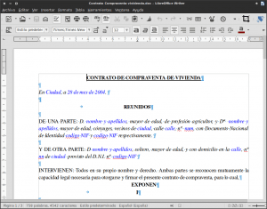
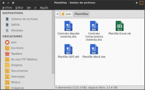
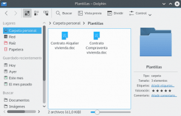
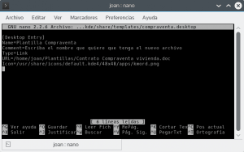
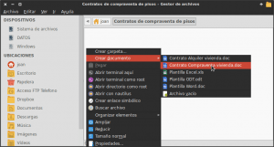
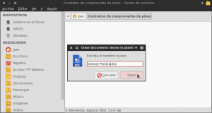
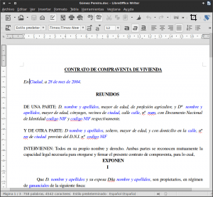

Seguro que gran parte de los usuarios se habrá fijado que en su partición home existe una carpeta que se llama Plantillas (Templates en Inglés). El uso de la carpeta plantillas sin duda es más que interesante. Por este motivo he decido escribir un breve post detallando el uso que podemos dar a la carpeta plantillas.<!--more-->

## PARA QUE SIRVE LA CARPETA PLANTILLAS

La carpeta plantillas sirve **para almacenar plantillas de nuestros documentos. Una vez estén almacenadas la plantillas, las podremos usar de forma muy fácil y muy rápida para crear nuevos documentos en base a la plantillas que tenemos almacenadas**. De esta forma conseguiremos incrementar la productividad en nuestras tareas.

## ¿QUÉ TIPO DE PLANTILLAS PODEMOS CREAR?

Existen multitud de tipos de plantilla que podemos crear. Para cada formato de archivo podremos crear diversas plantillas. Ejemplos de plantillas que se acostumbran a crear habitualmente son las siguientes:

1. **Plantillas para cada uno de los programas que conforman la suite ofimática de Libreoffice**. De esta forma cuando se cree un nuevo documento a partir de una plantilla, tendrá el tipo de letra que nosotros queramos, los margenes que nosotros queramos, las cabeceras que nosotros queramos, un texto predeterminado en el encabezado y/o pie de página, un logo en el encabezado de la página, un texto predeterminado en el cuerpo del documento, etc.
2. **Plantillas para poder crear scripts en bash, phyton, javascript, o en cualquier otro lenguaje de programación**. De está forma podemos crear archivos para programar en un determinado lenguaje sin la necesidad de tener que añadir ciertas librerías y cuerpos de algoritmo que siempre se acostumbran a usar.
3. **Plantillas para poder crear documentos con extensión .txt**, o documentos en blanco de forma fácil e instantánea.
4. En definitiva podemos crear plantillas para todo tipo de archivos existentes como por ejemplo archivos .xcf de gimp, archivos .svg en inkscape, etc.

###### Nota: En este punto cada uno sabrá las plantillas que le conviene crear. En este post he detallado las que en mi caso considero que son de mayor utilidad.

## CREAR PLANTILLAS EN LA CARPETA PLANTILLAS

### Crear plantillas en el caso de usar Thunar, Nautilus o PcmanFM

Para empezar a usar la carpeta plantillas, **lo primero que tenemos que realizar es crear una o varias plantillas**. Imaginemos que tenemos una inmobiliaria y tenemos varios tipos de contrato:

1. Contrato de Arrendamiento
2. Contrato de Compraventa

Lo primero que tenemos que hacer es localizar estos contratos. Una vez localizados los contratos los abrimos y los acondicionamos a nuestro gusto para que a posteriori los podamos usar como plantilla sin problemas. En mi caso, tal y como se puede ver en la captura de pantalla, he puesto en color azul la totalidad de datos que son variables dentro del contrato.

[](images/Preparar-la-plantilla.png)

De este modo cuando cree el contrato a partir de la plantilla, podré saber los datos que tengo que preguntar a los clientes y modificarlos de forma muy rápida.

Una vez estamos a gusto con nuestras plantillas, tal y como se puede ver en la captura de pantalla, **las tenemos que copiar en carpeta Plantillas** (**~/Plantillas**):

[](images/Archivos-ubicados-en-la-carpeta-plantillas.png)

Una vez realizado este simple paso ya tenemos dos plantillas creadas.

###### Nota: Vosotros podéis crear las plantillas que vosotros queráis/necesitéis. Por ejemplo podéis crear una plantilla de Word/Writer que contenga unos estilos predeterminados, un tipo de letra predeterminado, un logo de nuestra de empresa, etc.

### Crear plantillas en el caso de usar Dolphin

En el caso que estemos usando Dolphin en Kde, el proceso para crear las plantillas es un poco más laborioso.

**Los primeros pasos pasos a realizar son exactamente los mismos que acabamos de ver descritos en el apartado anterior**. Imaginaremos que tenemos una inmobiliaria y tenemos varios tipos de contrato:

1. Contrato de Arrendamiento
2. Contrato de Compraventa

Lo primero que tenemos que hacer es localizar estos contratos. Una vez localizados los contratos los abrimos y los acondicionamos a nuestro gusto para que a posteriori los podamos usar como plantilla sin problemas. Una vez modificados los contratos, tal y como se puede ver en la captura de pantalla, los copiamos dentro de la carpeta Plantillas (**~/Plantillas**).

[](images/Carpeta-plantillas-en-Dolphin.png)

Una vez realizados estos pasos, en Nautilus, Thunar y PcmanFM el proceso habría finalizado, pero **si usamos Dolphin además deberemos añadir los siguientes pasos:**

Primero tendremos que crear la carpeta templates dentro de la ubicación .kde/share. Para ello **abrimos una terminal y tecleamos el siguiente comando**:

> ```
> mkdir ~/.kde/share/templates
> ```

###### Nota: En algunas distros, como por ejemplo archlinux, la ruta en que hay que crear la carpeta templates es probable que sea ~/.kde4/share

Seguidamente dentro de la ubicación que acabamos de crear tenemos que crear y editar un archivo, que en mi caso será **compraventa.desktop**. Para ello **abrimos una terminal y tecleamos el siguiente comando:**

> ```
> nano ~/.kde/share/templates/compraventa.desktop
> ```

###### Nota: En algunas distros, como por ejemplo archlinux, la ruta en que hay que crear el archivo compraventa.desktop es posible que sea ~/.kde4/share/templates

###### Nota: En mi caso el nombre del archivo creado es compraventa.desktop. Vosotros podéis usar el nombre que más os guste o el primero que os pase por la cabeza.

Después de ejecutar el último comando se abrirá editor de texto nano. Dentro del editor de texto nano deberemos **introducir el código que podéis ver en la siguiente captura de pantalla:**

[](images/Entrada-de-escritorio-en-Dolphin.png)

Es interesante entender el código que contiene el archivo compravetna.desktop. De este modo podremos crear nuevas entradas en el menú contextual siempre que queramos. Por lo tanto a continuación mostramos el significado de cada una de las líneas del archivo.

**La primera línea** del archivo **es** la siguiente:

> ```
> [Desktop Entry]
> ```

Esta línea siempre será la misma y su función es indicar que estamos definiendo una entrada de escritorio.

**La segunda línea** del archivo compraventa.desktop **es** esta:

> ```
> Name=Plantilla compraventa
> ```

En mi caso elijo **Plantilla compraventa** como valor de la variable Name. Vosotros podéis poner el valor/nombre que queráis. La variable Name es el nombre que tendrá la plantilla, y por lo tanto será el nombre que aparecerá en el menú contextual **Crear Documento**.

**La tercera línea** del archivo **es** la siguiente:

> ```
> Comment=Escriba el nombre que quiere que tenga el nuevo archivo
> ```

En el campo Comment podemos escribir la frase, letra o palabra que queremos. En mi caso siempre pongo **Escriba el nombre que quiere que tenga el nuevo archivo**, ya que lo que pongamos en el campo Comment, es la frase que aparece en la ventana que aparece cuando se nos pide que nombre queremos que tenga el archivo que creamos a partir de la plantilla.

**La cuarta línea** del archivo compraventa.desktop **es**:

> ```
> Type=Link
> ```

En este caso tenemos tres posible tipos a definir. Application, Link y Directory. En nuestro caso, para configurar la plantilla deberemos seleccionar siempre el tipo **Link**.

**La quinta línea** del archivo **es** la siguiente:

> ```
> URL=/home/joan/Plantillas/Contrato Compraventa vivienda.doc
> ```

En el campo URL tenemos que indicar la ubicación exacta donde hemos guardado nuestra plantilla. En mi caso la ubicación de la plantilla es **/home/joan/Plantillas/Contrato Compraventa vivienda.doc**

Finalmente **la última línea** del archivo compraventa.desktop es la siguiente:

> ```
> Icon=/usr/share/icons/default.kde4/48x48/aps/kword.png
> ```

En la variable Icon tenemos que indicar la ruta del icono que queramos que aparezca dentro del menú contextual Crear Documento. En mi caso he indicado la ruta para que aparezca el icono kword.png. Vosotros podéis seleccionar el icono y la ruta que queráis.

Una vez introducido el código podemos **guardar los cambios en el archivo compraventa.desktop y cerrar el archivo**. El proceso para la creación de la primera de las plantillas ha finalizado.

Ahora tan solo tendríamos que **repetir el proceso para crear la segunda de las plantillas para el contrato de Arrendamiento creando y configurando un nuevo archivo, que se podría llamar arrendamiento.desktop.**

## COMO USAR LA CARPETA PLANTILLAS

Una vez creadas las plantillas ya podemos empezar a usarlas. Ahora imaginemos que llega un cliente que acaba de comprar un piso y tenéis que redactar el contrato de compraventa. Una forma rápida para empezar a trabajar en el contrato es la siguiente:

**1-** Tal y como se puede ver en la captura de pantalla nos **vamos a la ubicación en la que queremos guardar el contrato**. Una vez en la ubicación, tal y como se puede ver en la captura de pantalla, **presionamos el botón derecho del mouse y seleccionamos la opción** **Crear documentos** del menú contextual. Una vez seleccionada la opción, tal y como se puede ver en la captura de pantalla, aparecerán la totalidad de plantillas que tenemos almacenadas. En nuestro caso, como queremos redactar un contrato de compraventa, **seleccionaremos la plantilla** **Contrato Compraventa vivienda.doc** y presionaremos el botón izquierdo del mouse.

[](images/Crear-documento-a-partir-de-la-plantilla.png)

**2-** Después de presionar el botón izquierdo del mouse, aparecerá una ventana en la que tenemos que **definir el nombre que queremos que tenga el archivo del contrato que queremos redactar**. En mi caso, tal y como se puede ver en la captura de pantalla, elijo el nombre Gómez Pereira y **presiono el botón** **Crear**.

[](images/Escribir-el-nombre-del-archivo-a-crear.png)

**3-** Después de presionar el botón crear, se creará el archivo Gómez Pereira.doc. Si abrimos el archivo nos encontraremos con algo parecido a lo que podemos ver en la siguiente imagen:

[](images/Archivo-creado-a-partir-de-una-plantilla.png)

Como se puede ver en la captura de pantalla, en el archivo que hemos creado y acabamos de abrir, aparece exactamente el mismo contenido de la plantilla que creamos en el apartado anterior. Por lo tanto para redactar el contrato tan solo tendremos que modificar las partes que se muestran en color azul.

De este modo, con el uso de la carpeta plantillas, conseguimos incrementar la productividad y eficiencia en los distintos trabajos que realizamos con nuestro ordenador.
