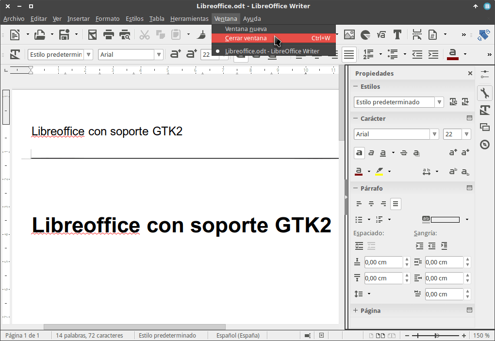
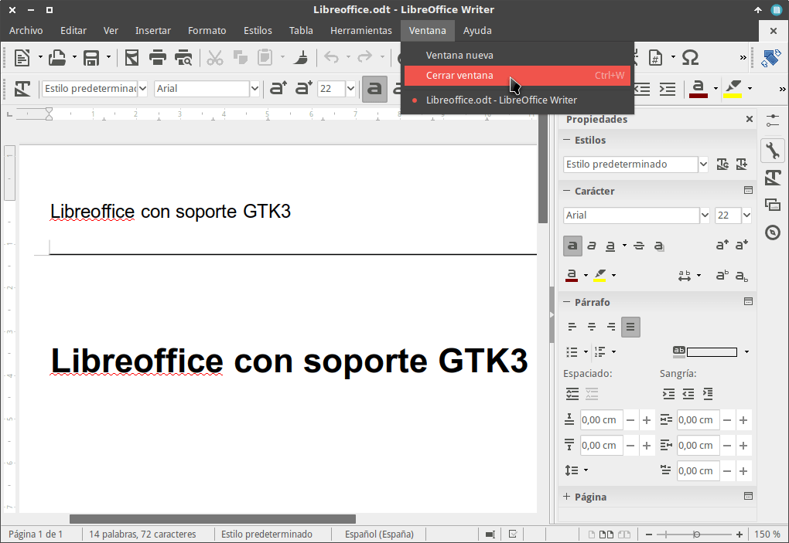

El soporte de Libreoffice para GTK3 ha mejorado muchísimo en los últimos meses y a día de hoy puedo afirmar que Libreoffice con GTK3 luce muchísimo mejor que Libreoffice con GTK2.<!--more-->

Con una versión de Libreoffice igual o superior a la 5.2, GTK 3.20 y el tema Numix, aunque seguro aún faltan detalles por pulir, el aspecto y el rendimiento de Libreoffice con GTK3 son buenos.

Inicialmente vemos que el aspecto de Libreoffice con GTK2 es el siguiente:

[](images/Libreoffice-con-soporte-GTK2.png)

Si queréis ver como luce Libreoffice con GTK3 tan solo tenéis que seguir los siguientes pasos:

## COMO USAR LIBREOFFICE CON GTK3

Para empezar a usar Libreoffice con GTK3 tenemos que seguir las siguientes instrucciones.

### Instalar el paquete libreoffice-gtk3 que da soporte para GTK3

Para activar el soporte GTK3 tenemos que instalar el paquete libreoffice-gtk3 en nuestro ordenador.

**Para ello en  Debian** y en distribuciones derivadas de Debian tenemos que ejecutar el siguiente comando en la terminal:

> ```
> sudo apt-get install libreoffice-gtk3
> ```

**En el caso que utilicen Archlinux** no hay que realizar absolutamente nada porque a partir de la versión 5, Libreoffice utiliza GTK3 por defecto.

**Si** en vuestro caso **usan Fedora** o distribuciones basadas en Fedora deberán ejecutar el siguiente comando:

> ```
> sudo dnf install libreoffice-gtk3
> ```

Una vez instalado este paquete el soporte para GTK3 estará activado.

### Desinstalar el paquete libreoffice-gtk2

Una vez activado el soporte GTK3, tan solo tenemos que desactivar el soporte para GTK2 desinstalando el paquete libreoffice-gtk2.

Para ello **en Debian** y en distribuciones derivadas de Debian ejecutaremos el siguiente comando en la terminal:

> ```
> sudo apt-get remove libreoffice-gtk2
> ```

En el caso que vuestra distro no disponga de libreoffice-gtk2 ejecuten el siguiente comando en la terminal:

> ```
> sudo apt-get remove libreoffice-gtk
> ```

**Si** en vuestro caso **usan Fedora** o distribuciones basadas en Fedora deberán utilizar el siguiente comando:

> ```
> sudo dnf erase libreoffice-gtk2
> ```

Una vez realizados los cambios ya podemos usar Libreoffice con soporte para GTK3.

### ASPECTO FINAL DE LIBREOFFICE CON GTK3

Al abrir Libreoffice con el soporte para GTK3 activado el aspecto será el siguiente:

[](images/Libreoffice-con-soporte-GTK3.png)

Como se puede observar los menús y los paneles de Libreoffice han cambiado a mejor.

Aunque las diferencia de aspecto no sea enormemente grande, creo que todo el mundo coincidirá que a estas altura la visualización de Libreoffice con GTK3 es mejor que con GTK2.
