Quien quiera probar la experiencia de usar el menú global en un entorno XFCE tan solo tiene que seguir las instrucciones que se muestran en el siguiente artículo. Pero antes de ir al grano pasaremos a ver las ventajas y desventajas que supone el hecho de usar el menú global en un entorno de escritorio.<!--more-->

## VENTAJAS DE USAR EL MENÚ GLOBAL EN UN ENTORNO DE ESCRITORIO

El Menú global te puede gustar o no gustar, pero quien lo haya usado sabrá que proporciona los siguientes beneficios:

1. **Mejor aprovechamiento del espacio vertical de nuestro monitor**. Si disponemos de un monitor panorámico y una barra lateral aun se aprovechará más el espacio del monitor.
2. Ahorrando espacio vertical de nuestro monitor podremos hacer más grandes los elementos de la ventana en que estamos trabajando. Los elementos grandes son más fáciles de clicar y manipular.
3. Los botones de cerrar, minimizar y maximizar estarán en las esquinas. Los **elementos en las esquinas son más fácil de acceder y clicar**.
4. Los menús estarán en el panel superior. Por lo tanto será **más fácil acceder a los menús** ya que tan solo tendremos que tirar el puntero del ratón hacia arriba.

## DESVENTAJAS DE USAR GLOBAL MENU EN UN ENTORNO DE ESCRITORIO

Usar el menú global en XFCE también puede ocasionar inconvenientes. Algunos de ellos son los siguientes:

1. El menú global siempre se mostrará en el panel superior de nuestro escritorio. Por lo tanto las personas que trabajen sin maximizar la pantalla tendrán que hacer un **desplazamiento de ratón superior para acceder a los menús**. En mi caso esto no es un problema porque siempre acostumbro a trabajar con la pantalla maximizada.
2. El menú global funcionará en la gran mayoría de programas. No obstante existen algunos programas en que no funciona. Esto hará que el **entorno de escritorio no sea 100% consistente**.

Existen menús globales implementados en otros escritorios que solucionan algunos de los problemas mencionados en este apartado. Por ejemplo los menús globales de KDE y Unity son capaces de mostrar los menús de las aplicaciones en la barra de título de las ventanas que no están maximizadas.

## INSTALAR EL MENÚ GLOBAL EN DEBIAN TESTING

Para disponer del menú global en Debian testing XFCE tan solo tenemos que instalar el paquete xfce4-appmenu-plugin. Para ello abrimos una terminal y ejecutamos el siguiente comando:

> ```
> sudo apt install xfce4-appmenu-plugin
> ```

Acto seguido se instalará el paquete xfce4-appmenu-plugin y el resto de sus dependencias. De esta forma tan sencilla ya tendremos todo lo necesario para disponer del menú global en XFCE.

###### Nota: Distribuciones como por ejemplo Manjaro, Archlinux o MX Linux también disponen del paquete xfce4-appmenu-plugin en sus repositorios.

## UBICAR LOS BOTONES DE CERRAR, MINIMIZAR Y MAXIMIZAR EN PANEL SUPERIOR DE XFCE

El escritorio que bajo mi punta de vista ha desarrollado mejor el menú global ha sido Unity. Para poder obtener una experiencia similar al escritorio Unity aconsejo instalar el plugin xfce4-windowck-plugin.

El plugin xfce4-windowck-plugin nos permitirá realizar las siguientes configuraciones:

1. Mostrar los botones de cerrar, minimizar y maximizar en el panel superior de XFCE.
2. Mostrar el título de la ventana en el panel superior de XFCE.
3. Mostrar el icono de la ventana en el panel superior de nuestro entorno de escritorio.

La forma más fácil de instalar este plugin en Debian es acceder a los repositorios de MX Linux y descargar el plugin. Para ello accedemos a la siguiente URL:

[http://mxrepo.com/mx/repo/pool/main/x/xfce4-windowck-plugin/](http://mxrepo.com/mx/repo/pool/main/x/xfce4-windowck-plugin/ "Descargar xfce4-windowck-plugin")

Acto seguido descargamos el archivo .deb que corresponda a nuestra arquitectura. En mi caso descargo el archivo xfce4-windowck-plugin\_0.4.4-1mx17+1\_amd64.deb.

[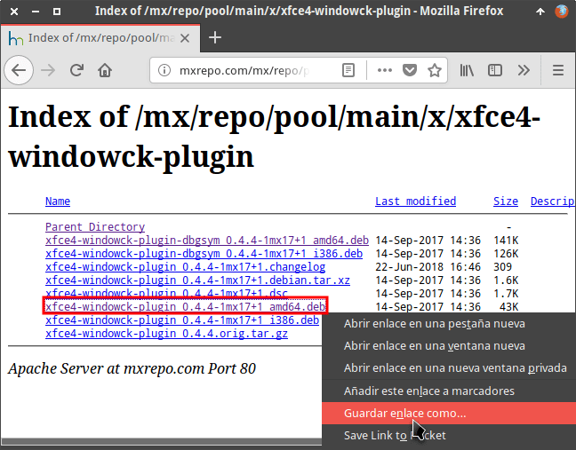](images/descargar-windowck-plugin.png)

Una vez descargado el paquete lo instalamos usando el instalador de paquetes gdebi.

[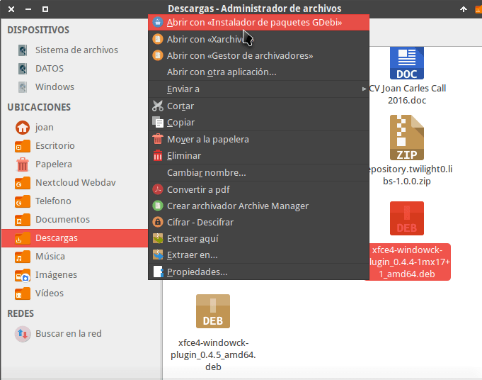](images/instalar-windowck.png)

A partir de estos momentos tenemos todo lo necesario para poder usar el menú global en XFCE.

###### Nota: Distribuciones como por ejemplo Manjaro, Archlinux o MX Linux disponen del paquete xfce4-windowck-plugin en sus repositorios.

## CONFIGURAR EL ENTORNO DE ESCRITORIO PARA ACTIVAR Y USAR EL MENÚ GLOBAL

Para empezar a usar el menú global tan solo falta configurar los paneles de nuestro escritorio XFCE. Para ello tan solo tenemos que seguir las siguientes indicaciones

### Configuración del panel superior de XFCE

Para obtener una buena experiencia es necesario crear un panel superior en nuestro escritorio XFCE.

Para crear y configurar el panel superior abriremos una terminal y ejecutaremos el siguiente comando:

> ```
> xfce4-panel --preferences
> ```

Cuando aparezca la ventana de configuración de los paneles clicaremos en el icono Añadir un panel nuevo.

[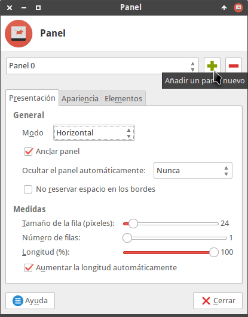](images/crear-panel-nuevo.png)

Una vez creado el panel lo arrastramos al extremo superior izquierdo.

[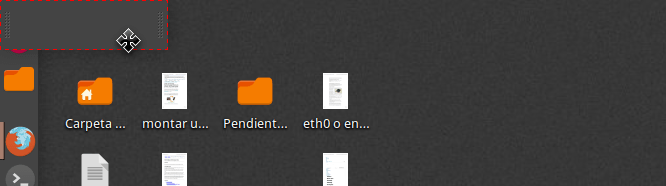](images/ubicar-panel-parte-superior.png)

Seguidamente aplicamos la siguiente configuración al panel que acabamos de crear.

[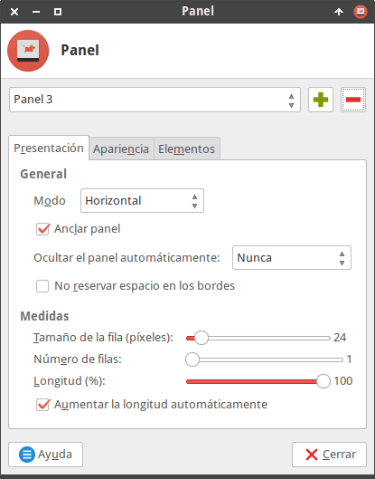](images/configuracion-presentacion-panel-superior.png)

A continuación clicamos en la pestaña Apariencia y aplicamos la siguiente configuración:

[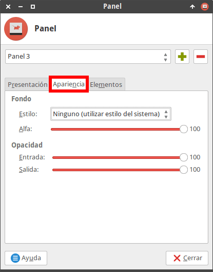](images/apariencia-panel-superior.png)

El siguiente paso consiste en clicar sobre la pestaña Elementos. Dentro de la pestaña Elementos añadiremos los elementos que incluirá el panel superior de XFCE. Para añadir el primero de los elementos clicamos en el botón +.

[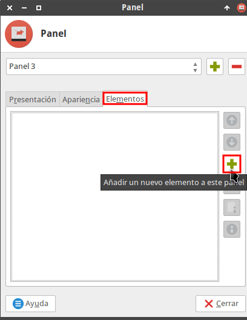](images/añadir-nuevo-elemento-panel.png)

A continuación añadimos el elemento Window Header – Buttons para que se muestren los botones de abrir, cerrar y maximizar a la izquierda del panel superior. Para ello seleccionamos el elemento Window Header – Buttons y presionamos en el botón Añadir.

[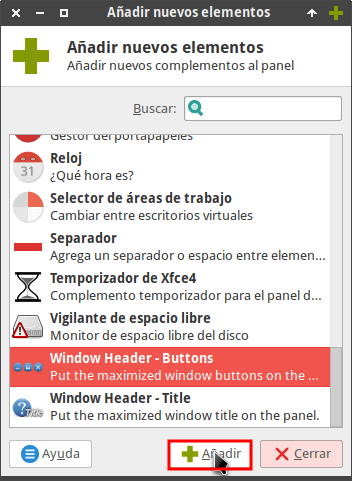](images/añadir-window-header-buttons.png)

El siguiente elemento que tenemos que añadir es el AppMenu plugin. Este elemento será el encargado que se muestre el menú global en nuestro panel superior de XFCE. Para añadir el elemento lo buscamos en la lista, lo seleccionamos y acto seguido presionamos sobre el botón Añadir.

[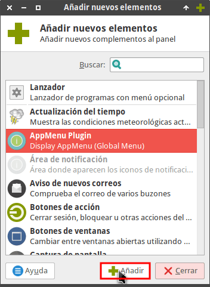](images/añadir-appmenu-plugin.png)

Del mismo modo que hemos añadido Window Header – Buttons y AppMenu plugin, en mi caso también añado los siguientes elementos en el orden que especifico:

1. Separador.
2. Complemento de pulseaudio.
3. Aviso de nuevos correos.
4. Área de notificación.
5. Fecha y hora.
6. Actualización del tiempo.
7. Selector de áreas de trabajo.
8. Separador.
9. Botón de acción.

###### Nota: Si lo creen conveniente pueden modificar el orden y los elementos añadidos al panel en función de sus preferencias. Si por ejemplo prefieren tener los botones de cerrar y minimizar ventanas a la derecha deberán ubicar el elemento Window Header – Buttons en la última posición.

###### Nota: Si lo creen conveniente también pueden añadir el elemento Window Header – Title. De este modo podrán añadir el título de las ventanas en el panel superior. En mi caso no me gusta esta opción, por lo tanto no la uso.

Una vez seleccionados todos los elementos presionamos el botón Cerrar.

[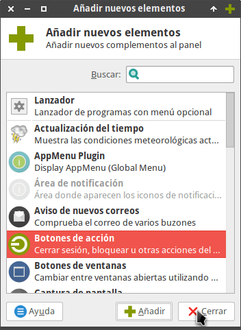](images/finalizar-adicion-elementos.png)

Seguidamente configuraremos los elementos del panel superior de nuestro escritorio XFCE. Para ello seleccionamos el elemento Window Header -Buttons y presionamos el botón Editar el elemento seleccionado.

[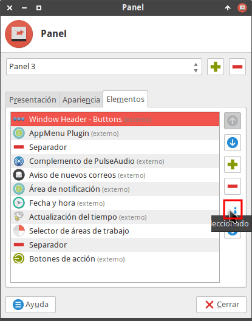](images/editar-configuracion-window-header-buttons.png)

A continuación configuraremos el comportamiento de los botones que aparecen en el panel superior de XFCE. Podremos configurar diversos aspectos como por ejemplo:

1. El tema de los botones que se mostrarán en el panel.
2. El orden en que aparecen los botones de cerrar, minimizar y maximizar.
3. Las circunstancias en que se mostrarán los botones en el panel superior.

En mi caso la configuración seleccionada es la siguiente:

[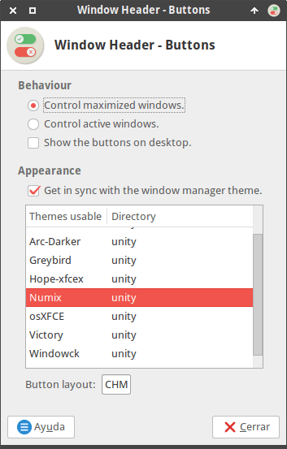](images/configuracion-window-header-buttons.png)

Una vez finalizada la configuración de Window Header -Buttons configuraremos el elemento AppMenu Plugin. Por lo tanto, seleccionamos el elemento AppMenu Plugin y presionamos el botón Editar el elemento seleccionado.

[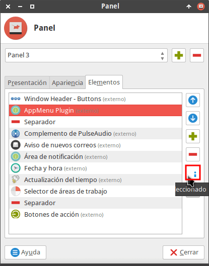](images/editar-configuracion-appmenu-plugin.png)

Seguidamente aparecerá la ventana de configuración del menú global en la que podremos configurar las siguientes opciones:

1. Mostrar el menú global expandido o con todos los menús dentro de un menú.
2. Resaltar el nombre de las aplicaciones en negrita.
3. Expandir el plugin dentro del panel de XFCE.

En mi caso la configuración de este elemento es la siguiente:

[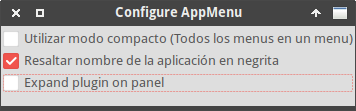](images/configuracion-appmenu-plugin.png)

A continuación configuraremos el resto de elementos del panel superior hasta obtener un resultado similar al siguiente:

[](images/panel-superior-configurado.png)

### Configurar un panel lateral para el escritorio XFCE

Para crear y configurar el panel lateral de nuestro escritorio XFCE abriremos una terminal y ejecutaremos el siguiente comando:

> ```
> xfce4-panel --preferences
> ```

Una vez se abra la ventana de configuración de los paneles, presionaremos el botón + para crear un nuevo panel.

[](images/crear-panel-nuevo.png)

A continuación aplicamos la siguiente configuración al panel que acabamos de crear.

[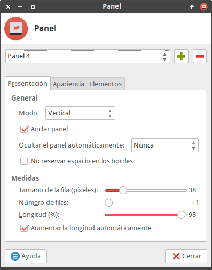](images/configuracion-presentacion-panel-vertical.png)

Seguidamente arrastramos el panel que acabamos de configurar al extremo superior izquierdo de forma que se integre adecuadamente con el panel superior de XFCE.

[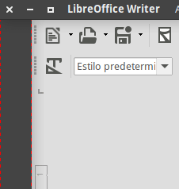](images/panel-lateral-vertical-posicionado.png)

###### Nota: Si no se integra bien deberéis jugar con el tamaño y posicionamiento de los panales para conseguir que se vea perfecto.

Al igual que hicimos en el apartado anterior, nos dirigimos a la pestaña Elementos y añadimos los siguiente elementos a nuestro panel vertical:

1. Menú Whisker.
2. Menú de directorios.
3. Separador.
4. Separador.
5. Separador.
6. Botones de ventanas.

[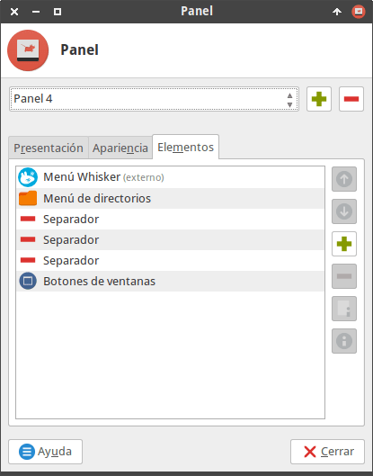](images/elementos-panel-lateral-introducidos.png)

A continuación configuraremos los elementos del panel. Para ello seleccionamos el elemento Botones de ventanas y presionamos encima del botón Editar el elemento seleccionado.

[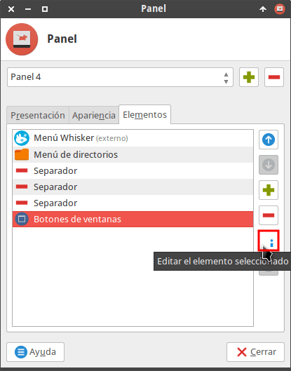](images/editar-botones-de-ventanas-panel-vertial.png)

La configuración de los botones de ventanas aplicada en mi caso es la siguiente:

[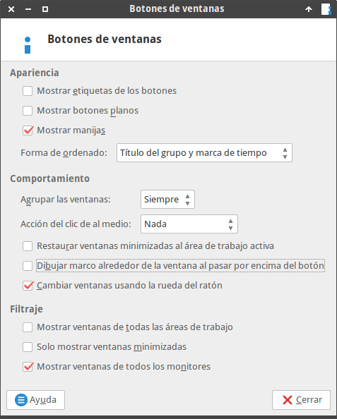](images/configuracion-aplicada-botones-de-ventana.png)

Una vez finalizada la configuración del primer elemento seguiremos con el resto de elementos hasta conseguir un aspecto similar al siguiente:

[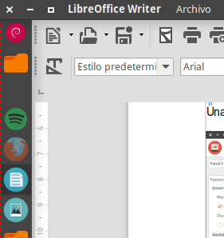](images/configuracion-panel-lateral-finalizada.png)

###### Nota: El aspecto final conseguido se parece al escritorio Unity.

Es posible que algunos usuarios de XFCE encuentren el comportamiento de la barra lateral de XFCE demasiado simple. Si lo creen conveniente pueden usar Dockbarx .Dockbarx ofrece una funcionalidad similar a la barra de tareas de Windows. El aspecto de la barra lateral con DockbarX es parecido al siguiente:

[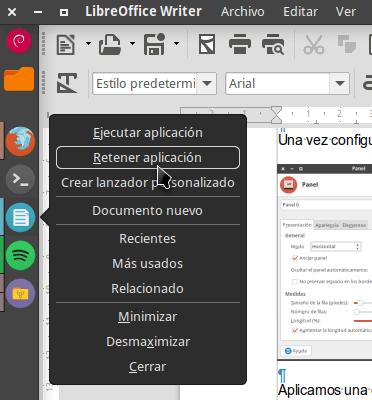](images/menu-global-con-dockbarx.png)

### Ocultar los marcos de las ventanas maximizadas

Para obtener una mejor experiencia tenemos que ocultar el marco de las ventanas cuando las maximizamos. Para ello abrimos una terminal y ejecutamos el siguiente comando:

> ```
> xfwm4-tweaks-settings
> ```

Cuando se abran los ajustes del gestor de ventanas de XFCE clicamos en la pestaña Accesibilidad. Seguidamente activamos la opción Esconder el marco de la ventana cuando esté maximizada. Finalmente presionamos el botón Cerrar.

[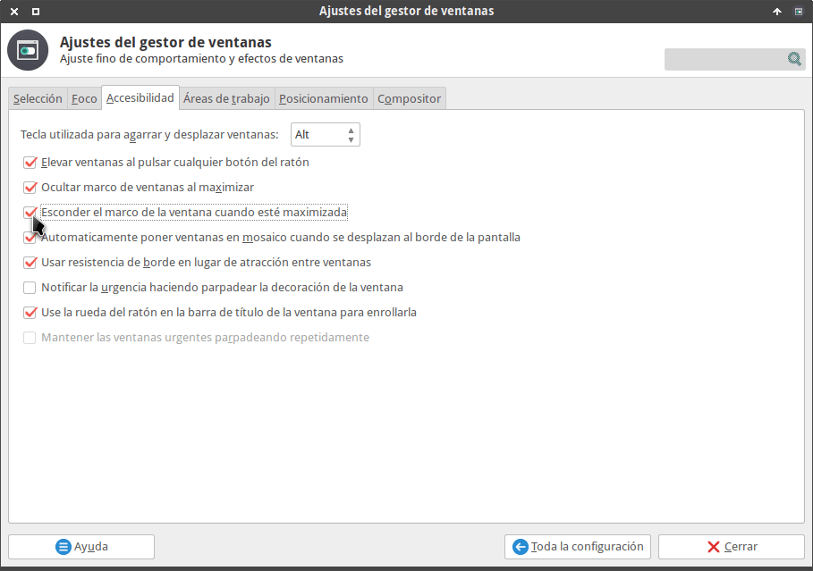](images/esconder-marco-ventana-maximizada.png)

A partir de estos momentos, cada vez que maximicemos una ventana se ocultarán sus marcos.

### Asegurar que los menús de los programas únicamente se muestren en el panel superior

Para que los menús no se muestren en las ventanas y asegurar que únicamente se muestran en el panel superior de nuestro entorno de escritorio tienen que ejecutar los siguientes comandos en la terminal:

> ```
> xfconf-query -c xsettings -p /Gtk/ShellShowsMenubar -n -t bool -s true
> ```
> 
> ```
> xfconf-query -c xsettings -p /Gtk/ShellShowsAppmenu -n -t bool -s true
> ```
> 
> ```
> xfconf-query -c xsettings -p /Gtk/Modules -n -t string -s "appmenu-gtk-module"
> 
> ```

###### Nota: Si alguna vez quieren quieren revertir el comportamiento definido en este apartado tan solo tienen que volver a ejecutar los comandos cambiando los valores True por False.

## PROGRAMAS EN LOS QUE FUNCIONARÁ EL MENÚ GLOBAL

El menú global funcionará en la gran mayoría de programas. Funcionará tanto en programas GTK2, GTK3 y Qt.

Existen casos en que algunos programas no funcionarán por los siguientes motivos:

1. Programas que en su código no declaran de forma adecuada que disponen de un menú.
2. Programas que únicamente usan las ventanas de Gnome Shell. Un ejemplo de este tipo de aplicaciones es Corebird.

No obstante, como se ha comentado anteriormente el menú global funciona en prácticamente la totalidad de aplicaciones.

## TECLAS IMPORTANTES EN EL USO DEL MENÚ GLOBAL

Cuando se usa el menú global puede resultar un poco molesto maximizar y minimizar ventanas. Para facilitar tal tarea podemos hacer uso de la tecla ALT.

Cuando tengamos una ventana maximizada y la queramos minimizar tan solo tenemos que presionar al tecla ALT + Hacer doble clic con el botón izquierdo del ratón en cualquier parte de la ventana que queramos minimizar.

Una vez minimizada la ventana también la podemos volver a maximizar. Para ello tan solo tenemos que repetir el proceso anterior presionado la tecla ALT + Hacinedo doble clic con el botón izquierdo del ratón.
