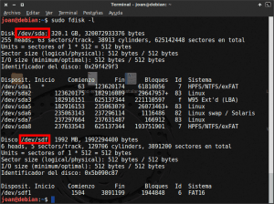
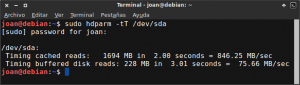
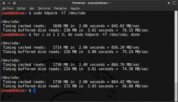
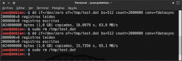
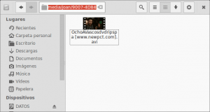
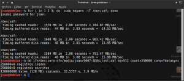

La semana pasada escribí un post de [como evaluar el estado de salud de un disco duro o dispositivo de almacenamiento](). Uno de los puntos era analizar si la velocidad de lectura y escritura son las que se detallan en las especificaciones del disco o si son las mismas que teníamos que cuando el disco duro era nuevo.

En el caso que quieran realizar esta comprobación pueden aplicar el método que se detalla a continuación.<!--more-->

## HERRAMIENTAS PARA EVALUAR LA VELOCIDAD DE LECTURA Y ESCRITURA

**Hay varias formas para poder evaluar la velocidad de lectura y escritura** de un dispositivo de almacenamiento como por ejemplo un disco duro. **En mi caso usaré la terminal y las herramientas hdparm y dd**. Los motivos por los que elijo este método son los siguientes:

1. Quien administra servidores lo más probable es que no disponga de un entorno gráfico.
2. Si sabemos como realizar el procedimiento por la terminal podremos aplicar el método en cualquier distribución Linux.
3. No me gusta tener paquetes que no uso instalados en mi ordenador o servidor.
4. Realizando el procedimiento desde la terminal tenemos el control total del test que estamos aplicando en cada momento.

###### Nota: A quien no le guste la terminal siempre puede usar la utilidad de discos de gnome para poder realizar esta operación. Quien quiera usar la aplicación gráfica tienen que instalar el paquete [gnome-disk-utility](https://git.gnome.org/browse/gnome-disk-utility "Información de la herramienta gnome disk utility").

###### Nota: Tenéis que ir con cuidado a la hora de experimentar con las herramientas hdparm y dd. Estas dos herramientas tienen multitud de utilidades y algunas de ellas son críticas. Por lo tanto al usar estas 2 herramientas siempre tenemos que ir con precaución y siendo consciente de lo que hacemos en cada momento.

## INSTALACIÓN DE LAS HERRAMIENTAS NECESARIAS

**Lo más probable es que la distribución Linux que estáis usando ya tenga instalados de serie las herramientas que vamos a utilizar para medir la velocidad de lectura y escritura**. **En el caso de no tenerlas** lo único que tendremos que hacer es instalar el paquete hdparm.

Para instalar hdparm **en distribuciones derivadas de Debian** tan solo tenemos que **introducir el siguiente comando en la terminal:**

> ```
> sudo apt-get install hdparm
> ```

**En el caso de usar distribuciones derivadas de Red Had**, como por ejemplo Fedora o CentOS, tenéis que **usar el siguiente comando**:

> ```
> sudo yum install hdparm
> ```

**Finalmente los usuarios de Archlinux, o alguna distro derivada de Archlinux** como por ejemplo Manjaro, tienen que **escribir el siguiente comando en la terminal:**

> ```
> sudo pacman -S hdparm
> ```

Una vez introducido el comando presionan  **Enter** y el paquete se instalará.

## DENOMINACIÓN DEL DISPOSITIVO QUE QUEREMOS ANALIZAR

Antes de iniciar el test lo primero que tenemos que realizar es saber como se reconoce el disco duro o dispositivo que queremos analizar. Para ello **en la terminal introducimos el siguiente comando:**

> ```
> sudo fdisk -l
> ```

Los resultados de ejecutar este comando son los siguientes:

[](images/Identificación-dispositivos.png)

C**omo se puede ver en la captura de pantalla hemos detectado dos dispositivos de almacenamiento** conectados a nuestro ordenador.

1. El primero es **el** **/dev/sda** **que es nuestro disco duro**. Seguidamente analizaremos la velocidad de lectura y escritura de este dispositivo.
2. **El segundo dispositivo** que encontramos **es el** **/dev/sdf** **que es una vieja memoria usb** que tengo enchufada en mi ordenador. También analizaremos su velocidad de lectura y de escritura.

## VELOCIDAD DE LECTURA DE NUESTRO DISCO DURO

Para analizar la velocidad de lectura del disco duro tan solo tenemos que **abrir una terminal y teclear el siguiente comando:**

> ```
> sudo hdparm -tT /dev/sda
> ```

**hdparm:** Estamos llamando a la herramienta hdparm que es la que nos servirá para medir la velocidad de lectura.

**t (Timing buffered disk):** Al introducir el parámetro t lo que estamos haciendo es ordenar que se mida la velocidad real de lectura del contenido almacenado en la [cache de disco](https://en.wikipedia.org/wiki/Disk_buffer "Explicación de lo que es la cache de disco"), también conocida como buffer cache, sin que previamente y durante el proceso haya nada almacenado en la misma buffer cache. Todo el contenido que se leerá en la buffer cache provendrá de la superficie del disco duro.

**T (Timing cached reads):** Al introducir el parámetro T lo que estamos haciendo es indicar que se mida la velocidad de lectura de la información que tenemos almacenada en el cache de disco, también conocida cono buffer cache, sin que haya en ningún momento acceso al contenido almacenado en la superficie de nuestro disco duro.

**/dev/sda:** Es la denominación del dispositivo que queremos analizar. En el apartado anterior hemos visto como averiguar el nombre con el que se reconoce el dispositivo de almacenamiento que queremos analizar.

Una vez ejecutado el comando vemos, que en mi caso, obtengo los siguientes resultados:

[](images/velocidad-lectura-disco-duro.png)

Como se puede ver en la captura de pantalla **los resultados obtenidos son los siguientes:**

1. **Timing Cached reads:** **La velocidad de lectura de la información almacenada en la cache de disco**, o buffer cache, **sin que en ningún momento haya acceso al contenido almacenado en la superficie del disco duro es** de **846 MB/s**.
2. **Timing buffered disk:** **La velocidad real de lectura de la información almacenada en la superficie del disco duro y medida en la cache de disco, o buffer cache, es** de **76 MB/s**. Este parámetro es el que da una idea más clara del rendimiento de nuestro disco duro ya que el valor obtenido será equivalente a la velocidad de escritura cuando se satura o se llena la cache de disco.

Para que los resultados de lectura sean significativos es necesario repetir el proceso que acabamos de ver 2 o 3 veces. Para automatizar el proceso de repetición poemos hacer introduciendo el siguiente comando en la terminal:

> ```
> for i in 1 2 3; do sudo hdparm -tT /dev/sda; done
> ```

Después de aplicar el comando los resultados que se muestran en la siguiente captura de pantalla:

[](images/Confirmación-velocidad-lectura-disco-duro.png)

En la totalidad de casos observamos que los valores son similares y prácticamente idénticos a la primera medición que realizamos. Por lo tanto podemos estar seguros que los valores obtenidos en la primera medición son plenamente fiables. Para los amantes de las estadísticas pueden calcular la velocidad de lectura media, máxima y mínima con los resultados que hemos obtenido.

###### Nota: Al analizar la velocidad de lectura nuestro ordenador tiene que estar completamente en reposo y sin ejecutar ninguna otra tarea.

###### Nota: En el caso que para realizar el análisis se quiera deshabilitar la [page cache](https://en.wikipedia.org/wiki/Page_cache "Explicación de lo que es la page Cache") que se realiza en la memoria RAM del sistema operativo pueden modificar el comando sudo hdparm -tT /dev/sda por sudo hdparm -tT --direct /dev/sda. De este modo es posible obtener un rendimiento concreto del disco sin la influencia de otras características de nuestro sistema operativo.

## VELOCIDAD DE ESCRITURA DE NUESTRO DISCO DURO

El comando dd tiene multitud de aplicaciones. Algunas de las aplicaciones son clonar un disco duro, destruir completamente el contenido de una partición, crear un liveusb, etc. Pero en esta ocasión **usaremos el comando dd para medir al velocidad de escritura de nuestro disco duro**.

**El comando que tenemos que introducir en la terminal** para medir la velocidad de escritura **es el siguiente:**

> ```
> dd if=/dev/zero of=/tmp/test.dat bs=512 count=2000000 conv=fdatasync
> ```

El significado de la totalidad de opciones introducidas en el comando dd es el siguiente:

**dd:** Estamos invocando la herramienta dd (duplicate data) que es la que nos servirá para medir la velocidad de escritura.

**if =/dev/zero:** Esta parte del comando indica que como fichero de origen (input file) se debe usar el archivo **/dev/zero**. El dispositivo o archivo **/dev/zero** lo que hace es generar una cadena de ceros con las características que definiremos con los comandos bs y count.

**of=/tmp/test.dat:** Esta parte del comando indica que el fichero de destino (output file) es un fichero con nombre **test.dat** ubicado en la ubicación **/tmp**. La información que contendrá el fichero **test.dat** es la información que generará el dispositivo **/dev/zero** que será una cadena de ceros con las características que definiremos con los comando bs y count.

**bs=512:** Introduciendo este comando lo que estamos definiendo es que la información que se escriba en archivo **test.dat** sea en bloques de 512 bytes. Elijo 512 bytes porqué es el tamaño de bloque en que se formateo mi disco duro. En vuestro caso podéis elegir un valor diferente. En función del valor del tamaño de bloque elegido la velocidad de escritura variará ligeramente.

**count=2000000:** En esta entrada lo que estamos definiendo es que en el archivo **test.dat** se escriban 2000000 bloques del tamaño definido en el parámetro bs (512 bytes).

**conv=fdatasync:** Introducimos este parámetro para obtener unos resultados de escritura que se aproximen a lo que es la velocidad de escritura real del disco. Si no usamos este parámetro el resultado obtenido solo contemplara el tiempo obtenido en volcar la totalidad de información a la cache de disco. Si usamos este comando el resultado obtenido tendrá en cuenta además el tiempo necesario en volcar la información de la cache de disco a la superficie del disco duro. Por lo tanto introduciendo este comando obtendremos una velocidad de escritura que se asemejará al rendimiento real de nuestro disco duro.

Por lo tanto **introduciendo este comando lo que haremos es generar un archivo de 1Gb (512bytes x 2000000 = 1 Gb) lleno de ceros y que se ubicará en **/tmp/test.dat**. Este archivo se generará escribiendo 20000000 de bloques de 512 bytes.**

**Una vez generado el archivo el comando dd nos dará la velocidad de escritura que hemos obtenido:**

[](images/velocidad-escritura-disco-duro.png)

Como se puede ver en la captura de pantalla, **en mi caso la velocidad de escritura de mi disco duro es de** **65 MB/s**. Si hubiera aumentado el tamaño del bloque es probable que la velocidad de escritura hubiera sido ligeramente mayor a la obtenida.

Ahora **para finalizar** el proceso tan solo tenemos que borrar el archivo que acabamos de generar para obtener la velocidad de escritura. Para ello t**ecleamos el siguiente comando en la terminal:**

> ```
> sudo rm -f /tmp/test.dat
> ```

###### Nota: Al analizar la velocidad de escritura de nuestro ordenador tiene que estar completamente en reposo y sin ejecutar ninguna otra tarea.

## VELOCIDAD DE LECTURA Y ESCRITURA DE LA MEMORIA USB

Analizar la velocidad de lectura y escritura de una memoria USB será sumamente fácil ya que **los comandos a usar son exactamente los mismos que en el disco duro**.

**Los únicos parámetros a sustituir son** el dispositivo a analizar y la ubicación donde se creará el archivo que escribiremos para medir la velocidad de escritura.

Anteriormente usando el comando sudo fdisk -l vimos que nuestro pendrive o memora USB se reconoce por la denominación /dev/sdf. Por lo tanto en la totalidad de comandos usados anteriormente deberemos sustituir **/dev/sda** **por** **/dev/sdf**.

La ruta en que generamos el archivo para evaluar la velocidad de la memoria usb no puede ser la /tmp. La ruta en este caso tiene que dirigirnos a nuestra memoria USB. Para averiguar la ruta que dirige a nuestra memoria usb abrimos nuestro administrador de archivos **y** accedemos al contenido de nuestro USB:

[](images/punto-de-montaje-de-la-memoria-USB.png)

Una vez hayamos accedido a la memoria USB, tal y como se puede ver en la captura de pantalla, en nuestro administrador de archivos podremos ver que la ruta o punto de montaje de nuestra memoria USB es la /media/joan/9007-4D84/

Por lo tanto en los comando usados anteriormente deberemos sustituir **/tmp/test.dat** **por** **/media/joan/9007-4D84/test.dat**.

**Así por lo tanto para medir la velocidad de lectura de nuestra memoria USB deberemos usar el siguiente comando:**

> ```
> for i in 1 2 3; do sudo hdparm -tT /dev/sdf; done
> ```

**y para medir la velocidad de escritura deberemos usar este comando:**

> ```
> dd if=/dev/zero of=/media/joan/9007-4D84/test.dat bs=512 count=2000000 conv=fdatasync
> ```

En mi caso los resultados obtenido se pueden observar en la siguiente captura de pantalla:

[](images/velocidad-escritura-usb.png)

Obviamente la velocidad de lectura y escritura obtenida en este caso es muy inferior a la velocidad que obtuve con el disco duro.

## UTILIDADES QUE PUEDE TENER CONOCER LA VELOCIDAD DE LECTURA Y ESCRITURA

Para finalizar el post simplemente quiero citar **algunas de las utilidades que pienso que puede tener conocer cual es la velocidad de lectura y escritura** de nuestros dispositivos de almacenamiento. Algunas de las utilidades pueden ser las siguientes:

1. Para saber que memoria USB es la mas adecuada para usar como LiveUSB.
2. Para saber si nuestro disco duro o Pendrive rinde tal y como tiene que rendir.
3. Para saber si nuestra memoria USB o disco duro se ajusta a las especificaciones que promete el fabricante.

Si alguien se anima a proponer otra utilidad adicional que no dude en proponerlo en los comentarios.
