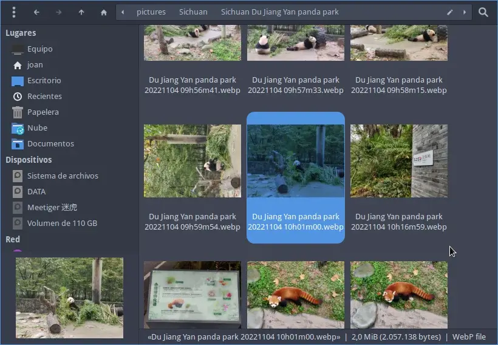

Últimamente en mi web solo uso imágenes con el formato webp. El motivo es que a igualdad de calidad [ocupan mucho menos tamaño](https://photutorial.com/image-format-comparison-statistics/) que las imágenes con formato jpg y png. No obstante el formato webp no es el más estándar y esto me genera una serie de inconvenientes como por ejemplo que mi gestor de ficheros Thunar no es capaz de mostrar las imágenes en miniatura.  En el caso que os pase lo mismo y por lo tanto tengáis problemas para que el gestor de ficheros Thunar muestre las miniaturas o Thumbnails de las imágenes con formato webp sigan las instrucciones que detallaré a continuación.<!--more-->

## COMO VER LAS IMÁGENES EN MINIATURA O THUMBNAILS DE LAS FOTOS CON FORMATO WEBP EN THUNAR

Lo primero que tenemos que realizar es asegurar que tenemos instalados los paquetes `**libwebp**` y `**tumbler**` en nuestro equipo. Para ello ejecutaremos el siguiente comando:

> ```shell
> sudo apt install libwebp tumbler
> ```

**Nota:** En el caso que usen Arch Linux deberán usar el comando `**sudo pacman -S libwebp tumbler**`

A continuación crearemos el fichero `**webp.thumbnailer**` que será el encargado de generar las imágenes en miniatura o Thumbnails. Para crear este fichero ejecutaremos el siguiente comando en la terminal:

> ```shell
> sudo nano /usr/share/thumbnailers/webp.thumbnailer
> ```

Cuando se abra el editor de textos pegaremos el siguiente código:

```shell
[Thumbnailer Entry]
Version=1.0
Encoding=UTF-8
Type=X-Thumbnailer
Name=webp Thumbnailer
MimeType=image/webp;
Exec=/usr/bin/convert -thumbnail %s %i %o
```

Una vez pegado el contenido guardaremos los cambios y cerraremos el fichero. Ahora definiremos el MIME de webp ejecutando el siguiente comando en la terminal:

> ```shell
> nano ~/.local/share/mime/packages/webp.xml
> ```

Cuando se abra el editor de texto nano pegaremos el siguiente código:

```shell
<?xml version="1.0" encoding="UTF-8"?>
<mime-info xmlns="http://www.freedesktop.org/standards/shared-mime-info">
    <mime-type type="image/webp">
        <comment>WebP file</comment>
        <icon name="image"/>
        <glob-deleteall/>
        <glob pattern="*.webp"/>
    </mime-type>
</mime-info>
```

A continuación guardaremos los cambios y cerraremos el fichero. Finalmente deberán ejecutar el siguiente comando en la terminal para actualizar la cache de la base de datos de los tipos MIME.

> ```shell
> update-mime-database ~/.local/share/mime
> ```

Después de seguir la totalidad de instrucciones y de reiniciar el ordenador deberían ser capaces de visualizar las imágenes en miniatura o Thumbnails de la totalidad de imágenes que tengan formato webp en su gestor de ficheros Thunar.



Aplicando estos simples pasos e [instalando la librería webp-pixbuf-loader]() consigo una integración perfecta de las imágenes webp en mi equipo.
