En España, después de la entrada en vigor de la nueva ley de propiedad intelectual, prácticamente la totalidad de las apps existentes para ver series y películas en streaming con nuestros dispositivos Chromecast en Android e iOS han desaparecido. Por lo tanto a día hoy, para muchas personas es completamente imposible ver series online en streaming con su chromecast.<!--more-->

Con el fin de solucionar este “problema” escribo este post. A pesar que el grado de comodidad no será el mismo que antes podremos seguir viendo la totalidad de contenido que podíamos ver en el pasado sin ningún tipo de problema.

Los pasos a realizar para ver series y películas en streaming con chromecast son los siguientes:

## PASO 1: LOCALIZAR LOS ENLACES QUE CONTIENEN EL VÍDEO QUE QUEREMOS VER

Obviamente después del cierre de seriespepito, peliculaspepito, series.ly, etc, los enlaces se deberán conseguir a través de otras fuentes. Afortunadamente aún **siguen existiendo multitud de fuentes para encontrar enlaces. Algunas de las fuentes que a día de hoy podemos usar son las siguientes:**

##### Webs de enlaces de para ver series y películas:

[https://pepecine.online/](https://pepecine.online/ "Web de enlaces de series y películas") [https://www.megadede.com/](https://www.megadede.com/ "Web de enlaces de series y películas") [http://www.seriestotales.com/](http://www.seriestotales.com/ "Web de enlaces de series y películas") [http://www.dilo.nu/](https://www.dilo.nu/ "Web de enlaces de series y películas") [https://yonkis.to/](https://yonkis.to/ "Web de enlaces de series y películas") [http://seriesdanko.to/](http://seriesdanko.to/ "Web de enlaces de series y películas") [http://hdfull.tv/](http://hdfull.tv/ "Web de enlaces de series y películas") [https://vidcorn.com/](https://vidcorn.com/ "Web de enlaces de series y películas")

##### Webs de enlaces para ver películas:

[https://www.megadede.com/](https://www.megadede.com/ "Web de enlaces de películas") [http://www.pelisplus.tv/](http://www.pelisplus.tv/ "Web de enlaces de películas")

###### Nota: En el paso 1 he dejado multitud de links para encontrar enlaces. El tiempo dirá que servicio, de los citados, prevalece sobre los demás.

## PASO 2: INSTALAR LA APLICACIÓN PARA TRANSMITIR LOS ENLACES AL CHROMECAST

#### Usuarios de Android

**Los usuarios de Android tienen 2 opciones**. **La primera** de ellas **es** instalar la aplicación **Vidownload**. Esta Aplicación permite reproducir links/enlaces que contienen vídeo a través de nuestro dispositivo chromecast. Además también permite descargar el contenido de los links.

Esta aplicación no se halla disponible en la tienda de google. Para poder descargarla e instalarla lo pueden realizar a través de la tienda Aptoide o a través de la página web de los desarrolladores. **Para poder descargar e instalar el archivo apk a través de la web de los desarrolladores pueden utilizar el siguiente** [link](http://lowlevel-studios.com/project-view/vidownload/ "Link de Descarga de Vidownload").

**La segunda de las opciones** que tienen los usuarios de Android **es** instalar la aplicación **WebVideoCaster**. Esta aplicación es un navegador web que mientras estamos navegando detecta los vídeos compatibles con Chromecast. Una vez detectados los vídeos los permite reproducir en el chromecast sin ningún tipo de problema. **Quien quiera instalar esta aplicación lo puede hacer tranquilamente a través del siguiente** [enlace](https://play.google.com/store/apps/details?id=com.instantbits.cast.webvideo&hl=es "Link de Descarga de la aplicación Web Video Caster") que le dirigirá a la google play Store.

Una vez instaladas cualquiera de las 2 aplicaciones ya podemos pasar al paso número 3.

###### Nota: Las 2 App para Android citadas en este apartado son completamente gratuitas.

#### Usuarios de iOS

**Los usuarios de iOS tienen que instalar cualquiera de estas 2 aplicaciones**:

1. [Video Web Downloader](https://itunes.apple.com/es/app/video-web-downloader-reproduce/id761514283?mt=8 "Link de descarga de Video Web Downloader")
2. [Videoexplorer](https://itunes.apple.com/es/app/video-explorer-descarga-y/id702442900?mt=8 "Link de descarga de Video Explorer")

**Para instalar cualquiera de estas dos Apps solamente tienen que acceder a la Appstore y proceder a su compra.**

Las 2 aplicaciones que acabo de citar son muy similares. Ambas son navegadores web que mientras estamos navegando detectan los vídeos compatibles con Chromecast. Una vez detectados los vídeos, estas aplicaciones nos permitirán reproducir estos vídeos en streaming a través del Chromecast. Personalmente recomiendo instalar Video Web Downloader porqué es la que yo tengo y me funciona.

Una vez instalada una de estas 2 apps en nuestro dispositivos con iOS, ya podemos pasar al paso siguiente paso.

###### Nota: Las dos aplicaciones citadas para iOS son de pago. Cada una de las App recomendadas tiene un coste de 1.79 Euros

## PASO 3: COMO USAR LA APP PARA VER SERIES O PELÍCULAS

#### Usuarios de Android Opción 1

Una vez hemos terminado la instalación de vidownload ya podemos empezar a ver series y películas de nuevo. Para ello lo primero que tenemos que hacer es buscar los enlaces. En este ejemplo voy a obtener los enlaces de seriesyonkis.sx para visualizar la serie falling skies.

Para ello **accedemos a la web de** [https://yonkis.to/](https://yonkis.to/ "Web de enlaces de series y películas") . Una vez dentro de la web **buscamos la serie de Falling Skies**.

[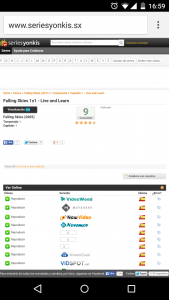](images/Falling-Skies.png)

Tal y como se puede ver en la captura de pantalla, una vez encontrada la serie y el capítulo que queremos visualizar, tan solo tenemos que **seleccionar el servidor**. En mi caso elijo uno de los enlaces que funciona con el servidor Streamcloud porqué últimamente es el servidor que funciona mejor.

Una vez seleccionado el servidor nos aparecerá la siguiente pantalla:

**Dejamos el dedo presionado encima de** ****Reproducir Ahora****. A los pocos segundos, tal y como se puede ver en la captura de pantalla, nos aparecerá la siguiente pantalla:

[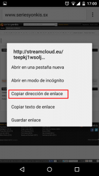](images/Enlace-de-visualización.png)

En ella podemos ver el enlace que estamos buscando. Para copiarlo tenemos que **presionar encima de la opción** ****Copiar dirección de enlace****. En estos momentos el proceso para obtener el enlace ha terminado.

###### Nota: El proceso de obtención de los enlaces variará en función de la web en la que vayamos a obtener los enlaces. No obstante en todas y cada una de las webs citadas el proceso es intuitivo.

Una vez hemos obtenido el enlace **abrimos la aplicación Vidownload**.

[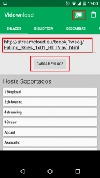](images/Uso-de-Vidownload.png)

Una vez abierta, el primer paso es **clicar encima del icono del chromecast** para sincronizar la aplicación Vidownload con el chromecast.

Seguidamente, **en el recuadro que se muestra en la captura de pantalla, pegaremos el enlace que obtuvimos en seriesyonlies.sx**. Una vez pegado el enlace tan solo tenemos que **presionar encima del botón de **Cargar Enlace**** y esperar que el contenido se visualice en nuestro televisor.

#### Usuarios de Android Opción 2

A quien no le guste Vidownload tiene la opción de usar Web Video Caster. Para ver el uso de Web Video Caster veremos un ejemplo. En el ejemplo se mostrará como visualizar Breaking bad a través de la web watchtvseries.se

Para ello **abrimos la aplicación Web Video Caster**. En la parte superior derecha verán el icono de Chromecast. **Una vez localizado el icono de Chromecast lo presionamos para conectar la aplicación Web Video Caster con nuestro Chromecast**.

Seguidamente **accedemos a la web** [http://watchtvseries.se/](http://watchtvseries.se/ "Web de enlaces de series y películas") **y buscamos la serie Breaking Bad**.

[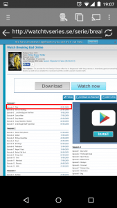](images/Serie-localizada.png)

Tal y como se puede ver en la captura, una vez encontrada la serie **presionamos encima del capítulo que queremos ver**. En mi caso presionaré encima del capítulo número 1. Seguidamente aparecerá la siguiente pantalla:

[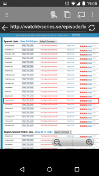](images/Seleccionar-el-servidor.png)

Ahora tenemos que **seleccionar el servidor que queremos usar para visualizar el capítulo**. En mi caso, tal y como se puede ver en la captura de pantalla, seleccionaré el servidor de Streamcloud ya que son los que mejor funcionan.

Una vez seleccionado el servidor aparecerá otra pantalla:

[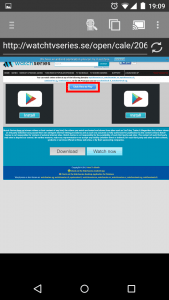](images/Click-here-to-play.png)

En esta pantalla deberemos **presionar el botón de **Click here to play****. Seguidamente aparecerá otra pantalla:

[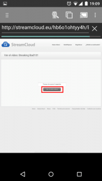](images/Ver-el-Vídeo-Ahora.png)

En esta pantalla deberemos **esperar unos 10 segundos**. Una vez pasado el tiempo de espera deberemos **presionar encima del botón** ****ver vídeo ahora****. Finalmente ya estamos en la página para poder visualizar el vídeo.

[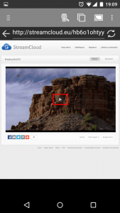](images/Ver-Serie.png)

Ahora tan solo tenemos que **presionar encima del botón play** que aparece encima del reproductor de vídeo, y el capítulo 1 de breaking bad empezará a reproducirse en nuestro televisor.

#### Usuarios de iOS

Una vez hayamos terminado la instalación de Video Web Downloader ya podremos empezar a ver series y películas en streaming con nuestro Chromecast sin ningún tipo de problema.

En este caso, para poner un ejemplo, accederemos a la web de megadede.com y visualizaremos el último capitulo disponible de la serie Naruto Shippuden. Para ello tal y como se puede ver en la captura de pantalla **accedemos a la web de** [https://www.megadede.com/](https://www.megadede.com/ "Web de enlaces de series y películas") **y buscamos la serie que queremos visualizar**:

[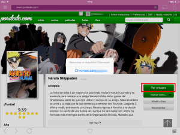](images/Búsqueda-de-la-serie-que-queremos-ver.png)

Una vez encontrada la serie **presionamos encima del icono del chromecast para sincronizar la aplicación con el chromecast**. Seguidamente **presionamos encima del botón de **Ver Enlaces****. Después de presionar encima del botón de ver enlaces aparecerá la siguiente pantalla:

[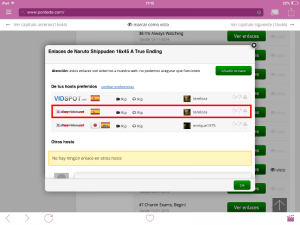](images/Seleccionar-el-servidor1.png)

En está pantalla hay que **seleccionar el servidor que usaremos para ver Naruto**. En mi caso selecciono el servidor de allmyvideos.net. Una vez seleccionado el servidor, aparecerá otra pantalla en la que deberemos **presionar de nuevo encima del botón botón** ****Ver Enlaces****. Después de presionar encima del botón aparecerá una pantalla parecida a la siguiente:

[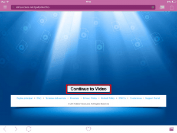](images/Empezar-a-visualizar-el-vídeo.png)

**Presionan encima del botón** ****Continue to Video**** y seguidamente aparecerá la siguiente pantalla:

[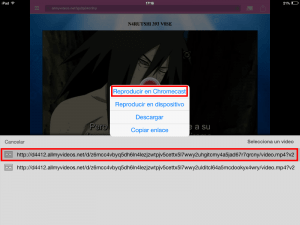](images/Empieza-la-reproducción.png)

Ahora tan solo tenemos que **presionar en uno de los 2 enlaces que aparecen en la parte inferior de la pantalla**. Después de presionar a uno de los 2 enlaces, tal y como se puede ver en la captura de pantalla, aparecerá un listado de opciones de reproducción en el que tenemos que **seleccionar** ****Reproducir en Chromecast****. Después de esto tan solo nos resta esperar unos segundos para empezar a visualizar la serie en nuestro televisor.
