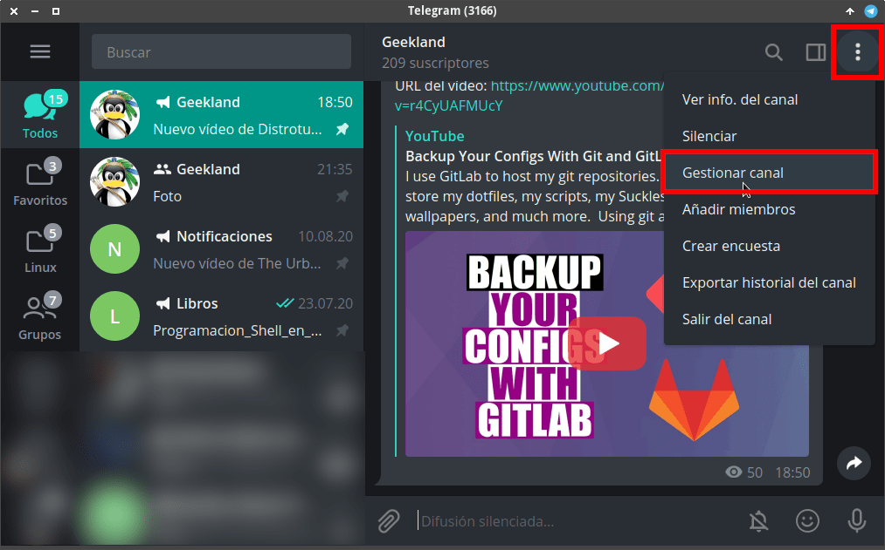
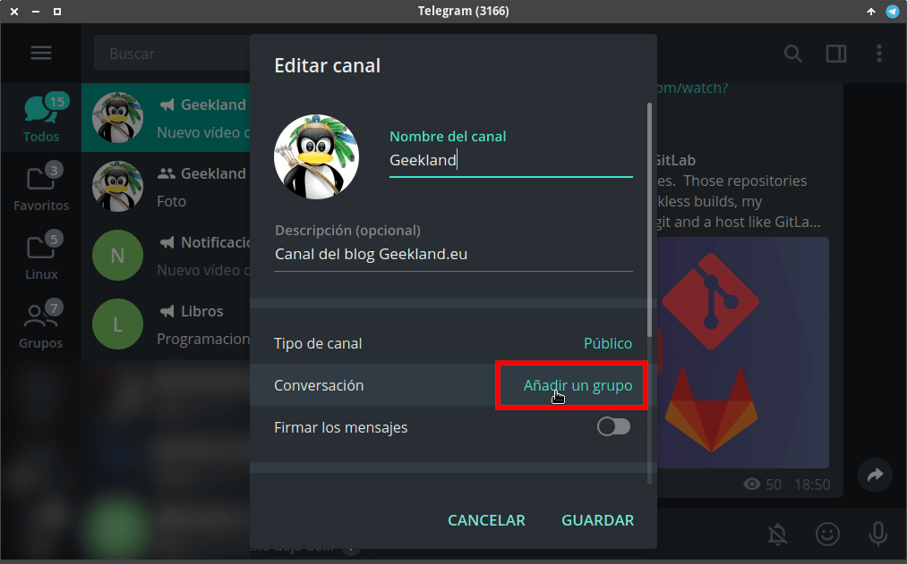
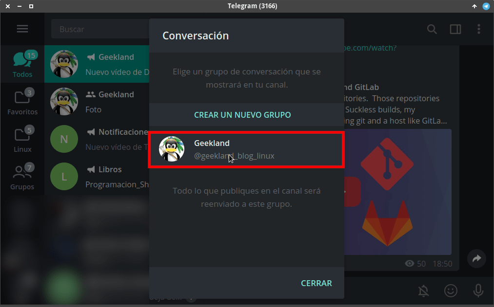
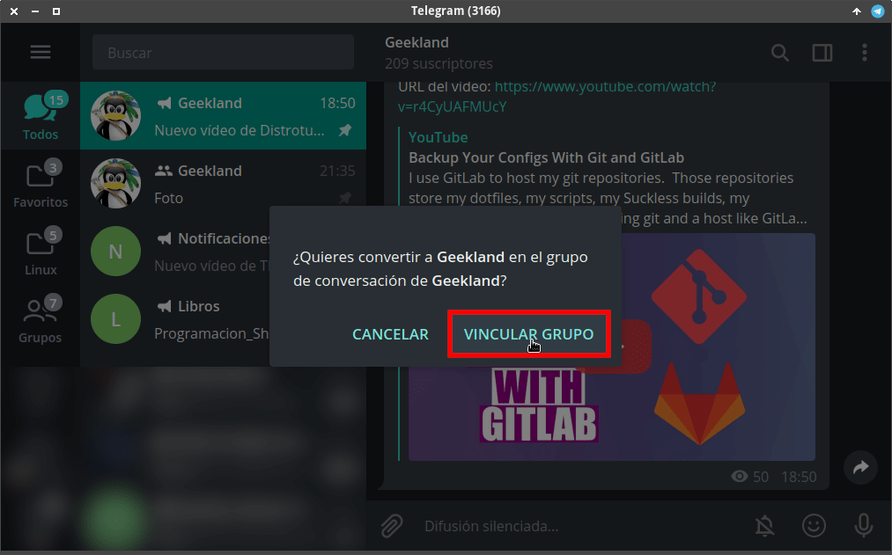
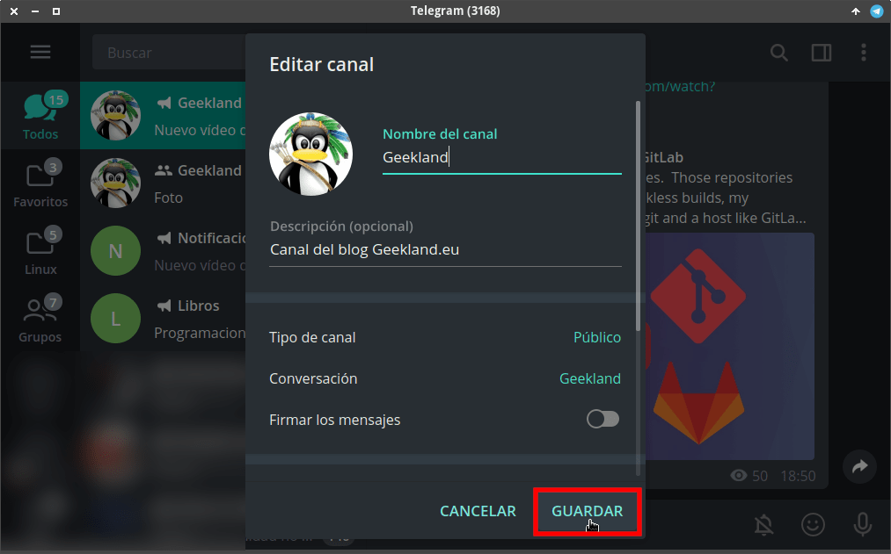

A continuación veremos como podemos vincular un canal de Telegram con un grupo. Esto sin duda proporciona una serie de beneficios tanto para los lectores como para los propietarios de los canales y grupos. Algunos de los beneficios que obtendrán ambas partes son los siguientes:<!--more-->

1. Los lectores de un canal tendrán la oportunidad de interactuar y comentar sobre el contenido publicado en el canal.
2. Los propietarios del canal tendrán la oportunidad de hacer crecer su grupo de Telegram. Esto es así porque a través del canal se podrán sumar nuevos usuarios al grupo de forma fácil.
3. Los propietarios podrán usar el canal como un medio de comunicación para el grupo. De esta forma los comunicados se podrán hacer de forma más organizada.

Para vincular un canal con un grupo deberán proceder del siguiente modo.

## VINCULAR UN CANAL CON UN GRUPO EN TELEGRAM

Para vincular un canal con un grupo obviamente necesitamos disponer de un canal y en grupo. En mi caso dispongo del siguiente canal y del siguiente grupo:

A continuación entramos dentro de nuestro canal. En la parte superior derecha clicamos sobre los 3 puntos en disposición vertical y cuando se despliegue el menú clicamos en la opción **Gestionar canal**.

Acto seguido, en el apartado de conversación clicamos sobre la opción **Añadir un grupo**.

Seguidamente seleccionamos el grupo de conversación para nuestro canal. Para seleccionarlo tan solo tenemos que clicar sobre el grupo en cuestión.

Ya para finalizar tan solo tendremos que clicar sobre la opción **Vincular Grupo**.

Y también sobre el botón de **Guardar**.

## ¿CÓMO SE PUEDE ACCEDER AL GRUPO DE CONVERSACIÓN?

Una vez finalizada la vinculación tenéis que tener en cuenta los siguiente aspectos:

- Todo contenido que se publique en el canal de Telegram también se publicará de forma automática en el grupo. Además, en el grupo de conversación siempre se anclará el último mensaje publicado en el canal.
- Cuando un usuario entre en nuestro Canal, en la parte inferior derecha verá un botón que pone conversar. Si el lector del canal quiere preguntar o conversar sobre el contenido del canal tan solo tiene que clicar sobre el botón de conversar y accederá dentro del grupo de conversación.

- Dentro del grupo de conversación verá las mismas publicaciones que en el canal, pero además podrá conversar e interactuar con el resto de integrantes del grupo.

