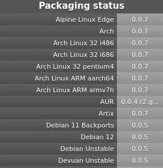
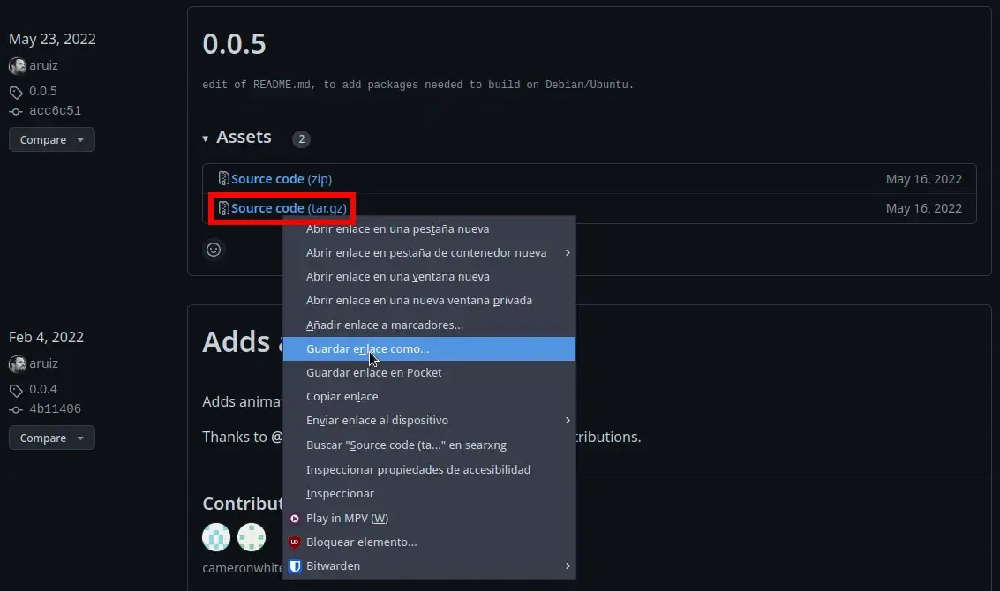
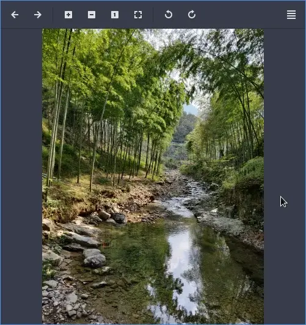
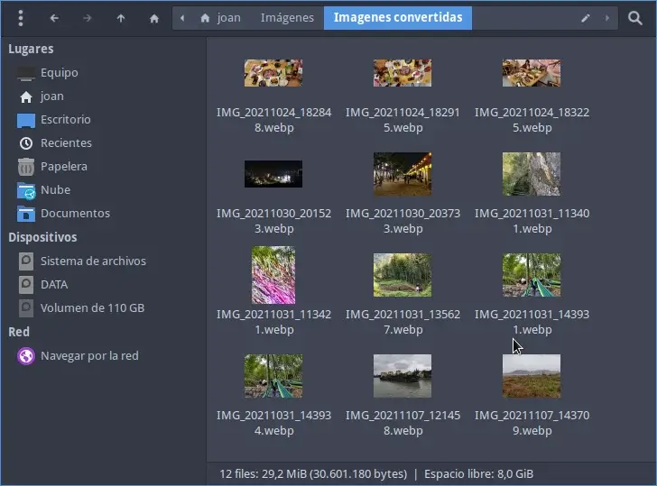

Me gusta visualizar las fotografías e imágenes con visores de fotos ligeros como por ejemplo Viewnior, Ristretto, Eog, etc. Desafortunadamente los software que acabo de citar no tienen soporte para visualizar imágenes en formato webp de forma predeterminada. Para solucionar este problema y por lo tanto poder visualizar imágenes en el formato webp instalaremos la librería webp-pixbuf-loader del siguiente modo.<!--more-->

**Nota:** En muchos foros se recomienda usar gimp o el navegador para visualizar las fotografías en formato `.webp`. Obviamente es una solución, pero no son programas ágiles y ligeros para visualizar grandes lotes de fotografías.

**Nota:** La librería webp-pixbuf-loader únicamente sirve para visualizar imágenes estáticas. No servirá para visualizar imágenes .webp animadas. Una vez instalada la librería su gestor de ficheros también debería ser capaz de mostrar las imágenes en miniatura o thumbnails.

## ¿POR QUÉ SOFTWARE COMO VIEWNIOR, RISTRETTO Y EOG NO DISPONEN DE SOPORTE PARA VISUALIZAR IMÁGENES EN FORMATO WEBP?

Los software citados en la introducción del artículo utilizan [gdk-pixbuf](https://docs.gtk.org/gdk-pixbuf/class.Pixbuf.html) para representar los pixel de una imagen. Esto es un problema porque gdk-pixbuf no es compatible con el formato webp.

## INSTALAR LA LIBRERÍA WEBP-PIXBUF-LOADER PARA VISUALIZAR IMÁGENES EN FORMATO WEBP

A continuación encontrarán las instrucciones para instalar `**webp-pixbuf-loader**` en algunas de las distribuciones Linux más populares.

### Instalar webp-pixbuf-loader en Debian Testing, Debian Sid, Arch Linux, Fedora y Open Suse

El paquete `**webp-pixbuf-loader**` se halla en los repositorios de todas las distros mencionadas en el título. Por lo tanto en Debian Testing y en Debian Sid tan solo tendrán que ejecutar el siguiente comando en la terminal:

> ```shell
> sudo apt install webp-pixbuf-loader
> ```

Si usan Fedora tendrán que usar el siguiente comando:

> ```shell
> sudo dnf install webp-pixbuf-loader
> ```

En el caso que usen Arch Linux deberán usar el siguiente comando:

> ```shell
> sudo pacman -S webp-pixbuf-loader
> ```

Finalmente los usuarios que usen Open Suse deberán usar el siguiente comando:

> ```shell
> sudo zypper install webp-pixbuf-loader
> ```

Una vez instalada la librería `**webp-pixbuf-loader**` tienen que reiniciar el ordenador. A partir de estos momentos, la próxima vez que abran una imagen con el formato .webp se abrirá sin problema alguno. Además deberían poder visualizar las imágenes en miniatura en su gestor de archivos.

### Instalar la librería webp-pixbuf-loader en Debian Estable

La versión actual de Debian estable no dispone de `**webp-pixbuf-loader**` en sus repositorios estándar. Para instalar el paquete `**webp-pixbuf-loader**` deberán añadir el repositorio Backports del siguiente modo:

https://geeklandlinux.github.io/posts/repositorio-backports-debian-estable/

Una vez añadido el repositorio podrán ejecutar el siguiente comando para instalar webp-pixbuf-loader.

> ```shell
> sudo apt install webp-pixbuf-loader
> ```

### Instalar webp-pixbuf-loader Ubuntu y Linux Mint

A partir de la versión 22.10 de Ubuntu el paquete `**webp-pixbuf-loader**` está incluido en los repositorios de Ubuntu y Linux Mint. Por lo tanto tan solo tendremos que ejecutar el siguiente comando:

> ```shell
> sudo apt install webp-pixbuf-loader
> ```

Si usan Ubuntu 20.04 o 22.04 tendrán que usar un repositorio no oficial. Para añadir el repositorio tendrán que ejecutar el siguiente comando en la terminal:

> ```shell
> sudo add-apt-repository ppa:helkaluin/webp-pixbuf-loader
> ```

Acto seguido refrescamos los repositorios de Ubuntu o Linux Mint mediante el siguiente comando:

> ```shell
> sudo apt update
> ```

Finalmente procederemos a la instalación de `**webp-pixbuf-loader**` mediante el siguiente comando:

> ```shell
> sudo apt install webp-pixbuf-loader
> ```

### Instalar webp-pixbuf-loader en el caso que el paquete binario no esté en los repositorios

Una solución que funcionará en la totalidad de distribuciones es construir e instalar la librería a partir del código fuente. Para ello lo primero que hay que realizar es instalar las dependencias ejecutando el siguiente comando:

> ```shell
> sudo apt install git meson ninja-build libwebp-dev libgdk-pixbuf2.0-dev libgtk-3-dev build-essential
> ```

A continuación se dirigen a la siguiente URL:

[https://github.com/aruiz/webp-pixbuf-loader/](https://github.com/aruiz/webp-pixbuf-loader/)

Dentro de la web tendréis que mirar la versión de webp-pixbuf-loader tenéis que instalar. En mi caso uso Debian 11, por lo tanto tendré que instalar la versión 0.0.5



Para descargar esta versión se dirigen a la siguiente [url](https://github.com/aruiz/webp-pixbuf-loader/releases) y descargan el código fuente:



Ahora descomprimiremos el código fuente que acabamos de descargar mediante el siguiente comando:

> ```shell
> tar -xf webp-pixbuf-loader-0.0.5.tar.gz
> ```

Una vez finalizado el proceso accederemos dentro de la carpeta que acabamos de descomprimir. Para ello en mi caso tendré que ejecutar el siguiente comando:

> ```shell
> cd webp-pixbuf-loader-0.0.5
> ```

El siguiente paso consistirá en construir la librería `**webp-pixbuf-loader**` ejecutando los siguientes comandos:

> ```shell
> meson builddir -Dgdk_pixbuf_query_loaders_path=/usr/lib/x86_64-linux-gnu/gdk-pixbuf-2.0/gdk-pixbuf-query-loaders
> ```
> 
> ```shell
> ninja -C builddir
> ```

Finalmente instalaremos la librería ejecutando el siguiente comando

> ```shell
> sudo ninja -C builddir install
> ```

Les recomiendo que una vez finalizada la instalación reinicien el equipo.

## COMPROBAR QUE PODEMOS VISUALIZAR IMÁGENES EN EL FORMATO WEBP

Si ahora intentamos visualizar fotografías con el software Viewnior o con Risttreto no tendremos ningún tipo de problema:



Además las imágenes en miniatura se deberían mostrar sin problema alguno en su gestor de ficheros-



### ¿Qué podemos realizar en el caso que tengamos problemas en visualizar las imágenes en miniatura en el gestor de ficheros?

En el caso que tengan problemas para visualizar las miniaturas en el gestor de ficheros borren la cache de las imágenes ejecutando los siguientes comandos:

> ```bashj
> rm ~/.cache/thumbnails/fail/gnome-thumbnail-factory/*.png
> ```
> 
> ```shell
> rm ~/.cache/thumbnails/normal/*.png
> ```
> 
> ```shell
> rm ~/.cache/thumbnails/large/*.png
> ```

Si después de borrar la cache siguen con problemas y usan el gestor de ficheros Thunar les recomiendo que sigan las siguientes instrucciones:

https://geeklandlinux.github.io/posts/ver-miniaturas-o-thumbnails-de-las-imagenes-webp-en-thunar/

### FUENTES

[https://github.com/aruiz/webp-pixbuf-loader/releases](https://github.com/aruiz/webp-pixbuf-loader/releases)
