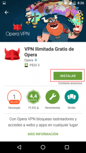
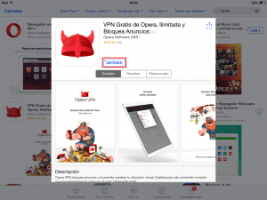
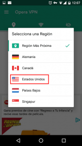
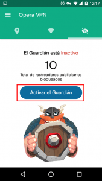
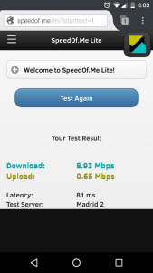
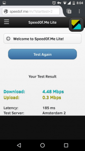

Hace unas semanas publique un post detallando como usar el servicio VPN que trae incorporado de serie el navegador de escritorio de Opera. En esta ocasión veremos como podemos instalar y usar el servicio VPN para Android e iOS que nos ofrece.<!--more-->

## INSTALAR OPERA VPN PARA ANDROID

Para empezar a utilizar el VPN para Android tan solo tenemos que instalar una App de la google Store.

Para ello clicamos en el siguiente siguiente link:

[https://play.google.com/store/apps/details?id=com.opera.vpn&hl=es](https://play.google.com/store/apps/details?id=com.opera.vpn&hl=es "Link para acceder a la instalación de Opera VPN en la Play Store")

Una vez estén dentro de la Play Store presionan el botón **Instalar** y acto seguido se procederá a la instalación de la aplicación.

## INSTALAR OPERA VPN EN IOS

Al igual que en Android tan solo tenemos que acceder a la App store e instalar una App.

Para ello clicamos encima del siguiente link:

[https://itunes.apple.com/us/app/opera-free-vpn-unlimited-ad/id1080756781?mt=8](https://itunes.apple.com/us/app/opera-free-vpn-unlimited-ad/id1080756781?mt=8 "Acceder a la App store e instalar Opera VPN")

Una vez dentro de la App Store clicamos encima del botón **Obtener** y después clicamos en el botón **Instalar**. A continuación introducimos nuestra contraseña de iTunes y se procederá a la instalación de la aplicación.

## INSTRUCCIONES USAR EL SERVICIO OPERA VPN

Seguidamente veremos los pasos a seguir para usar el servicio VPN gratuito de Opera en Android y en iOS.

###### Nota: Las instrucciones que se mostrarán a continuación son para Android. El procedimiento en iOS es prácticamente el mismo.

### Activar el servicio VPN

Abrimos la aplicación y presionamos encima del botón **Conectar**.

Esperamos unos segundos y en el momento que aparezca una llave en el panel de nuestro Android podemos estar seguros que ya estamos conectados al servicio VPN.

### Cambiar de ubicación del servicio VPN

El servicio VPN nos conecta de forma automática al servidor VPN más cercano para ofrecernos el mejor rendimiento.

No obstante puede darse el caso que nos interese usar un servidor VPN ubicado en un determinado país para saltarnos una restricción geográfica.

Si este es el caso, una vez conectados al servicio VPN tan solo tenemos que presionar el botón **Cambiar Región**.

Seguidamente se abrirá una ventana en la que deberemos seleccionar la región del servidor VPN que queremos usar. Como en mi caso me interesa disponer de una IP Americana seleccionaré la opción **Estados Unidos**.

Ahora tan solo tenemos que esperar unos segundos y cuando se establezca la conexión dispondré de una IP Americana. Por lo tanto en estos momentos podré usar servicios, como por ejemplo Pandora, que únicamente están disponibles en Estados Unidos.

### Bloquear los rastreadores publicitarios de internet

El servicio VPN también nos permite bloquear los rastreadores publicitarios. Para ello tan solo tenemos que clicar en el símbolo del **ojo tachado**.

A continuación aparecerá la siguiente ventana en la que únicamente tendremos que clicar encima de la opción **Activar el Guardián**.

## CARACTERÍSTICAS DEL SERVICIO VPN PARA ANDROID E IOS

Algunas de las características del servicio VPN que podemos destacar son las siguientes:

### Velocidad del servicio VPN

La velocidad y el rendimiento son más que sorprendentes para tratarse de un servicio VPN gratuito.

En mi caso si hago un test de velocidad antes de conectarme al servicio VPN obtengo los siguientes resultados:

Una vez conectado al servicio VPN vuelvo a repetir el test obteniendo los siguientes resultados.

Si comparamos los resultados obtenidos vemos que las velocidad de carga y descarga son inferiores a las iniciales. No obstante disponemos de una velocidad de descarga de 4,48 Mbps, una velocidad de subida de 0.3 Mbps y un ping de únicamente 185 ms.

Por lo tanto para tratarse de un servicio VPN gratuito y multiplataforma los resultados son excelentes.

### Gratuito e ilimitado

Este servicio VPN es completamente gratuito e ilimitado. Por lo tanto podemos realizar un uso normal de nuestro teléfono sin preocuparnos del ancho de banda consumido por el servicio VPN.

A pesar de ser un servicio ilimitado tenemos que tener cuidado con lo que hacemos. En el caso de detectarse un uso anormal del servicio VPN nos pueden bloquear el servicio.

### Elección de 5 ubicaciones virtuales

El servicio VPN nos permite seleccionar 5 IP’s diferentes ubicadas en distintas regiones. Las regiones que se incluyen son:

1. Alemania
2. Canadá
3. Estados Unidos
4. Holanda
5. Singapur

Esto nos permitirá que estando ubicados en España podamos acceder a servicios que por ejemplo únicamente están disponibles en Estados Unidos.

###### Nota: Es posible que en un futuro cercano se incremente el número de ubicaciones virtuales.

### Bloquea los rastreadores publicitarios de Internet

Este servicio VPN no bloquea los anuncios publicitarios, pero si trae incorporado un bloqueador de rastreadores publicitarios.

Bloqueando los rastreadores publicitarios conseguiremos lo siguiente:

1. Las empresas publicitarias no podrán generar un perfil personal con nuestros datos.
2. Las compañías publicitarias no podrán obtener información sobre nuestros hábitos de navegación. Por lo tanto ninguna de las empresas publicitarias podrá saber las web que visitamos, los temas que nos interesan, que tipo de dispositivo estamos utilizando, el navegador que usamos, la resolución de pantalla de nuestro dispositivo, etc.

### Audita la seguridad de las redes Wifi

La App audita la seguridad de las redes wifi a las que estamos conectados.

En el caso que la seguridad de la red Wifi a la que nos conectamos no sea la idónea, la App nos avisa y nos sugiere que usemos el servicio VPN de opera para protegernos.

Personalmente encuentro que esta característica es inútil y si pudiera desactivarla lo haría con mucho gusto.

Según mi humilde opinión el único fin de la auditoría es darte notificaciones para fomentar que uses su servicio VPN. Las comprobaciones realizadas para auditar la red Wifi son muy básicas y no es necesario disponer de ningún software para realizarlas. Nosotros mismos las podemos realizar aplicando el sentido común.

### VPN en toda regla

Al contrario de lo que pasa con el navegador de escritorio, el servicio VPN para Android y para iOS es un servicio VPN en toda regla.

Con esto simplemente quiero decir que el servicio VPN funcionará para absolutamente todas las aplicaciones que tengamos instaladas en nuestro dispositivo móvil.

###### Nota: Cabe recordar que el VPN del navegador de escritorio de Opera únicamente se puede utilizar cuando usamos el navegador Opera. Por lo tanto más que un VPN se trata de un proxy que nos ofrece una conexión segura.

## BENEFICIOS QUE PODEMOS OBTENER DE ESTE SERVICIO VPN

En varios de las artículos escritos en este blog he citado las ventajas que proporcionan los servicios VPN. Quien esté interesado en consultar esta información puede visitar los siguientes enlaces:

[https://geekland.eu/activar-y-usar-vpn-gratuito-en-opera/]()

[https://geekland.eu/conectarse-a-un-servidor-vpn-gratis/]()

## CONCLUSIONES

Con todas las características ofrecidas por este VPN podemos afirmar que estamos frente a uno de los mejores servicios VPN para Android y para iOS.

En caso que nos os convenza esta opción, en la tienda de aplicaciones de vuestra plataforma encontraréis opciones alternativas como por ejemplo TouchVPN.

Obviamente se trata de un servicio gratuito y por lo tanto imagino que intentarán monetizar su servicio mediante los anuncios que aparecen en la App y con los registro de nuestra actividad mientras usamos el servicio VPN.
