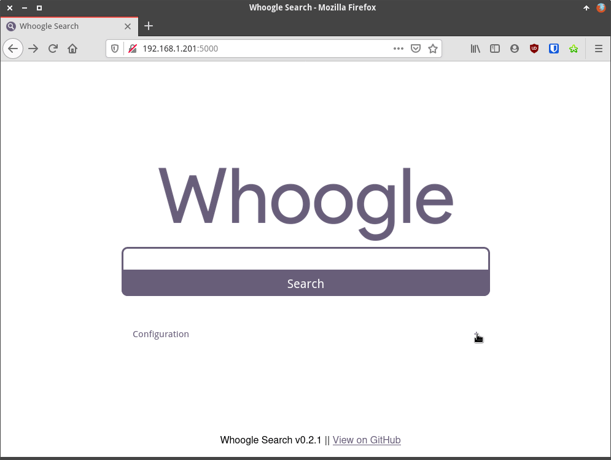
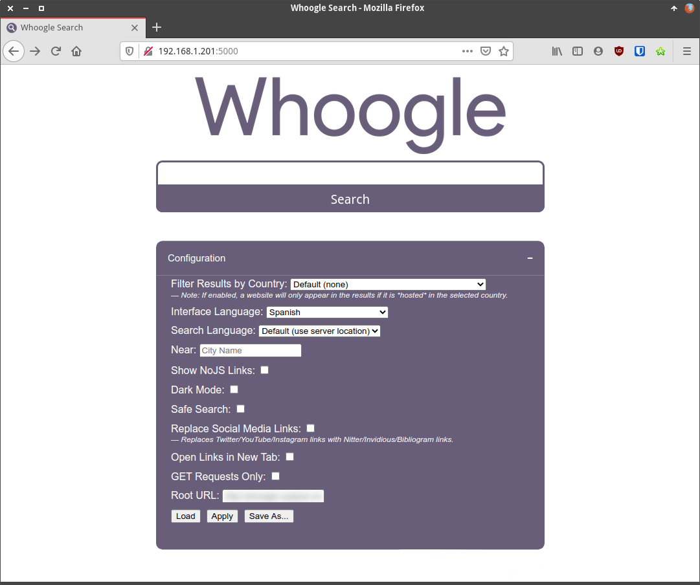
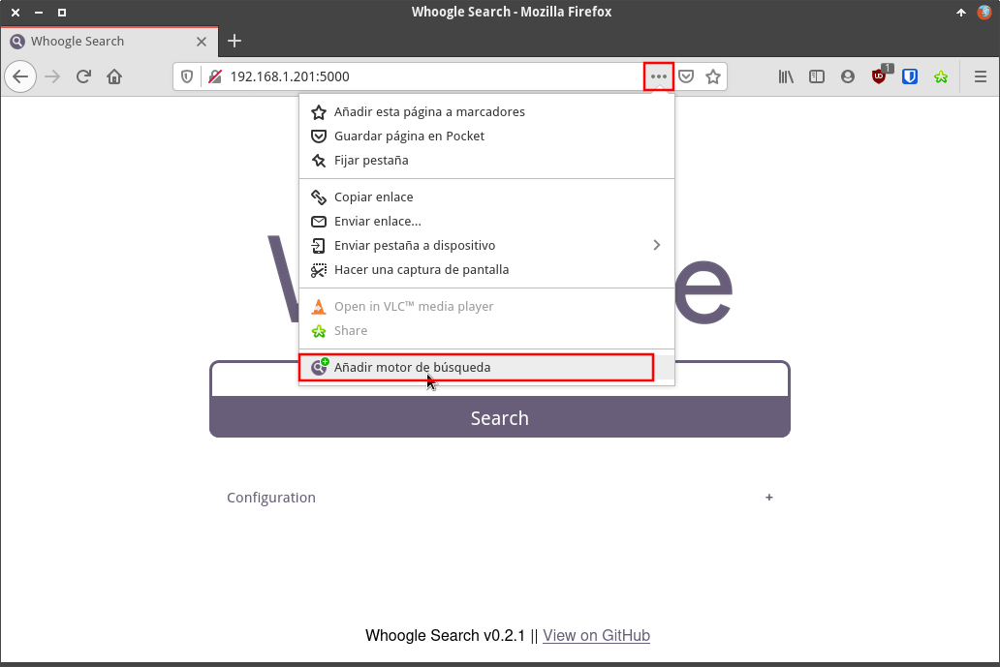
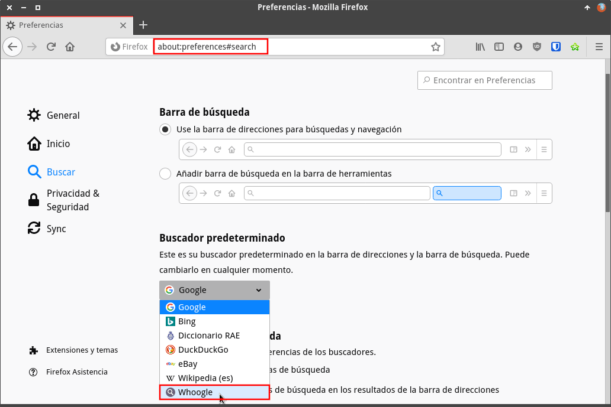
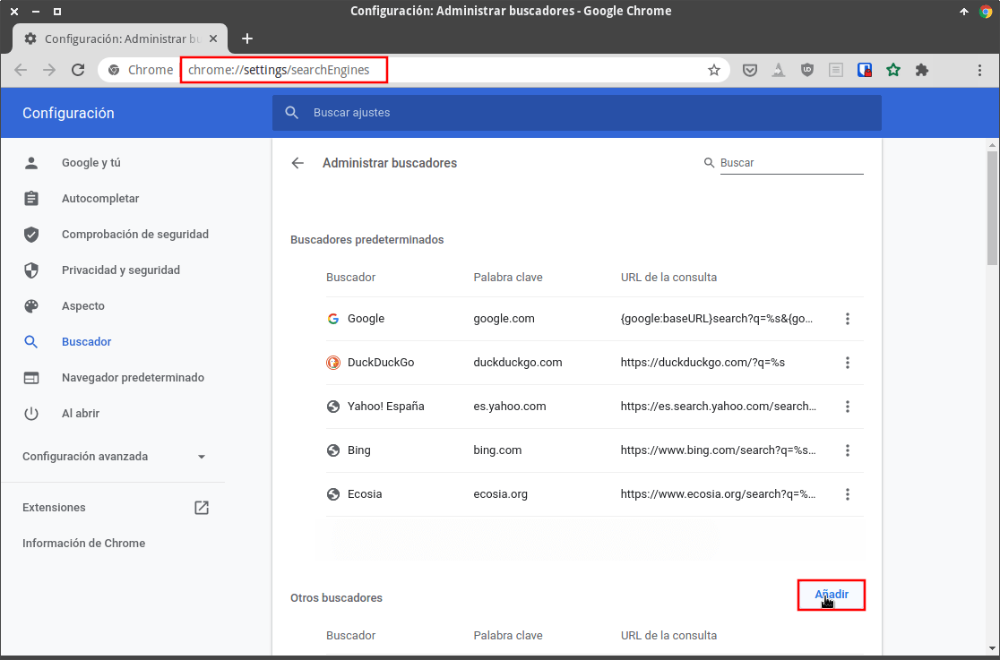
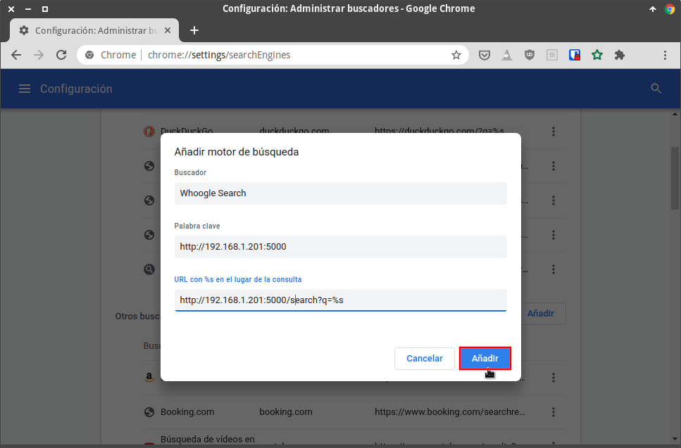
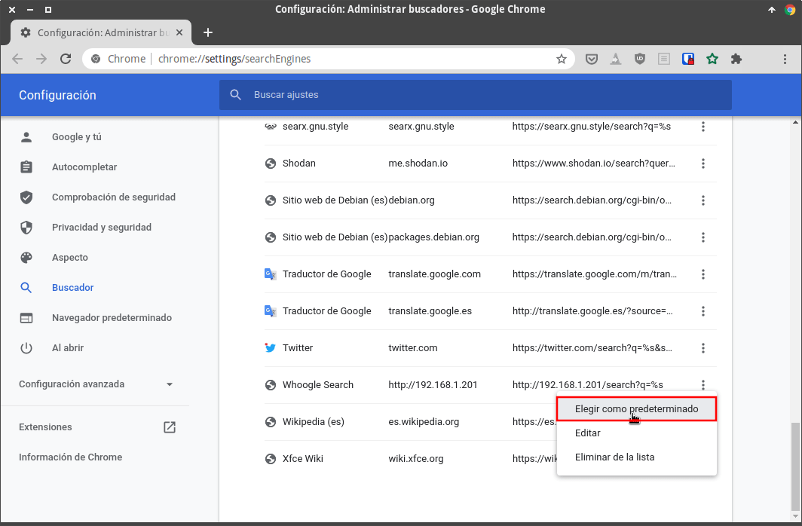

A continuación veremos la forma de usar el buscador de Google respetando un poco más nuestra privacidad. El método que usaremos para conseguir nuestro objetivo es realizar las búsquedas mediante un buscador alternativo llamado Whoogle. Existen otras opciones similares a la que veremos en este artículo. Algunas de ellas son:<!--more-->

1. SearX
2. StartPage

No obstante nos focalizaremos en Whoogle por los siguientes motivos:

1. Es un proyecto pequeño y con un desarrollo reciente. Por lo tanto es interesante darlo a conocer.
2. Al igual que SearX es una opción autoalojada. Por lo tanto somos nosotros quien tendrá el control de nuestras búsquedas.
3. Su configuración es mucho más simple que SearX. Whoogle tiene muchas menos opciones que SearX, pero tiene las opciones que todo el mundo acostumbra a usar.
4. Tiene opciones interesantes relacionadas con la privacidad que verán en el siguiente apartado.
5. Su funcionamiento es muy fluido y su interfaz es similar a la de Google. Por lo tanto la adaptación que tendremos será sencilla.

## COMO WHOOGLE PRESERVA NUESTRA PRIVACIDAD EN LAS BÚSQUEDAS

Whoogle actúa como un servidor proxy. Por lo tanto su funcionamiento se puede resumir de la siguiente forma:

1. Nosotros realizamos un petición de búsqueda a Whoogle.
2. Una vez recibida la petición Whoogle realiza la búsqueda en el buscador de Google.
3. Google devolverá el resultado de la búsqueda a Whoogle.
4. Una vez Whoogle reciba los resultados de búsqueda de Google aplicará una serie de filtros. Estos filtros consisten en eliminar todos los enlaces patrocinados, suprimir los enlaces AMP, [eliminar porciones de las URL](https://www.annielytics.com/guides/definitive-guide-campaign-tagging-google-analytics/ "Como una URL nos puede trackear") que sirven para realizarnos un seguimiento, suprimir las sugerencias de autocompletado, modificar la [cabecera](https://developer.mozilla.org/es/docs/Web/HTTP/Headers/Referer "Ejemplo de información que puede revelar una cabecera") de nuestras peticiones para que los sitios que visitamos no sepan de donde venimos, proporcionar enlaces para visitar las web con Javascript deshabilitado, enmascarar nuestro user agent, deshabilitar el javascript de los resultados de búsqueda que google nos acostumbra a proporcionar, etc.
5. Una vez aplicados todos los filtros Whoogle nos mostrará los resultados de la búsqueda.

### De que no nos protege el buscador Whoogle

Como han visto Whoogle realiza multitud de operaciones para preservar nuestra privacidad. No obstante si lo alojamos localmente y somos los únicos que lo usan Google seguirá conociendo nuestra IP y podrá asociar nuestra IP con nuestras búsquedas. Si realmente quieren ocultar la IP y gozar de mayor privacidad deberán autoalojar Whoogle en un servidor externo. Además tienen que tener en cuenta que a mayor número de usuarios más incrementaremos nuestra privacidad. Para mitigar el problema que acabo de mencionar, el desarrollador de la aplicación tiene en mente usar la red Tor para enmascarar la IP del servidor que aloja Whoogle. Para esta última característica podrán encontrar más información en Github.

## INSTALAR WHOOGLE CON DOCKER EN UNA RASPBERRY PI

En mi caso uso Whoogle a nivel local en una Raspberry Pi que tengo en mi propio domicilio y para su instalación usé Docker. Si quieren usar Whoogle de la forma que lo estoy haciendo deberán proceder del siguiente modo:

### Instalar Docker

Para instalar Docker en su Raspberry Pi deberán seguir las instrucciones que se muestran en el siguiente enlace:

https://geeklandlinux.github.io/posts/instalar-docker-y-docker-compose-en-linux/

### Construir la imagen de Whoogle para la arquitectura ARM

Una vez instalado Docker iniciaremos la instalación de Whoogle. No existe ninguna imagen de Whoogle para arquitecturas ARM. Por lo tanto la crearemos de la siguiente forma.

Inicialmente descargaremos los archivos necesarios para construir la imagen. Para ello ejecutaremos el siguiente comando en la terminal de nuestra Raspberry Pi:

> ```shell
> git clone -b feature/docker-updates https://github.com/benbusby/whoogle-search && cd whoogle-search
> ```

Dentro del directorio que acabamos de descargar existen varios Dockerfile para construir una imagen. Como en mi caso pretendo construir una imagen para una arquitectura ARM ejecutaré el siguiente comando en la terminal:

> ```shell
> docker build --tag whoogle-search:1.0 -f Dockerfile.armhf .
> ```

Después de ejecutar el comando tendrán que esperar unos minutos para que se genere la imagen.

**Nota**: Para instalar Docker en arquitecturas amd64 es mucho más sencilla ya que su imagen está subida a [Dockerhub](https://hub.docker.com/r/benbusby/whoogle-search "Enlace a la página web Deckerhub").

### Levantar e iniciar el contenedor del buscador

Una vez generada la imagen ya podemos levantar el contenedor. Para ello tan solo tenemos que ejecutar el siguiente comando en la terminal:

> ```shell
> docker run --publish 5000:5000 --detach --name whoogle-search whoogle-search:1.0
> ```

Una vez levantado el contenedor ya podremos usar Whoogle para realizar nuestras búsquedas con más privacidad.

Otra opción para levantar el contenedor es mediante docker-compose. Con docker-compose y mediante las variables de entorno podremos por ejemplo añadir una contraseña de autenticación al buscador. De este modo los usuarios solo podrán usar Whoogle si conocen la contraseña que hemos definido. Para definir nuestro docker-compose ejecutaremos el siguiente comando en la terminal:

> ```shell
> nano docker-compose.yml
> ```

Cuando se abra el editor de textos modificaremos el contenido del fichero para que quede del siguiente modo:

> ```shell
> version: "3"
> 
> services:
>   whoogle-search:
>     image: whoogle-search:1.0
>     container_name: whoogle-search
>     hostname: whoogle-search
>     restart: unless-stopped
> 
>     ports:
>       - "5000:5000"
> 
>     environment:
>       - PUID=1000
>       - PGID=1000
>       - TZ=Europe/Madrid
>       - USER=usuario
>       - PASSWORD=contraseña
> ```

**Nota:** Deberán modificar las variables de entorno `environment` para adaptarlas a sus necesidades. Por ejemplo para definir un nombre de usuario y una contraseña.

Una vez definido el docker-compose tan solo hay que guardar los cambios y cerrar el fichero. Acto seguido levantarán el contenedor ejecutando el siguiente comando:

> ```shell
> docker-compose up -d
> ```

**Nota**: Si lo desean también pueden abrir el servidor al exterior mediante Traefik. De este modo podrán usar de forma sencilla y desde fuera de su red local.

## COMO USAR Y CONFIGURAR WHOOGLE PARA REALIZAR BÚSQUEDAS

Para ver si Whoogle está funcionando de forma apropiada tan solo tienen que abrir el navegador en un equipo de su red local e ingresar una URL del siguiente tipo:

> ```shell
> http://ip_servidor_whoogle:5000
> ```

**Nota**: Para averiguar la IP de vuestra Raspberry Pi tendrán que abrir una terminal y ejecutar el comando `ifconfig`

Una vez hayan accedido verán lo siguiente. Si quieren acceder a la configuración del buscador cliquen sobre el símbolo **+**.

[](images/buscador-whoogle-instalado.png)

### Opciones de configuración que ofrece Whoogle

En mi caso las opciones de configuración seleccionadas son las siguientes:

[](images/opciones-de-configuracion-whoogle.png)

El motivo para seleccionar cada una de las opciones es el siguiente:

1. Dejad el parámetro **Filter Results by country** con la opción **Default (none)**. Si seleccionáramos un país entonces Whoogle solo nos mostraría resultados de las web que estén alojadas en el país seleccionado.
2. En la segunda seleccionad vuestro idioma principal. De este modo los resultados mostrados por Whoogle se asimilarán a los que obtenéis habitualmente en Google.
3. En la opción **Search Language** les recomiendo que dejen la opción predeterminada **Default (use server location)**. De este modo obtendremos búsquedas en todos los lenguajes disponibles. Si únicamente queréis obtener resultados en Español entonces seleccionad la opción Español.
4. En la cuarta opción no hace falta introducir ninguna ciudad. Dejadlo en blanco. Al introducir una ciudad los resultados de búsqueda no son coherentes ni se parecen a los resultados de búsqueda que acostumbra a proporcionar Google.
5. La quinta opción nos ofrece la posibilidad que las búsquedas ofrecidas por Whoogle nos muestren una URL para visitar las web deshabilitando Javascript. En mi caso tengo la opción deshabilitada, pero si queréis mejorar vuestra privacidad podéis activar esta opción. Al activar esta opción es posible que algunas web no funcionen de forma correcta.
6. La opción Dark mode permite habilitar un modo oscuro para el buscador.
7. La opción Safe Search es para habilitar o deshabilitar el filtro de búsqueda segura de Google. En mi caso nunca habilito esta opción, pero quien tenga hijos la puede habilitar.
8. Si habilitamos la sexta opción podremos visitar Twitter, Instagram y Youtube mediante servicios webs alternativos y de esta forma evitar el seguimiento de estas compañías. En mi caso no habilito está opción, pero si son más estrictos en la privacidad que yo háganlo.
9. Finalmente les recomiendo que no tilden la opción GET Requests Only. Usando el método predeterminado **POST** evitaremos que se registren los términos usados para realizar la búsqueda.

Una vez finalizada la configuración presionan el botón **Apply**.

## CONVERTIR WHOOGLE EN NUESTRO MOTOR DE BÚSQUEDA PREDETERMINADO

Si les gusta Whoogle lo pueden fijar como buscador predeterminado tanto en su ordenador como en su teléfono. A continuación les mostraré como hacerlo en Firefox y Chrome/Chromium.

### Convertir Whoogle en el motor de búsqueda predeterminado de Firefox

Abren Firefox y acceden al buscador Whoogle. Acto seguido clican sobre los 3 puntos de la barra de búsqueda y cuando se despliegue el menú clican sobre la opción **Añadir motor de búsqueda**.

[](images/anadir-motor-de-busqueda-firefox.png)

A continuación, en la barra direcciones escriben `about:preferences#search` y presionan la tecla enter. Acto seguido en el apartado de buscador predeterminado seleccionan la opción **Whoogle**.

### [](images/establecer-whoogle-motor-predeterminado-firefox.png)

### Convertir Whoogle en el motor de búsqueda predeterminado en Chrome o Chromium

En la barra de navegación de Google chrome ingresan `chrome://settings/searchEngines` y presionan Enter. Acto seguido clican sobre el botón **Añadir**.

[](images/anadir-motor-busqueda-chrome.png)

A continuación rellenen los campos pertinentes para agregar el navegador y presionan el botón **Añadir**.

**Nota**: Deberán reemplazar la IP 192.168.1.201 por su IP Interna o por su dominio.

[](images/definir-motor-busqueda-chrome.png)

Finalmente buscan el motor que acabamos de agregar. Clican sobre les 3 puntos y cuando se despliegue el menú contextual clican sobre la opción **Elegir como predeterminado**.

[](images/definir-motor-de-busqueda-como-predeterminado-chrome.png)

De este modo tan sencillo podremos realizar búsquedas con mayor privacidad obteniendo una experiencia similar a la que tendríamos con Google.

## COMENTARIOS FINALES SOBRE EL BUSCADOR

Finalmente estoy usando Whoogle instalado en un servidor VPS. Funciona a la perfección, pero aún le quedan pequeños detalles por pulir. No obstante tengo la impresión que estos pequeños detalles se irán puliendo poco a poco porque el desarrollador se le ve activo y con ganas de mejorar su creación. Solo hay que darle un poco de tiempo para que la experiencia que pueda proporcionar sea similar a Startpage.

#### Fuentes

[https://github.com/benbusby/whogle-search](https://github.com/benbusby/whoogle-search)
