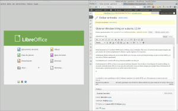
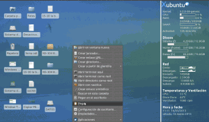
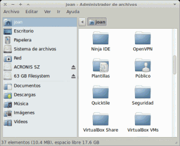
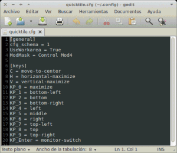
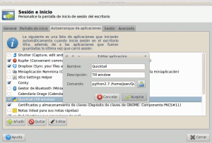
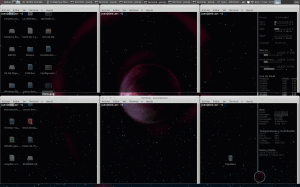

Particularmente uso el escritorio [XFCE](http://www.xfce.org/ "Xfce Website") tanto en Debian como en Xubuntu, que son los 2 sistemas operativos que utilizo habitualmente. Para mi es el escritorio ideal ya que bajo mi punto de vista es configurable, sencillo, intuitivo, funcional y ligero. Aunque mejor no discutir sobre estos puntos ya que es cuestión de gustos personales.<!--more-->

A pesar de las bondades que acabo de describir XFCE 4.8 presenta inconvenientes, o más bien dicho hay características que no están disponibles  y que bajo mi punto de vista son básicas, esenciales o muy útiles en mi caso.

## CARACTERÍSTICAS QUE ECHO DE MENOS EN XFCE 4.8

Lo primero que echo de menos de XFCE 4.8 respecto a otros entornos de escritorio es el window tiling. ¿Qué es el window tiling?

El window tiling es la característica que cuando arrastras una de las ventanas a un extremo del escritorio, esta se redimensiona automáticamente ocupando justo la mitad del espacio de la pantalla. Os muestro lo que es exactamente ya que una imagen vale más que mil palabras:

[](images/Window-tiling-en-xfce-horzintal.png)

Como podéis ver esta característica es ideal para la gente que posea una pantalla de gran tamaño ya que nos permite agilizar nuestro trabajo y simultanear tareas sin estar cambiando constantemente de ventana. Por ejemplo cuando estamos realizando algún trabajo podemos tener el navegador a un lado de nuestra pantalla mientas que en el otro podemos tener nuestro procesador de textos. Así de esta forma podemos leer y escribir al mismo tiempo y de forma fácil.

Otro problema que me molesta un poco de XFCE 4.8 es que no te dejar pegar archivos directamente en el escritorio. Por ejemplo, Si copiamos un archivo que tenemos en nuestra home, nos vamos al escritorio, cuando demos click al botón derecho para buscar la opción pegar veremos que está desactivada. Para dar solución a este problema solo tenéis que leer el siguiente apartado. Una solución alternativa para poder pegar un archivo es creando una acción personalizada con thunar para pegar en el escritorio. Para saber como crear una acción personalizada pueden consultar el siguiente post:

**[https://geekland.eu/acciones-personalizadas-en-thunar/]()**

## COMO OBTENER WINDOW TILING EN XFCE 4.8 Y PODER PEGAR DIRECTAMENTE EN EL ESCRITORIO

###### Nota: La solución que se aplica a continuación funciona perfectamente en xubuntu 11.10 y 12.04. Imagino que el método también será efectivo tanto en Linux Mint como en Ubuntu.   En caso de aplicar esta solución en otras distros existe la posibilidad de dañar vuestro entorno de escritorio o vuestro gestor de ventanas. A título personal he intentado aplicar esta solución en Debian Wheezy. Al intentar aplicarla vi que habían problemas de dependencias y preferí no forzar nada. En Debian Wheezy utilizo la solución que se describe en opciones alternativas.

Para obtener el window tiling en xfce 4.8 abrimos una terminal y tecleamos los siguientes comandos:

> **`sudo add-apt-repository ppa:fossfreedom/xfwm4 sudo apt-get update sudo apt-get install xfwm4`**

Después del proceso, como podemos observar en las imágenes, nuestro sistema operativo ya dispone de window tiling y podemos pegar archivos en el escritorio sin problema alguno:

[](images/Window-tiling-en-xfce-horzintal1.png)

Window tiling con ventanas en horizontal (Habilitado)

[](images/Window-tiling-en-xfce-vertical.png)

Window tilling con ventanas en vertical (Habilitado)

[](images/c128.png)

Pegar archivo en el escritorio activado (Habilitado)

Puedo asegurar que este método es 100% fiable en Xubuntu 12.04 LTS. Realice este proceso hace más de medio año y no me ha dado problema alguno. El rendimiento siempre ha sido perfecto y nunca he tenido ningún problema de dependencias en mi sistema causado por usar este repositorio.

## OPCIONES ALTERNATIVAS AL REPOSITORIO DE UBUNTU

Puede ser que con el método descrito y dependiendo de la distro que uséis tengáis problemas de dependencias. Si no queréis forzar la instalación existe una opción alternativa que es la que estoy usando en mi Debian. Para aplicar esta solución tenéis que proceder de la siguiente forma:

Lo primer que haremos es descargarnos un script  que ya está realizado. El script se llama quicktile y lo descargaremos de la siguiente página web:

[http://ssokolow.com/quicktile/](http://ssokolow.com/quicktile/ "Quicktail")

Como podéis leer en la página para que el script funcione tenéis que tener instalado **python** y los paquetes **python-xlib** y **dbus-python**  en vuestro ordenador. En mi caso tengo la versión 2.7 de python y funciona perfectamente. Desconozco si en versiones superiores como la 3 el script funciona. Para asegurar que tenemos los paquetes necesarios en la terminal teclemaos:

> ```
> sudo apt-get install python python-xlib
> ```

En la parte inferior de la página veréis un apartado que pone **Download**. En este apartado es de donde nos descargaremos el script ya sea en formato zip o en formato tar.

Una vez descargado el script traslados el zip o el tar dentro de nuestra home y lo descomprimimos. Una vez descomprimida la carpeta le cambiamos el nombre. La carpeta inicialmente tiene que tener un nombre similar a ssokolow-quicktile-1df6e04. Para cambiar el nombre abrimos una terminal dentro de nuestra home y escribimos:

> ```
> mv ssokolow-quicktile-1df6e04 Quicktile
> ```

Una vez cambiado el nombre este proceso nuestra home tiene que quedar de la siguiente forma:

[](images/Quicktile-en-home.png)

Seguidamente ejecutaremos quicktail para ver que funcione. Para ejecutarlo entramos dentro de la termina y tecleamos:

> ```
> cd Quicktile python2.7 quicktile.py -d  
> ```

###### Nota: El último comando se tendrá que adaptar en función dela versión de python que tengas instalada.

Una vez ejecutado por primera vez cerramos la terminal sin hacer nada. Ahora vamos a configurar el teclado para poder ubicar las ventanas de forma rápida donde queramos. Para ello abrimos una terminal y escribimos:

> ```
> gedit .config/quicktile.cfg
> ```

Se abrirá el editor de textos. Tenéis que asegurar que el contenido es el mismo que el de la siguiente imagen:

[](images/Configuración-quicktile.png)

Guardamos y cerramos el editor. Seguidamente ya solo nos falta configurar que quicktile arranque de forma automática cuando arrancamos nuestro ordenador. Para ello abrimos una terminal y tecleamos:

> ```
> xfce4-session-settings
> ```

Se abrirá una ventana. Dento de la ventana que se abre tenemos que selecionar la pestaña Autoarranque de aplicaciones. Una vez dentro de la pestaña tenemos que darle click al botón de añadir.

[](images/quicktile-inicio.png)

Una vez le hemos dado al botón de añadir tenemos que rellenar el menú como se puede ver en la imagen de arriba. El apartado comando queda cortado. El texto completo que hay que poner en el apartado comando es:

> ```
> python2.7 /home/joan/Quicktile/quicktile.py -d
> ```

Le damos al botón aceptar y ya hemos terminado. Solamente falta reiniciar nuestro ordenador y todo debería funcionar. Para su funcionamiento procedemos de la siguiente forma:

Hay que apretar simultáneamente las teclas ctrl+tecla windows+(cualquier número del teclado numérico (del 1 al 9))

Os dejo una pantalla para que podías observar lo que se puede hacer con quicktile:

[](images/resultado-final.png)

Además los usuarios de XFCE poseen aún de otras alternativas a las 2 que acabamos de citar. Tres alternativas adicionales que se me ocurren son las que presento a continuación:

1. En vez de usar xfwm4, que es el gestor de ventas por defecto de xfce, podemos usar compiz. Es una solución muy válida pero no la he usado nunca. Con xfce busco un sistema ligero y por lo tanto no tendría mucho mucho sentido usar xfce con compiz.
2. Actualizar a una distro que use XFCE 4.10 en vez de XFCE 4.8. XFCE 4.10 dispone de window tilling de serie y permite pegar archivos en el escritorio sin problema alguno. No obstante en mi caso he preferido no elegir esta opción ya que para mi y para mucha gente es un coñazo instalar y dejar a nuestro gusto un sistema operativo. Prefiero usar versiones LTS y estables.
3. También existe la posibilidad de compilar el entorno de escritorio de XFCE 4.10 o usar un repositorio de terceros que nos permita actualizar nuestro entorno de escritorio sin tener que instalar un sistema operativo des de cero.

Y a estas alturas... A disfrutar del window tiling en xfce 4.8 o en cualquier otro entorno de escritorio que no lo tenga de série.
