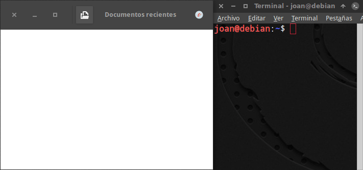
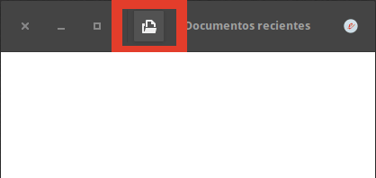
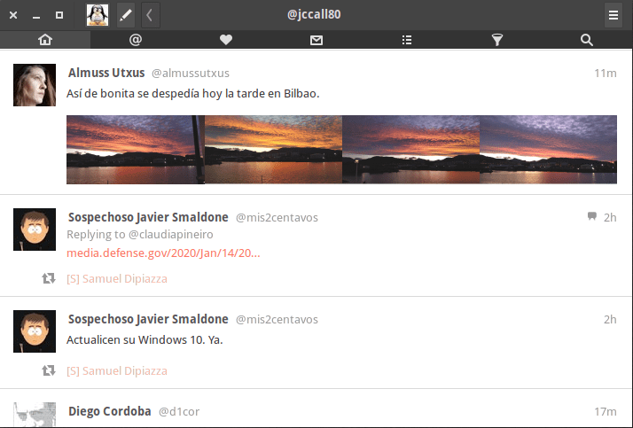
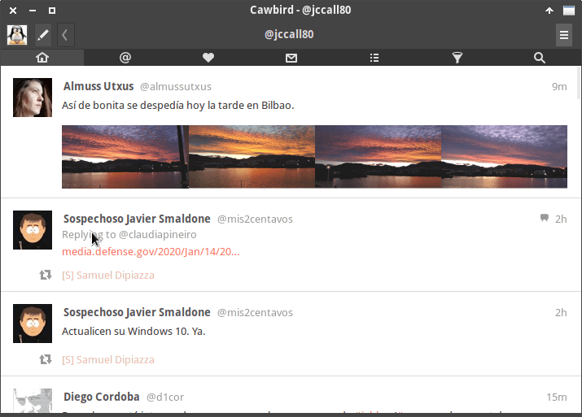

Gnome destrozo la integración de las aplicaciones en el escritorio mediante la introducción de las Client Side Decorations en Gnome 3. Desafortunadamente es posible que XFCE siga los pasos de Gnome habilitando esta característica a partir de la versión 4.16. Su hoja de ruta y lo que pretenden realizar está detallado en el siguiente enlace:<!--more-->

[https://wiki.xfce.org/releng/4.16/roadmap/general\_ui/csd](https://wiki.xfce.org/releng/4.16/roadmap/general_ui/csd "Anuncio de como se implementará CSD en XFCE")

Por lo tanto se acercan curvas porque este tema generará polémica.

## ¿QUÉ SON LAS CLIENT SIDE DECORATIONS?

Cuando hablamos de las Client Side Decorations, o CSD, nos referimos a la **enorme barra de título que tienen las aplicaciones desarrolladas por los programadores que siguen las directrices de Gnome**. En vez de la barra de título tradicional en que hay los botones de abrir, cerrar y minimizar, tenemos la barra gruesa que veis a continuación:

[")](images/muestra-de-las-client-side-decorations.png)

###### Nota: Váyanse mentalizando que todas las aplicaciones desarrolladas por el equipo de XFCE adoptarán un estilo gráfico similar al de la captura de pantalla que acabáis de ver.

Usando CSD, toda la barra gruesa del título será dibujada y dependerá exclusivamente del programa que ejecutamos. En ningún momento dependerá del gestor de ventanas xfwm4 como pasa en la barra de títulos tradicional.

Esto hecho hace que los desarrolladores de software puedan personalizar e introducir funcionalidades adicionales en la barra de título. Pero no creáis que todo son ventajas.

## VENTAJAS E INCONVENIENTES DE LAS CLIENT SIDE DECORATIONS (CSD)

Según los desarrolladores de XFCE las CSD [aportan beneficios](https://wiki.xfce.org/releng/4.16/roadmap/general_ui/csd). No obstante, mi punto de vista es que las Client Side Decorations no aportan ningún beneficio al usuario final. Aunque la forma de implementar CSD será diferente a Gnome, me temo que lo único que aportará este cambio son los siguientes inconvenientes:

### XFCE 4.16 será más feo que la versiones anteriores de XFCE

Las Client Side Decoration son estéticamente horrorosas. El motivo principal es que los bordes de las ventanas son extremadamente gruesos. Espero que los desarrolladores dejen una opción para que los usuarios puedan seleccionar el grosor que quieran.

### Desaprovechan la superficie de nuestro monitor

Los bordes de las ventanas son extremadamente grandes y esto hace que estemos desaprovechando pulgadas de nuestro monitor. Una prueba de lo que estoy diciendo lo podéis ver a continuación:

[](images/aprovechamiento-vertical-pantalla.png)

El aprovechamiento de pantalla de la barra de título tradicional es mejor. Y si añadiésemos el [menú global]() obtendríamos un aprovechamiento de pantalla increíblemente superior.

### Las Client Side Decorations puede que hagan desaparecer el Global menu

Este punto aún está por ver ya que en algunas capturas de pantalla vemos que Parole aun seguirá teniendo los menús tradicionales.

No obstante, las aplicaciones de Gnome que adoptan las Client Side Decorations no tienen un menú tradicional tal y como lo conocemos. En vez de menú tienen iconos tipo smartphone para nada agradables ni intuitivos.

[](images/iconos-area-menu.png)

Sin la existencia de menús tradicionales de nada sirve usar un global menu. Además aunque las aplicaciones tengan menús tradicionales veremos si se integran bien en el menú global de XFCE.

### Rompen la integración de las aplicaciones con el escritorio

A partir de XFCE 4.16 tendremos programas que funcionarán con CSD y programas que usarán la barra de título tradicional. Está mezcla de programas hará que el escritorio simplemente luzca mal.

### No podremos definir un tema para los títulos de la ventana

Los títulos de ventana tradicionales desaparecen. Por lo tanto no podremos definir un tema únicamente y exclusivamente para nuestro título de ventana.

Por lo tanto si no nos gusta la decoración del header bar tendremos que instalar un nuevo tema.

### No tendremos variedad de temas en el escritorio

Aunque los desarrolladores de XFCE digan lo contrario, será más difícil encontrar un tema que nos guste. Mi opinión se basa en que actualmente todos los temas de Gnome son iguales. La única diferencia entre ellos son los colores.

## CONCLUSIONES SOBRE LA INTRODUCCIÓN DE LAS CLIENT SIDE DECORATIONS EN XFCE

Mis conclusiones desglosadas por puntos son las escribo a continuación.

### Los desarrolladores de XFCE no escuchan a la comunidad

A pesar de las críticas de la comunidad y de los usuarios, el equipo de desarrollo de XFCE ha decidido implementar las Client Side Decorations de forma unilateral. A continuación les dejo unos links en que podrán leer los comentarios y reacciones de los usuarios y desarrolladores:

[https://simon.shimmerproject.org/2020/01/14/xfce-4-14-maintenance-and-4-15-updates/](https://simon.shimmerproject.org/2020/01/14/xfce-4-14-maintenance-and-4-15-updates/)

[https://mail.xfce.org/pipermail/xfce/2019-October/036689.html](https://mail.xfce.org/pipermail/xfce/2019-October/036689.html)

[https://forum.xfce.org/viewtopic.php?id=13689](https://forum.xfce.org/viewtopic.php?id=13689)

Frente las críticas y preocupaciones de los usuarios, los desarrolladores reaccionan respondiendo lo siguiente:

> “En vez rechazar las CSD intentemos usarlas de forma efectiva y arreglemos los problemas que vayamos encontrando.”

### Adoptan tecnologías que hicieron que la gente dejara de usar Gnome

XFCE adoptará una de las muchas características que propicio que los usuarios de Gnome huyeran en masa. Muchos usuarios que huyeron de Gnome se refugiaron en XFCE.

Por lo tanto tiene poca lógica que XFCE intente parecerse a Gnome y adopte sus tecnologías. Para mi las características que definen Gnome Shell son:

1. Entorno de escritorio lento.
2. Poco optimizado.
3. Consume gran cantidad de recursos.
4. Tiene menos funcionalidad que 10 años atrás.
5. No me gusta su concepto de escritorio ni como está implementada su filosofía minimalista.

Por lo tanto es normal que mucha gente que piensa igual que yo se preocupe por el futuro de XFCE.

### Alternativas disponibles para los usuarios

Guste o no guste, las Client Side Decorations serán aplicadas en XFCE 4.16. Los usuarios que estén encontrá pueden hacer llegar sus mensajes educados al equipo de desarrollo, pero dudaría mucho que cambiarán de opinión.

Por lo tanto **habrá que darles el beneficio de la duda** y esperar al resultado final. Igual nos sorprenden, mejoran y modernizan el escritorio actual. Pero si el resultado final no es satisfactorio entonces podemos adoptar las siguientes opciones:

1. **Esperar a que alguien realice un fork** de XFCE. Dudo que por este tema se realice un fork de la distro, pero igual alguien aporta una solución para que la gente que lo desee pueda seguir usando las barras de título tradicionales.
2. **Abandonar el uso de XFCE** y adoptar otros entornos de escritorio no utilicen las Client Side Decorations. Algunos de los entornos de escritorio que recomiendo son MATE, LXQt, KDE, Cinnamon, etc.
3. **Usar distribuciones que usen versiones viejas de XFCE**. Con un poco de suerte Xubuntu 20.04 usará XFCE 4.14 durante unos 3 años.
4. **Usar opciones como por ejemplo gtk3-nocsd** para al menos recuperar los títulos de ventana tradicionales. En el siguiente apartado citaremos como realizar lo que acabo de comentar.

## DESHABILITAR LAS CLIENT SIDE DECORATIONS

Si quieren volver a disponer de una barra de títulos tradicional pueden adoptar la siguiente solución.

Inicialmente tenemos la siguiente aplicación que usa las Client Side Decorations.

[](images/programa-con-client-side-decorations.png)

Para disponer otra vez de la barra de título tradicional tenemos que instalar el paquete gtk3-nocsd. Por lo tanto en Debian y distribuciones derivadas de Debian ejecutaremos el siguiente comando:

> ```
> sudo apt install gtk3-nocsd
> ```

###### Nota: Si usan un gestor de paquetes diferente a apt deberán reemplazar “apt install” por el comando pertinente.

Una vez instalado el paquete reinicien el ordenador. Una vez reiniciado la misma aplicación dispondrá de una barra de título tradicional:

[](images/programa-con-ventana-titulo-tradicional.png)

El resultado no acaba de ser del todo satisfactorio ya que no se aprovecha bien el espacio vertical del monitor. Pero al menos ahora tenemos una barra de título tradicional.
